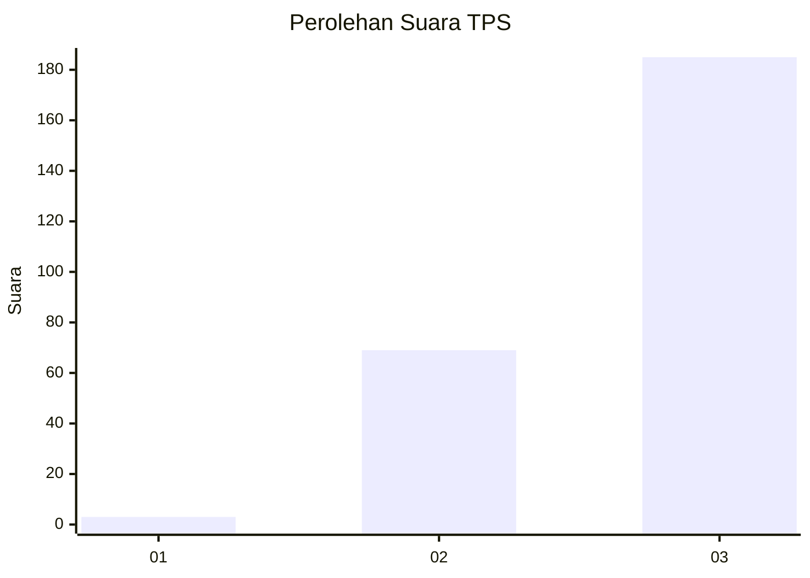
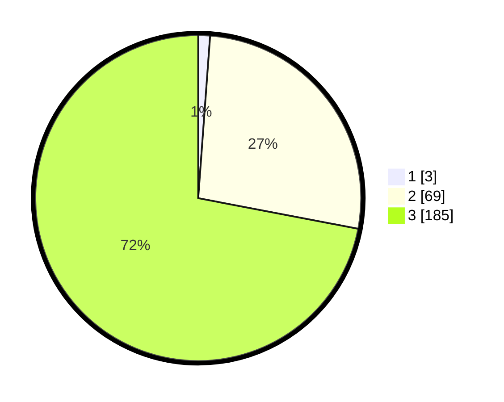

# Hasil

## Grafik

## Tabel

| No. | Nama Paslon    | Suara | Suara (raw) | Persentase |
|:--- |:-------------- | -----:| -----------:| ----------:|
| 1   | ANIES MUHAIMIN | 3     | [3][p-1]    | 1,17       |
| 2   | PRABOWO GIBRAN | 69    | [69][p-2]   | 26,85      |
| 3   | GANJAR MAHFUD  | 185   | [185][p-3]  | 71,98      |

[p-1]: https://github.com/gigit-pemilu/pemilu-2024-51-bali/blob/main/pilpres/hitung-suara/sub/51-bali/sub/03-badung/sub/03-abiansemal/sub/2006-sedang/sub/004-tps/sub/paslon-1.txt
[p-2]: https://github.com/gigit-pemilu/pemilu-2024-51-bali/blob/main/pilpres/hitung-suara/sub/51-bali/sub/03-badung/sub/03-abiansemal/sub/2006-sedang/sub/004-tps/sub/paslon-2.txt
[p-3]: https://github.com/gigit-pemilu/pemilu-2024-51-bali/blob/main/pilpres/hitung-suara/sub/51-bali/sub/03-badung/sub/03-abiansemal/sub/2006-sedang/sub/004-tps/sub/paslon-3.txt

## Foto C Plano

https://sirekap-obj-formc.kpu.go.id/8986/pemilu/ppwp/51/03/03/20/06/5103032006004-20240215-002834--cc4f7af0-8322-4c0e-935f-237cf97fe73a.jpg

https://sirekap-obj-formc.kpu.go.id/8986/pemilu/ppwp/51/03/03/20/06/5103032006004-20240215-003336--2f4cfd65-03b8-4235-9108-b4e98e99848c.jpg

https://sirekap-obj-formc.kpu.go.id/8986/pemilu/ppwp/51/03/03/20/06/5103032006004-20240215-003422--96652e36-37ee-4ed5-aa74-4d6cab15918a.jpg

## Metadata

| Key        | Value               |
| ---------- | ------------------- |
| Time Stamp | 2024-02-24 22:31:28 |

