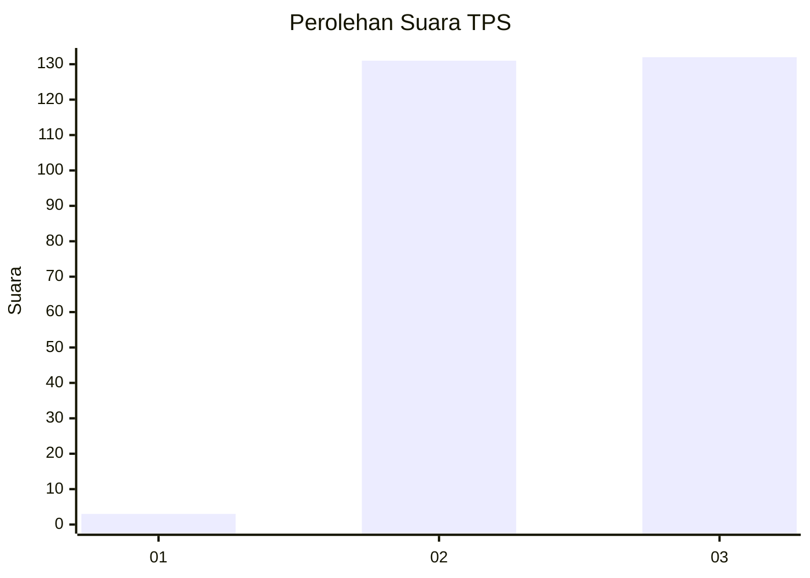
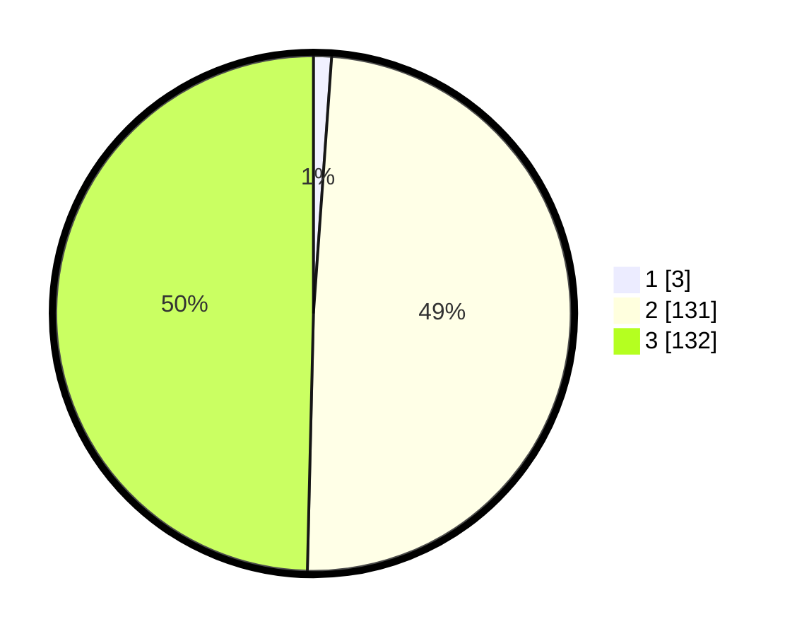

# Hasil

## Grafik

## Tabel

| No. | Nama Paslon    | Suara | Suara (raw) | Persentase |
|:--- |:-------------- | -----:| -----------:| ----------:|
| 1   | ANIES MUHAIMIN | 3     | [3][p-1]    | 1,13       |
| 2   | PRABOWO GIBRAN | 131   | [131][p-2]  | 49,25      |
| 3   | GANJAR MAHFUD  | 132   | [132][p-3]  | 49,62      |

[p-1]: https://github.com/gigit-pemilu/pemilu-2024-51-bali/blob/main/pilpres/hitung-suara/sub/51-bali/sub/03-badung/sub/03-abiansemal/sub/2006-sedang/sub/007-tps/sub/paslon-1.txt
[p-2]: https://github.com/gigit-pemilu/pemilu-2024-51-bali/blob/main/pilpres/hitung-suara/sub/51-bali/sub/03-badung/sub/03-abiansemal/sub/2006-sedang/sub/007-tps/sub/paslon-2.txt
[p-3]: https://github.com/gigit-pemilu/pemilu-2024-51-bali/blob/main/pilpres/hitung-suara/sub/51-bali/sub/03-badung/sub/03-abiansemal/sub/2006-sedang/sub/007-tps/sub/paslon-3.txt

## Foto C Plano

https://sirekap-obj-formc.kpu.go.id/575b/pemilu/ppwp/51/03/03/20/06/5103032006007-20240216-085634--e710a42c-8b9a-4ead-9cda-e46c14f1ccd3.jpg

https://sirekap-obj-formc.kpu.go.id/575b/pemilu/ppwp/51/03/03/20/06/5103032006007-20240217-010412--82a51d40-ad96-45d0-939e-b4db01e07766.jpg

https://sirekap-obj-formc.kpu.go.id/575b/pemilu/ppwp/51/03/03/20/06/5103032006007-20240216-085644--7264e5dd-acbc-466c-ae08-7baabd2f022a.jpg

## Metadata

| Key        | Value               |
| ---------- | ------------------- |
| Time Stamp | 2024-02-24 22:31:28 |

## DATA PEMILIH TETAP

Jumlah pemilih dalam DPT: **274**.
 * L: **132**.
 * P: **142**.

## DATA PENGGUNA HAK PILIH

Jumlah pengguna hak pilih dalam DPT: **259**.
 * L: **124**.
 * P: **135**.

Jumlah pengguna hak pilih dalam DPTb: **0**.
 * L: **0**.
 * P: **0**.

Jumlah pengguna hak pilih dalam DPK: **13**.
 * L: **6**.
 * P: **7**.

Jumlah pengguna hak pilih: **272**.
 * L: **130**.
 * P: **142**.

## JUMLAH SUARA SAH DAN TIDAK SAH

JUMLAH SELURUH SUARA SAH: **266**.

JUMLAH SUARA TIDAK SAH: **6**.

JUMLAH SELURUH SUARA SAH DAN SUARA TIDAK SAH: **272**.

