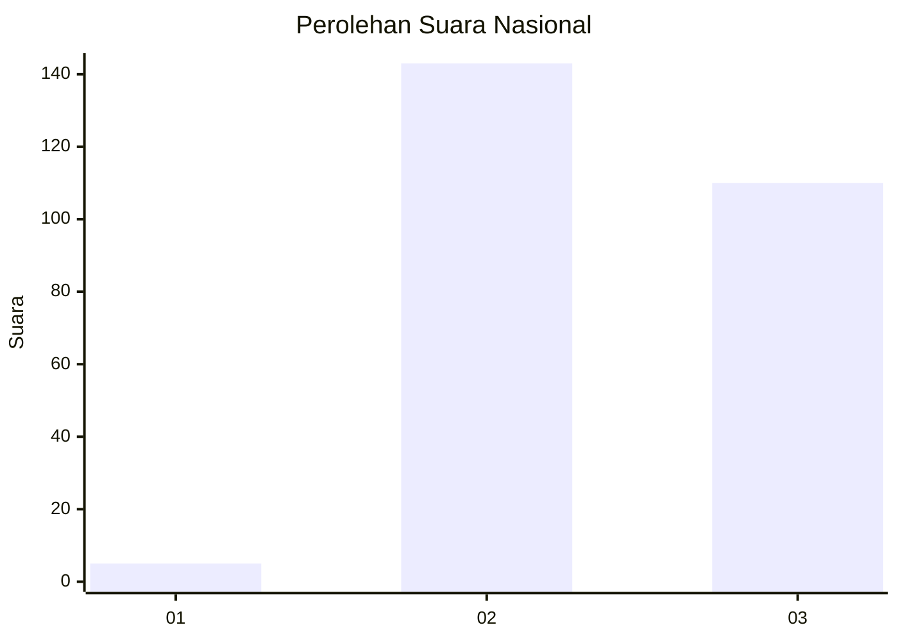
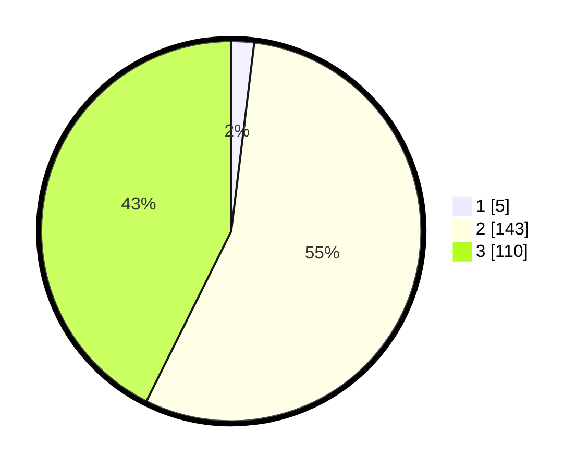

# Hasil

## Grafik

## Tabel

| No. | Nama Paslon    | Suara | Suara (raw) | Persentase |
|:--- |:-------------- | -----:| -----------:| ----------:|
| 1   | ANIES MUHAIMIN | 5     | [5][p-1]    | 1,94       |
| 2   | PRABOWO GIBRAN | 143   | [143][p-2]  | 55,43      |
| 3   | GANJAR MAHFUD  | 110   | [110][p-3]  | 42,64      |

[p-1]: https://github.com/gigit-pemilu/pemilu-2024/blob/main/pilpres/hitung-suara/sub/51-bali/sub/03-badung/sub/03-abiansemal/sub/2006-sedang/sub/013-tps/sub/paslon-1.txt
[p-2]: https://github.com/gigit-pemilu/pemilu-2024/blob/main/pilpres/hitung-suara/sub/51-bali/sub/03-badung/sub/03-abiansemal/sub/2006-sedang/sub/013-tps/sub/paslon-2.txt
[p-3]: https://github.com/gigit-pemilu/pemilu-2024/blob/main/pilpres/hitung-suara/sub/51-bali/sub/03-badung/sub/03-abiansemal/sub/2006-sedang/sub/013-tps/sub/paslon-3.txt

## Foto C Plano

https://sirekap-obj-formc.kpu.go.id/2412/pemilu/ppwp/51/03/03/20/06/5103032006013-20240216-150700--d537966a-f2fd-4b97-999b-ee436f6e57fa.jpg

https://sirekap-obj-formc.kpu.go.id/2412/pemilu/ppwp/51/03/03/20/06/5103032006013-20240216-092121--f6317f2d-744b-42a9-b2e7-48eaeb92ed66.jpg

https://sirekap-obj-formc.kpu.go.id/2412/pemilu/ppwp/51/03/03/20/06/5103032006013-20240216-092117--c557ed88-755c-4710-87e5-0bfb3af2190c.jpg

## Metadata

| Key        | Value               |
| ---------- | ------------------- |
| Time Stamp | 2024-02-21 21:00:04 |

## DATA PEMILIH TETAP

Jumlah pemilih dalam DPT: **275**.
 * L: **132**.
 * P: **143**.

## DATA PENGGUNA HAK PILIH

Jumlah pengguna hak pilih dalam DPT: **251**.
 * L: **122**.
 * P: **129**.

Jumlah pengguna hak pilih dalam DPTb: **0**.
 * L: **0**.
 * P: **0**.

Jumlah pengguna hak pilih dalam DPK: **9**.
 * L: **2**.
 * P: **7**.

Jumlah pengguna hak pilih: **260**.
 * L: **124**.
 * P: **136**.

## JUMLAH SUARA SAH DAN TIDAK SAH

JUMLAH SELURUH SUARA SAH: **258**.

JUMLAH SUARA TIDAK SAH: **2**.

JUMLAH SELURUH SUARA SAH DAN SUARA TIDAK SAH: **260**.

