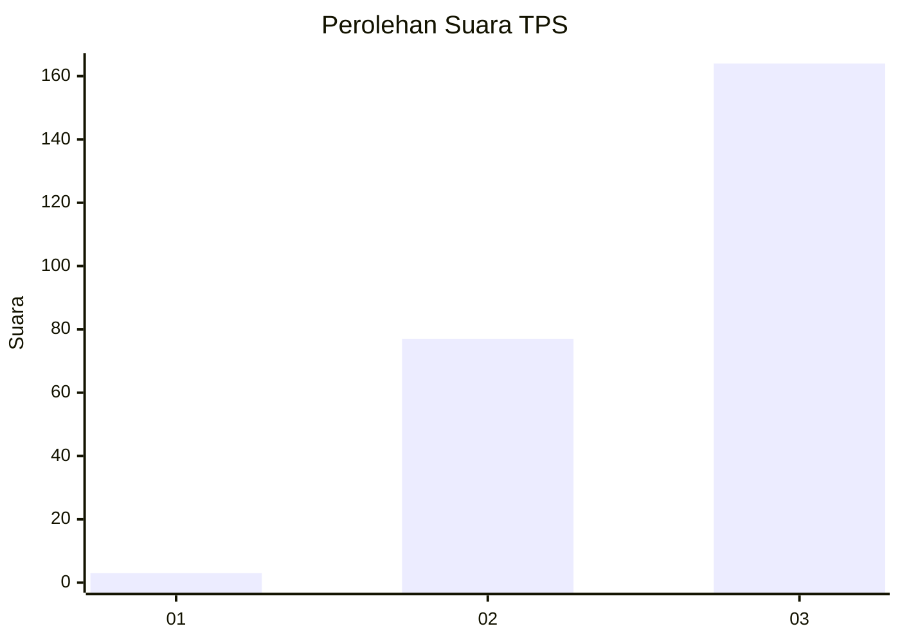
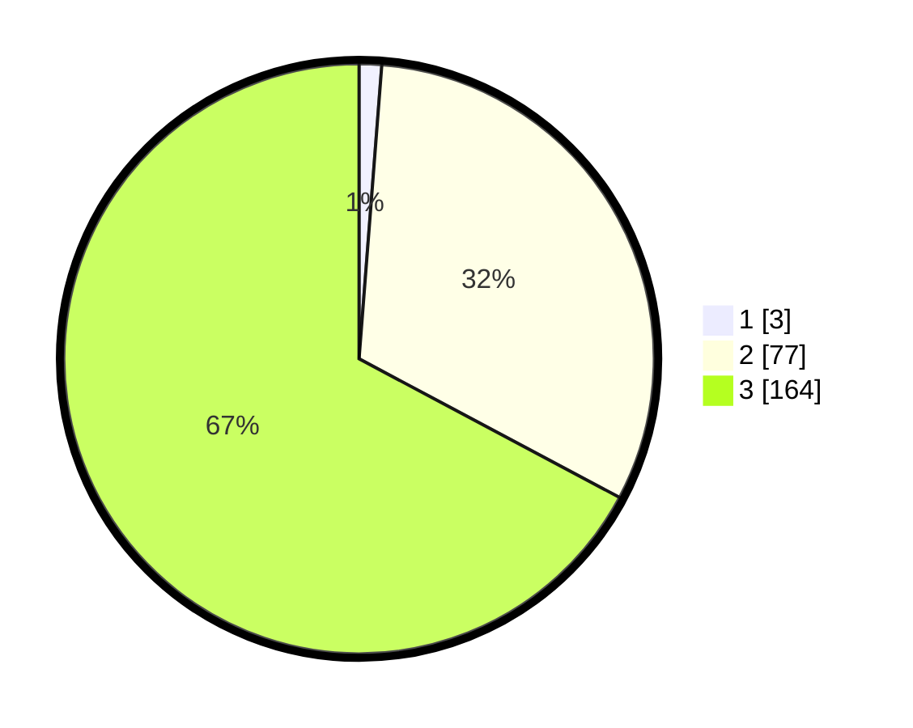

# Hasil

## Grafik

## Tabel

| No. | Nama Paslon    | Suara | Suara (raw) | Persentase |
|:--- |:-------------- | -----:| -----------:| ----------:|
| 1   | ANIES MUHAIMIN | 3     | [3][p-1]    | 1,23       |
| 2   | PRABOWO GIBRAN | 77    | [77][p-2]   | 31,56      |
| 3   | GANJAR MAHFUD  | 164   | [164][p-3]  | 67,21      |

[p-1]: https://github.com/gigit-pemilu/pemilu-2024-51-bali/blob/main/pilpres/hitung-suara/sub/51-bali/sub/03-badung/sub/03-abiansemal/sub/2007-mambal/sub/005-tps/sub/paslon-1.txt
[p-2]: https://github.com/gigit-pemilu/pemilu-2024-51-bali/blob/main/pilpres/hitung-suara/sub/51-bali/sub/03-badung/sub/03-abiansemal/sub/2007-mambal/sub/005-tps/sub/paslon-2.txt
[p-3]: https://github.com/gigit-pemilu/pemilu-2024-51-bali/blob/main/pilpres/hitung-suara/sub/51-bali/sub/03-badung/sub/03-abiansemal/sub/2007-mambal/sub/005-tps/sub/paslon-3.txt

## Foto C Plano

https://sirekap-obj-formc.kpu.go.id/745d/pemilu/ppwp/51/03/03/20/07/5103032007005-20240214-204919--9c7d435f-93ae-46ba-9caa-d85415895ea2.jpg

https://sirekap-obj-formc.kpu.go.id/745d/pemilu/ppwp/51/03/03/20/07/5103032007005-20240214-204953--2a485c65-ba18-40da-9e35-78df192e5e99.jpg

https://sirekap-obj-formc.kpu.go.id/745d/pemilu/ppwp/51/03/03/20/07/5103032007005-20240214-205004--48f1ca0e-0a48-42f2-a388-826ef5e34480.jpg

## Metadata

| Key        | Value               |
| ---------- | ------------------- |
| Time Stamp | 2024-02-15 18:00:26 |

## DATA PEMILIH TETAP

Jumlah pemilih dalam DPT: **278**.
 * L: **131**.
 * P: **147**.

## DATA PENGGUNA HAK PILIH

Jumlah pengguna hak pilih dalam DPT: **242**.
 * L: **112**.
 * P: **130**.

Jumlah pengguna hak pilih dalam DPTb: **4**.
 * L: **2**.
 * P: **2**.

Jumlah pengguna hak pilih dalam DPK: **0**.
 * L: **0**.
 * P: **0**.

Jumlah pengguna hak pilih: **246**.
 * L: **114**.
 * P: **132**.

## JUMLAH SUARA SAH DAN TIDAK SAH

JUMLAH SELURUH SUARA SAH: **244**.

JUMLAH SUARA TIDAK SAH: **2**.

JUMLAH SELURUH SUARA SAH DAN SUARA TIDAK SAH: **246**.

