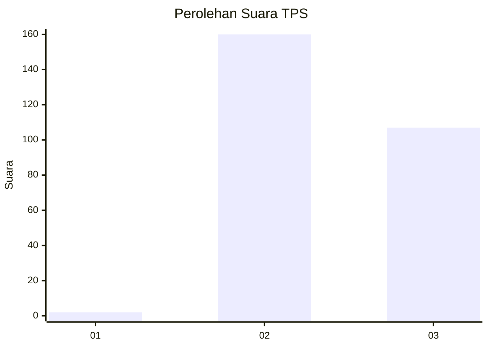
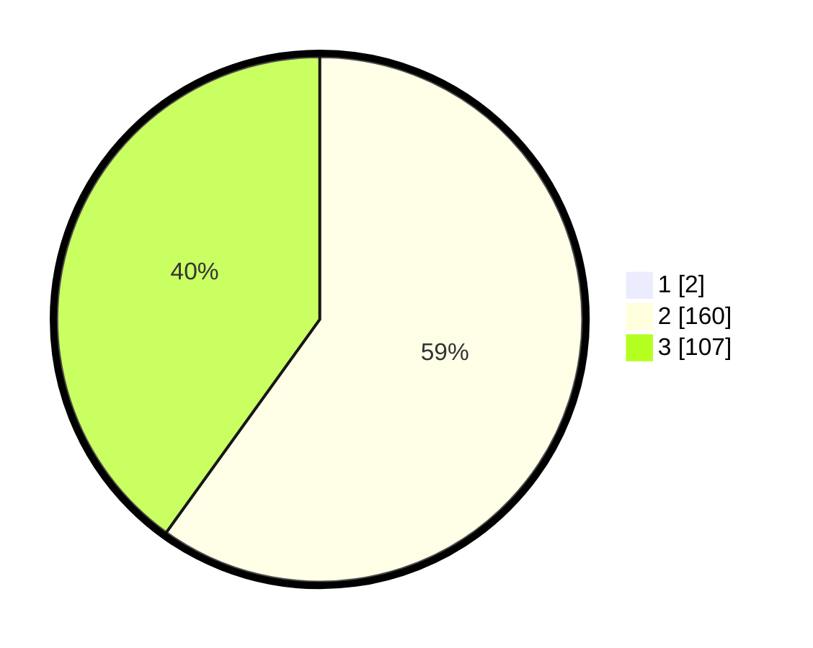

# Hasil

## Grafik

## Tabel

| No. | Nama Paslon    | Suara | Suara (raw) | Persentase |
|:--- |:-------------- | -----:| -----------:| ----------:|
| 1   | ANIES MUHAIMIN | 2     | [2][p-1]    | 0,74       |
| 2   | PRABOWO GIBRAN | 160   | [160][p-2]  | 59,48      |
| 3   | GANJAR MAHFUD  | 107   | [107][p-3]  | 39,78      |

[p-1]: https://github.com/gigit-pemilu/pemilu-2024-51-bali/blob/main/pilpres/hitung-suara/sub/51-bali/sub/03-badung/sub/03-abiansemal/sub/2007-mambal/sub/007-tps/sub/paslon-1.txt
[p-2]: https://github.com/gigit-pemilu/pemilu-2024-51-bali/blob/main/pilpres/hitung-suara/sub/51-bali/sub/03-badung/sub/03-abiansemal/sub/2007-mambal/sub/007-tps/sub/paslon-2.txt
[p-3]: https://github.com/gigit-pemilu/pemilu-2024-51-bali/blob/main/pilpres/hitung-suara/sub/51-bali/sub/03-badung/sub/03-abiansemal/sub/2007-mambal/sub/007-tps/sub/paslon-3.txt

## Foto C Plano

https://sirekap-obj-formc.kpu.go.id/224e/pemilu/ppwp/51/03/03/20/07/5103032007007-20240214-195043--0f8bb7ff-c8c2-4b7e-91e4-cde4f4d68953.jpg

https://sirekap-obj-formc.kpu.go.id/224e/pemilu/ppwp/51/03/03/20/07/5103032007007-20240214-195308--a7d1ec0f-14d2-47b9-8552-c0ebc1d01c2c.jpg

https://sirekap-obj-formc.kpu.go.id/224e/pemilu/ppwp/51/03/03/20/07/5103032007007-20240214-195356--600ffb3f-f8b3-494a-a903-bf44a488dd17.jpg

## Metadata

| Key        | Value               |
| ---------- | ------------------- |
| Time Stamp | 2024-02-15 00:41:44 |

## DATA PEMILIH TETAP

Jumlah pemilih dalam DPT: **282**.
 * L: **142**.
 * P: **140**.

## DATA PENGGUNA HAK PILIH

Jumlah pengguna hak pilih dalam DPT: **271**.
 * L: **138**.
 * P: **133**.

Jumlah pengguna hak pilih dalam DPTb: **1**.
 * L: **1**.
 * P: **0**.

Jumlah pengguna hak pilih dalam DPK: **0**.
 * L: **0**.
 * P: **0**.

Jumlah pengguna hak pilih: **272**.
 * L: **139**.
 * P: **133**.

## JUMLAH SUARA SAH DAN TIDAK SAH

JUMLAH SELURUH SUARA SAH: **269**.

JUMLAH SUARA TIDAK SAH: **3**.

JUMLAH SELURUH SUARA SAH DAN SUARA TIDAK SAH: **272**.

