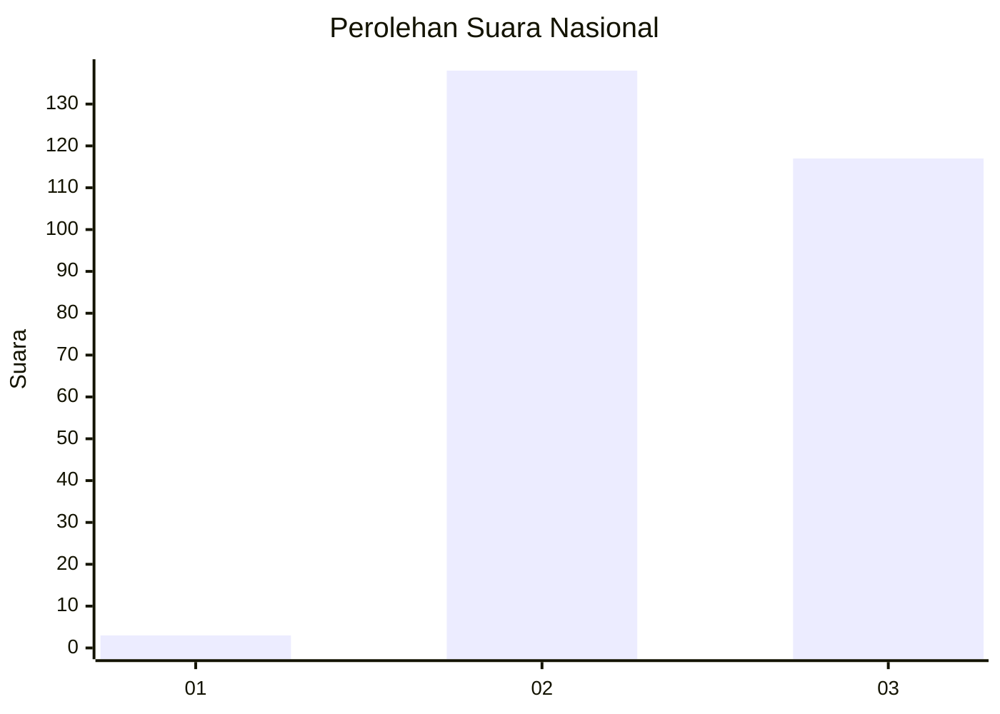
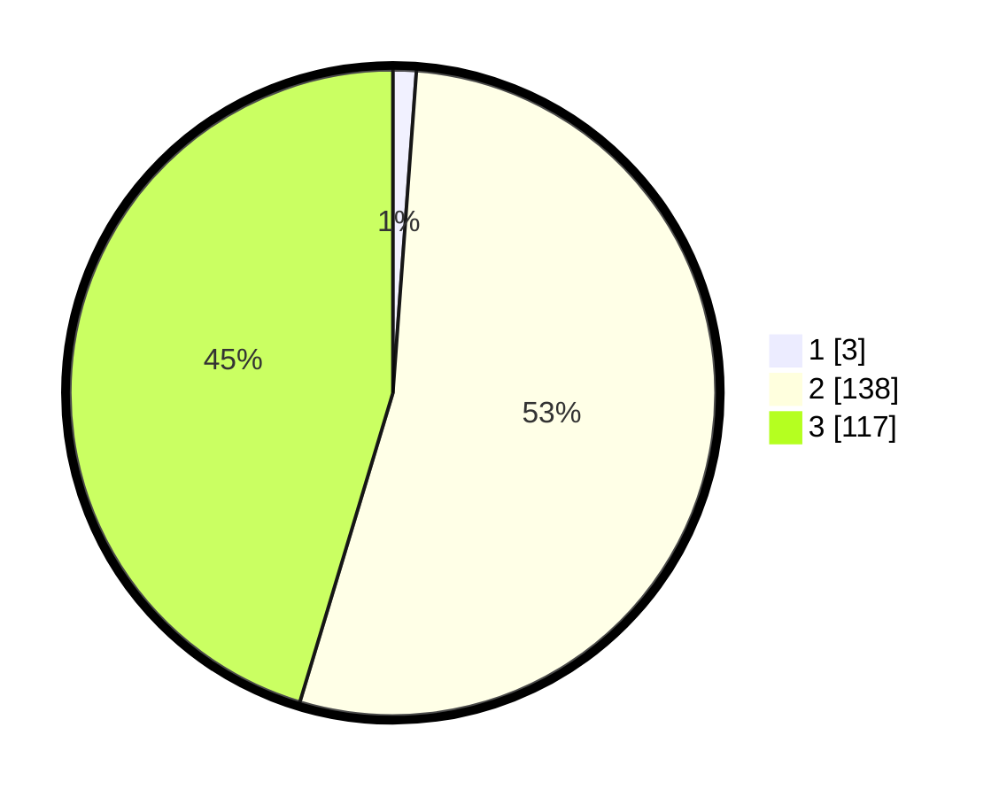

# Hasil

## Grafik

## Tabel

| No. | Nama Paslon    | Suara | Suara (raw) | Persentase |
|:--- |:-------------- | -----:| -----------:| ----------:|
| 1   | ANIES MUHAIMIN | 3     | [3][p-1]    | 1,16       |
| 2   | PRABOWO GIBRAN | 138   | [138][p-2]  | 53,49      |
| 3   | GANJAR MAHFUD  | 117   | [117][p-3]  | 45,35      |

[p-1]: https://github.com/gigit-pemilu/pemilu-2024/blob/main/pilpres/hitung-suara/sub/51-bali/sub/03-badung/sub/03-abiansemal/sub/2008-abiansemal/sub/002-tps/sub/paslon-1.txt
[p-2]: https://github.com/gigit-pemilu/pemilu-2024/blob/main/pilpres/hitung-suara/sub/51-bali/sub/03-badung/sub/03-abiansemal/sub/2008-abiansemal/sub/002-tps/sub/paslon-2.txt
[p-3]: https://github.com/gigit-pemilu/pemilu-2024/blob/main/pilpres/hitung-suara/sub/51-bali/sub/03-badung/sub/03-abiansemal/sub/2008-abiansemal/sub/002-tps/sub/paslon-3.txt

## Foto C Plano

https://sirekap-obj-formc.kpu.go.id/7763/pemilu/ppwp/51/03/03/20/08/5103032008002-20240215-062317--6bbd0d15-f960-4c0c-845f-975845585a08.jpg

https://sirekap-obj-formc.kpu.go.id/7763/pemilu/ppwp/51/03/03/20/08/5103032008002-20240215-062406--5f7f3b2b-9be9-44bf-b0b1-29550a2a96d1.jpg

https://sirekap-obj-formc.kpu.go.id/7763/pemilu/ppwp/51/03/03/20/08/5103032008002-20240215-062412--aee65e09-ba44-4906-9ed2-c06b0a8a5cc5.jpg

## Metadata

| Key        | Value               |
| ---------- | ------------------- |
| Time Stamp | 2024-02-24 22:31:28 |

