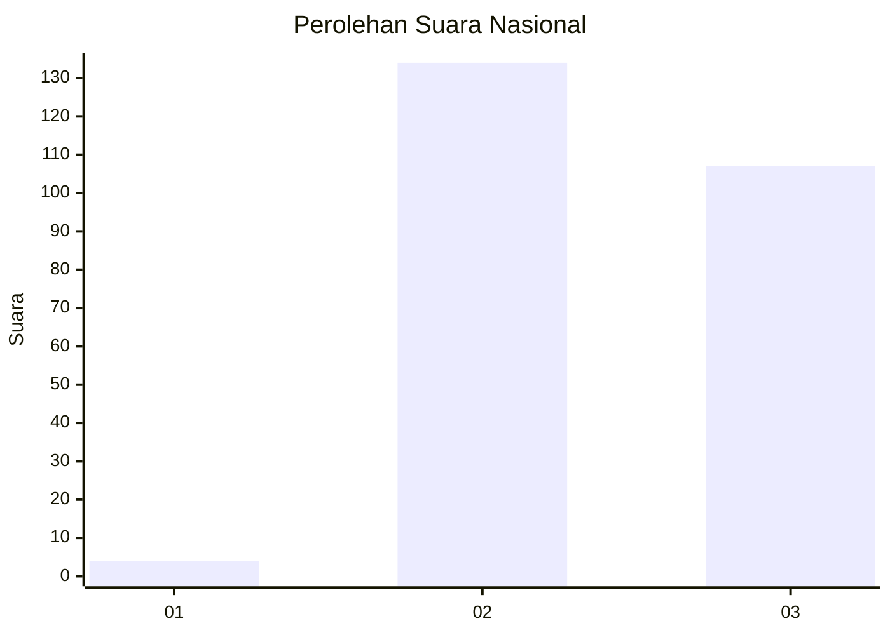
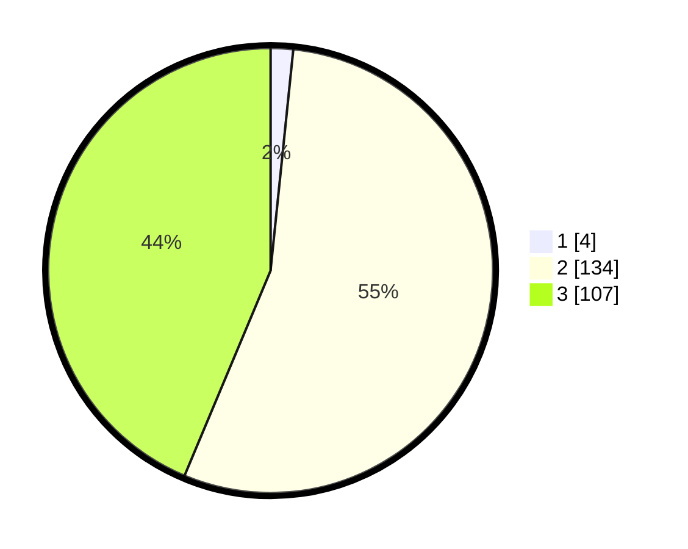

# Hasil

## Grafik

## Tabel

| No. | Nama Paslon    | Suara | Suara (raw) | Persentase |
|:--- |:-------------- | -----:| -----------:| ----------:|
| 1   | ANIES MUHAIMIN | 4     | [4][p-1]    | 1,63       |
| 2   | PRABOWO GIBRAN | 134   | [134][p-2]  | 54,69      |
| 3   | GANJAR MAHFUD  | 107   | [107][p-3]  | 43,67      |

[p-1]: https://github.com/gigit-pemilu/pemilu-2024/blob/main/pilpres/hitung-suara/sub/51-bali/sub/03-badung/sub/03-abiansemal/sub/2008-abiansemal/sub/004-tps/sub/paslon-1.txt
[p-2]: https://github.com/gigit-pemilu/pemilu-2024/blob/main/pilpres/hitung-suara/sub/51-bali/sub/03-badung/sub/03-abiansemal/sub/2008-abiansemal/sub/004-tps/sub/paslon-2.txt
[p-3]: https://github.com/gigit-pemilu/pemilu-2024/blob/main/pilpres/hitung-suara/sub/51-bali/sub/03-badung/sub/03-abiansemal/sub/2008-abiansemal/sub/004-tps/sub/paslon-3.txt

## Foto C Plano

https://sirekap-obj-formc.kpu.go.id/0edb/pemilu/ppwp/51/03/03/20/08/5103032008004-20240214-160102--08caa43a-1f11-4d8c-9453-9f97529cc0ce.jpg

https://sirekap-obj-formc.kpu.go.id/0edb/pemilu/ppwp/51/03/03/20/08/5103032008004-20240214-155334--cdbbb388-6179-4019-834b-795f164d6992.jpg

https://sirekap-obj-formc.kpu.go.id/0edb/pemilu/ppwp/51/03/03/20/08/5103032008004-20240214-155347--91d69be2-8b19-436c-ae09-4b5276e50986.jpg

## Metadata

| Key        | Value               |
| ---------- | ------------------- |
| Time Stamp | 2024-02-24 22:31:28 |

