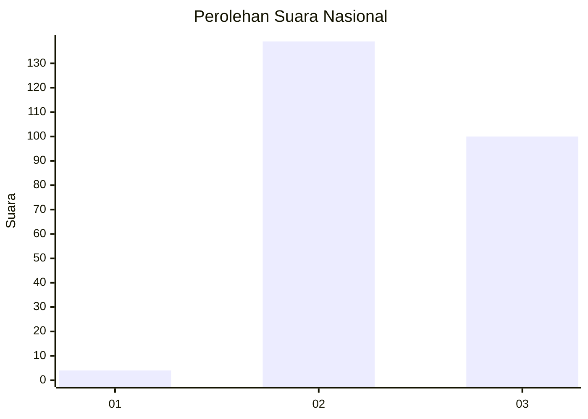
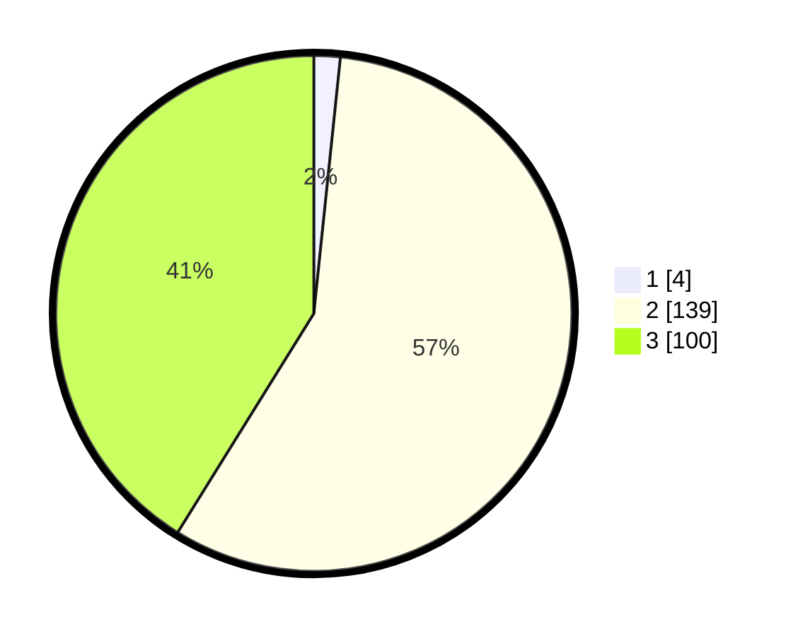

# Hasil

## Grafik

## Tabel

| No. | Nama Paslon    | Suara | Suara (raw) | Persentase |
|:--- |:-------------- | -----:| -----------:| ----------:|
| 1   | ANIES MUHAIMIN | 4     | [4][p-1]    | 1,65       |
| 2   | PRABOWO GIBRAN | 139   | [139][p-2]  | 57,20      |
| 3   | GANJAR MAHFUD  | 100   | [100][p-3]  | 41,15      |

[p-1]: https://github.com/gigit-pemilu/pemilu-2024/blob/main/pilpres/hitung-suara/sub/51-bali/sub/03-badung/sub/03-abiansemal/sub/2008-abiansemal/sub/006-tps/sub/paslon-1.txt
[p-2]: https://github.com/gigit-pemilu/pemilu-2024/blob/main/pilpres/hitung-suara/sub/51-bali/sub/03-badung/sub/03-abiansemal/sub/2008-abiansemal/sub/006-tps/sub/paslon-2.txt
[p-3]: https://github.com/gigit-pemilu/pemilu-2024/blob/main/pilpres/hitung-suara/sub/51-bali/sub/03-badung/sub/03-abiansemal/sub/2008-abiansemal/sub/006-tps/sub/paslon-3.txt

## Foto C Plano

https://sirekap-obj-formc.kpu.go.id/bd41/pemilu/ppwp/51/03/03/20/08/5103032008006-20240214-221342--65fafe2d-2933-4e54-8e65-6fca36691d1c.jpg

https://sirekap-obj-formc.kpu.go.id/bd41/pemilu/ppwp/51/03/03/20/08/5103032008006-20240214-232130--1e622e76-48fc-4fde-bf82-85db05d226db.jpg

https://sirekap-obj-formc.kpu.go.id/bd41/pemilu/ppwp/51/03/03/20/08/5103032008006-20240214-232211--e798f0ff-ca93-41d4-9d35-1c9cd6c0c2c8.jpg

## Metadata

| Key        | Value               |
| ---------- | ------------------- |
| Time Stamp | 2024-02-15 23:29:50 |

