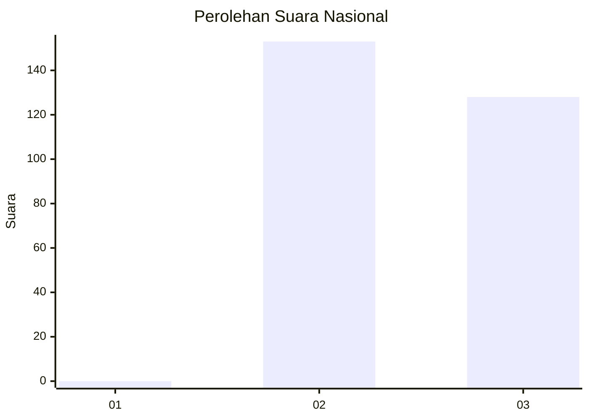
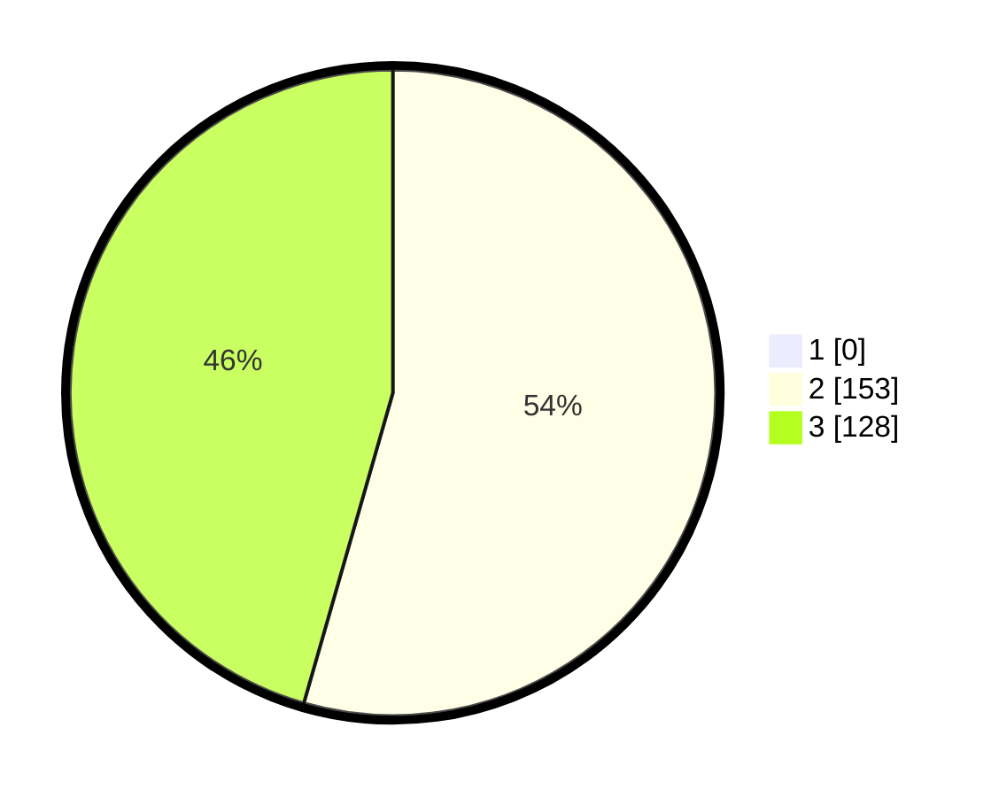

# Hasil

## Grafik

## Tabel

| No. | Nama Paslon    | Suara | Suara (raw) | Persentase |
|:--- |:-------------- | -----:| -----------:| ----------:|
| 1   | ANIES MUHAIMIN | 0     | [0][p-1]    | 0,00       |
| 2   | PRABOWO GIBRAN | 153   | [153][p-2]  | 54,45      |
| 3   | GANJAR MAHFUD  | 128   | [128][p-3]  | 45,55      |

[p-1]: https://github.com/gigit-pemilu/pemilu-2024/blob/main/pilpres/hitung-suara/sub/51-bali/sub/03-badung/sub/03-abiansemal/sub/2008-abiansemal/sub/014-tps/sub/paslon-1.txt
[p-2]: https://github.com/gigit-pemilu/pemilu-2024/blob/main/pilpres/hitung-suara/sub/51-bali/sub/03-badung/sub/03-abiansemal/sub/2008-abiansemal/sub/014-tps/sub/paslon-2.txt
[p-3]: https://github.com/gigit-pemilu/pemilu-2024/blob/main/pilpres/hitung-suara/sub/51-bali/sub/03-badung/sub/03-abiansemal/sub/2008-abiansemal/sub/014-tps/sub/paslon-3.txt

## Foto C Plano

https://sirekap-obj-formc.kpu.go.id/9c2b/pemilu/ppwp/51/03/03/20/08/5103032008014-20240214-232803--56165a6a-edf8-405b-acf8-83a158e487fb.jpg

https://sirekap-obj-formc.kpu.go.id/9c2b/pemilu/ppwp/51/03/03/20/08/5103032008014-20240214-233504--561fe9d2-2b64-493e-b73e-639f8c2517a1.jpg

https://sirekap-obj-formc.kpu.go.id/9c2b/pemilu/ppwp/51/03/03/20/08/5103032008014-20240214-233600--311375c7-55b7-4396-a3a8-90f12d71a73e.jpg

## Metadata

| Key        | Value               |
| ---------- | ------------------- |
| Time Stamp | 2024-02-24 22:31:28 |

