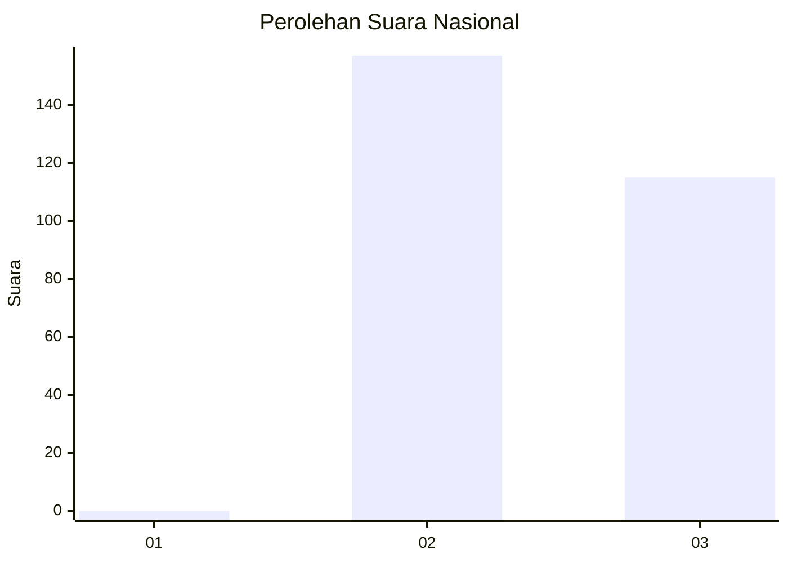
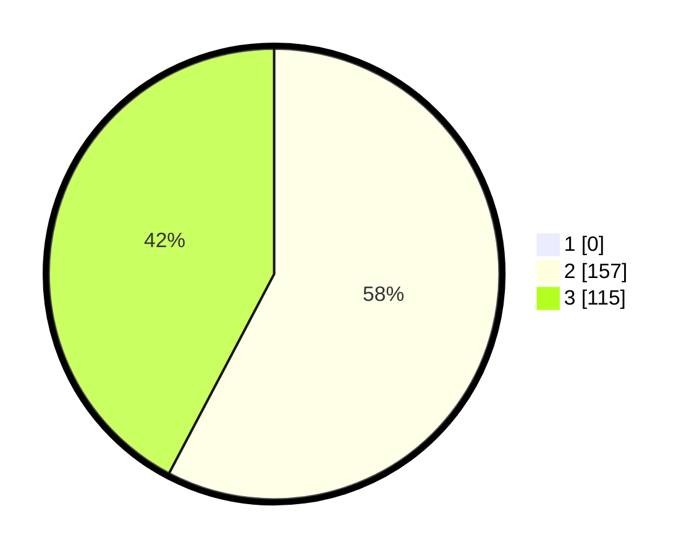

# Hasil

## Grafik

## Tabel

| No. | Nama Paslon    | Suara | Suara (raw) | Persentase |
|:--- |:-------------- | -----:| -----------:| ----------:|
| 1   | ANIES MUHAIMIN | 0     | [0][p-1]    | 0,00       |
| 2   | PRABOWO GIBRAN | 157   | [157][p-2]  | 57,72      |
| 3   | GANJAR MAHFUD  | 115   | [115][p-3]  | 42,28      |

[p-1]: https://github.com/gigit-pemilu/pemilu-2024/blob/main/pilpres/hitung-suara/sub/51-bali/sub/03-badung/sub/03-abiansemal/sub/2008-abiansemal/sub/022-tps/sub/paslon-1.txt
[p-2]: https://github.com/gigit-pemilu/pemilu-2024/blob/main/pilpres/hitung-suara/sub/51-bali/sub/03-badung/sub/03-abiansemal/sub/2008-abiansemal/sub/022-tps/sub/paslon-2.txt
[p-3]: https://github.com/gigit-pemilu/pemilu-2024/blob/main/pilpres/hitung-suara/sub/51-bali/sub/03-badung/sub/03-abiansemal/sub/2008-abiansemal/sub/022-tps/sub/paslon-3.txt

## Foto C Plano

https://sirekap-obj-formc.kpu.go.id/f2f2/pemilu/ppwp/51/03/03/20/08/5103032008022-20240214-194630--2d7883d8-d7a2-4732-9adf-0573b3fbdec5.jpg

https://sirekap-obj-formc.kpu.go.id/f2f2/pemilu/ppwp/51/03/03/20/08/5103032008022-20240214-194642--8eef36a2-8df7-474c-9f93-459737776339.jpg

https://sirekap-obj-formc.kpu.go.id/f2f2/pemilu/ppwp/51/03/03/20/08/5103032008022-20240214-194648--818fca1d-0b97-446f-950d-e2bdd959f9b2.jpg

## Metadata

| Key        | Value               |
| ---------- | ------------------- |
| Time Stamp | 2024-02-24 22:31:28 |

