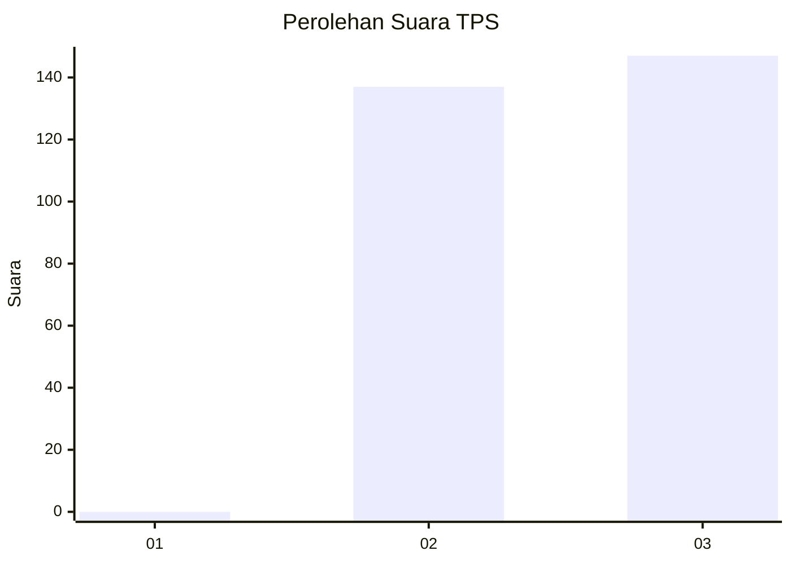
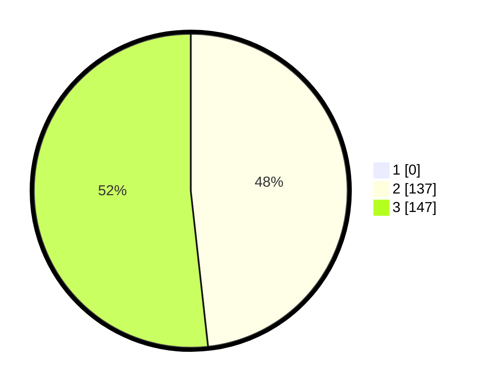

# Hasil

## Grafik

## Tabel

| No. | Nama Paslon    | Suara | Suara (raw) | Persentase |
|:--- |:-------------- | -----:| -----------:| ----------:|
| 1   | ANIES MUHAIMIN | 0     | [0][p-1]    | 0,00       |
| 2   | PRABOWO GIBRAN | 137   | [137][p-2]  | 48,24      |
| 3   | GANJAR MAHFUD  | 147   | [147][p-3]  | 51,76      |

[p-1]: https://github.com/gigit-pemilu/pemilu-2024-51-bali/blob/main/pilpres/hitung-suara/sub/51-bali/sub/03-badung/sub/03-abiansemal/sub/2008-abiansemal/sub/023-tps/sub/paslon-1.txt
[p-2]: https://github.com/gigit-pemilu/pemilu-2024-51-bali/blob/main/pilpres/hitung-suara/sub/51-bali/sub/03-badung/sub/03-abiansemal/sub/2008-abiansemal/sub/023-tps/sub/paslon-2.txt
[p-3]: https://github.com/gigit-pemilu/pemilu-2024-51-bali/blob/main/pilpres/hitung-suara/sub/51-bali/sub/03-badung/sub/03-abiansemal/sub/2008-abiansemal/sub/023-tps/sub/paslon-3.txt

## Foto C Plano

https://sirekap-obj-formc.kpu.go.id/6c18/pemilu/ppwp/51/03/03/20/08/5103032008023-20240214-231646--9b3e80af-9df0-46ac-bb59-ab4fc2dc6ef3.jpg

https://sirekap-obj-formc.kpu.go.id/6c18/pemilu/ppwp/51/03/03/20/08/5103032008023-20240214-231950--76459727-bd68-451a-b9e5-17fdb5df5d39.jpg

https://sirekap-obj-formc.kpu.go.id/6c18/pemilu/ppwp/51/03/03/20/08/5103032008023-20240214-232110--0711b7c4-bb48-48af-9298-3cb58c58eeee.jpg

## Metadata

| Key        | Value               |
| ---------- | ------------------- |
| Time Stamp | 2024-02-15 15:00:29 |

