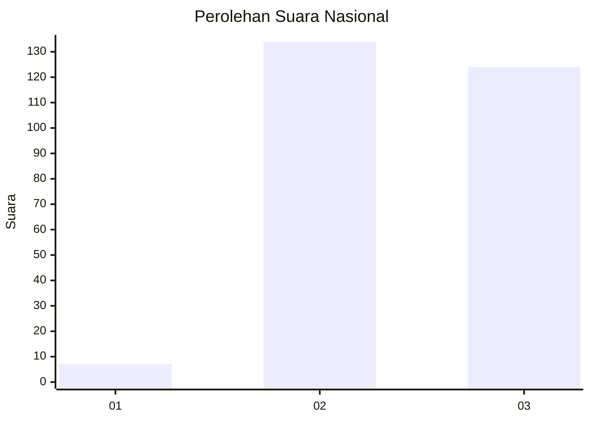
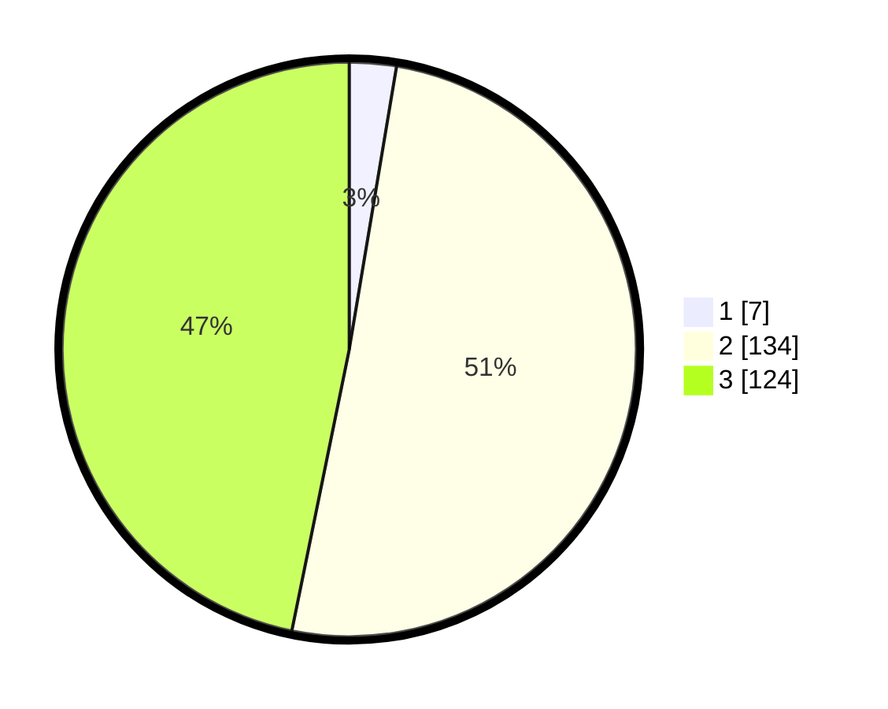

# Hasil

## Grafik

## Tabel

| No. | Nama Paslon    | Suara | Suara (raw) | Persentase |
|:--- |:-------------- | -----:| -----------:| ----------:|
| 1   | ANIES MUHAIMIN | 7     | [7][p-1]    | 2,64       |
| 2   | PRABOWO GIBRAN | 134   | [134][p-2]  | 50,57      |
| 3   | GANJAR MAHFUD  | 124   | [124][p-3]  | 46,79      |

[p-1]: https://github.com/gigit-pemilu/pemilu-2024/blob/main/pilpres/hitung-suara/sub/51-bali/sub/03-badung/sub/03-abiansemal/sub/2009-bongkasa/sub/003-tps/sub/paslon-1.txt
[p-2]: https://github.com/gigit-pemilu/pemilu-2024/blob/main/pilpres/hitung-suara/sub/51-bali/sub/03-badung/sub/03-abiansemal/sub/2009-bongkasa/sub/003-tps/sub/paslon-2.txt
[p-3]: https://github.com/gigit-pemilu/pemilu-2024/blob/main/pilpres/hitung-suara/sub/51-bali/sub/03-badung/sub/03-abiansemal/sub/2009-bongkasa/sub/003-tps/sub/paslon-3.txt

## Foto C Plano

https://sirekap-obj-formc.kpu.go.id/302f/pemilu/ppwp/51/03/03/20/09/5103032009003-20240214-210639--d22b86b0-ffed-43c3-acb2-a90c9b76f8f0.jpg

https://sirekap-obj-formc.kpu.go.id/302f/pemilu/ppwp/51/03/03/20/09/5103032009003-20240214-184857--e61974fd-7cd0-48d6-b191-a3496eb5459b.jpg

https://sirekap-obj-formc.kpu.go.id/302f/pemilu/ppwp/51/03/03/20/09/5103032009003-20240214-184910--71b31d0c-e0df-4595-bbf9-bcf5898b14a4.jpg

## Metadata

| Key        | Value               |
| ---------- | ------------------- |
| Time Stamp | 2024-02-21 17:00:00 |

## DATA PEMILIH TETAP

Jumlah pemilih dalam DPT: **295**.
 * L: **129**.
 * P: **166**.

## DATA PENGGUNA HAK PILIH

Jumlah pengguna hak pilih dalam DPT: **273**.
 * L: **120**.
 * P: **153**.

Jumlah pengguna hak pilih dalam DPTb: **0**.
 * L: **0**.
 * P: **0**.

Jumlah pengguna hak pilih dalam DPK: **1**.
 * L: **0**.
 * P: **1**.

Jumlah pengguna hak pilih: **274**.
 * L: **120**.
 * P: **154**.

## JUMLAH SUARA SAH DAN TIDAK SAH

JUMLAH SELURUH SUARA SAH: **265**.

JUMLAH SUARA TIDAK SAH: **9**.

JUMLAH SELURUH SUARA SAH DAN SUARA TIDAK SAH: **274**.

