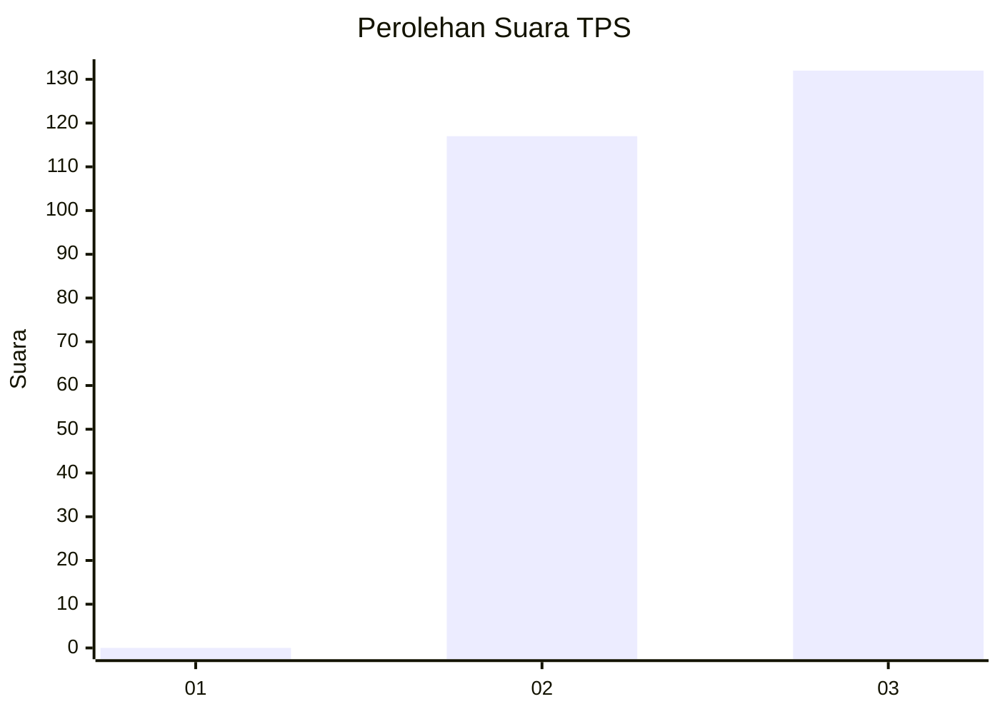
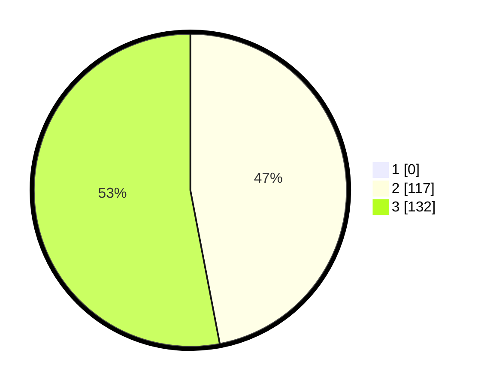

# Hasil

## Grafik

## Tabel

| No. | Nama Paslon    | Suara | Suara (raw) | Persentase |
|:--- |:-------------- | -----:| -----------:| ----------:|
| 1   | ANIES MUHAIMIN | 0     | [0][p-1]    | 0,00       |
| 2   | PRABOWO GIBRAN | 117   | [117][p-2]  | 46,99      |
| 3   | GANJAR MAHFUD  | 132   | [132][p-3]  | 53,01      |

[p-1]: https://github.com/gigit-pemilu/pemilu-2024-51-bali/blob/main/pilpres/hitung-suara/sub/51-bali/sub/03-badung/sub/03-abiansemal/sub/2009-bongkasa/sub/005-tps/sub/paslon-1.txt
[p-2]: https://github.com/gigit-pemilu/pemilu-2024-51-bali/blob/main/pilpres/hitung-suara/sub/51-bali/sub/03-badung/sub/03-abiansemal/sub/2009-bongkasa/sub/005-tps/sub/paslon-2.txt
[p-3]: https://github.com/gigit-pemilu/pemilu-2024-51-bali/blob/main/pilpres/hitung-suara/sub/51-bali/sub/03-badung/sub/03-abiansemal/sub/2009-bongkasa/sub/005-tps/sub/paslon-3.txt

## Foto C Plano

https://sirekap-obj-formc.kpu.go.id/4f1c/pemilu/ppwp/51/03/03/20/09/5103032009005-20240215-115508--9db03889-ce68-49b9-9f09-ee35272ded50.jpg

https://sirekap-obj-formc.kpu.go.id/4f1c/pemilu/ppwp/51/03/03/20/09/5103032009005-20240214-195211--c79c610a-4fce-41a9-8156-0bb36697f45e.jpg

https://sirekap-obj-formc.kpu.go.id/4f1c/pemilu/ppwp/51/03/03/20/09/5103032009005-20240214-195345--d1f8ffa4-ce1c-414e-bf5d-18c1b8181ef5.jpg

## Metadata

| Key        | Value               |
| ---------- | ------------------- |
| Time Stamp | 2024-02-17 05:00:03 |

## DATA PEMILIH TETAP

Jumlah pemilih dalam DPT: **278**.
 * L: **143**.
 * P: **135**.

## DATA PENGGUNA HAK PILIH

Jumlah pengguna hak pilih dalam DPT: **250**.
 * L: **128**.
 * P: **122**.

Jumlah pengguna hak pilih dalam DPTb: **0**.
 * L: **0**.
 * P: **0**.

Jumlah pengguna hak pilih dalam DPK: **3**.
 * L: **0**.
 * P: **3**.

Jumlah pengguna hak pilih: **253**.
 * L: **128**.
 * P: **125**.

## JUMLAH SUARA SAH DAN TIDAK SAH

JUMLAH SELURUH SUARA SAH: **249**.

JUMLAH SUARA TIDAK SAH: **4**.

JUMLAH SELURUH SUARA SAH DAN SUARA TIDAK SAH: **253**.

