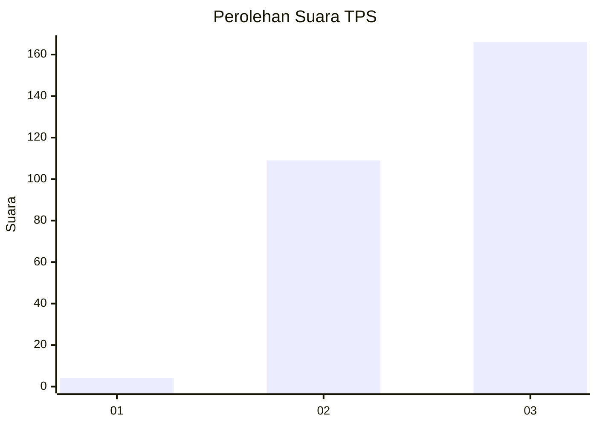
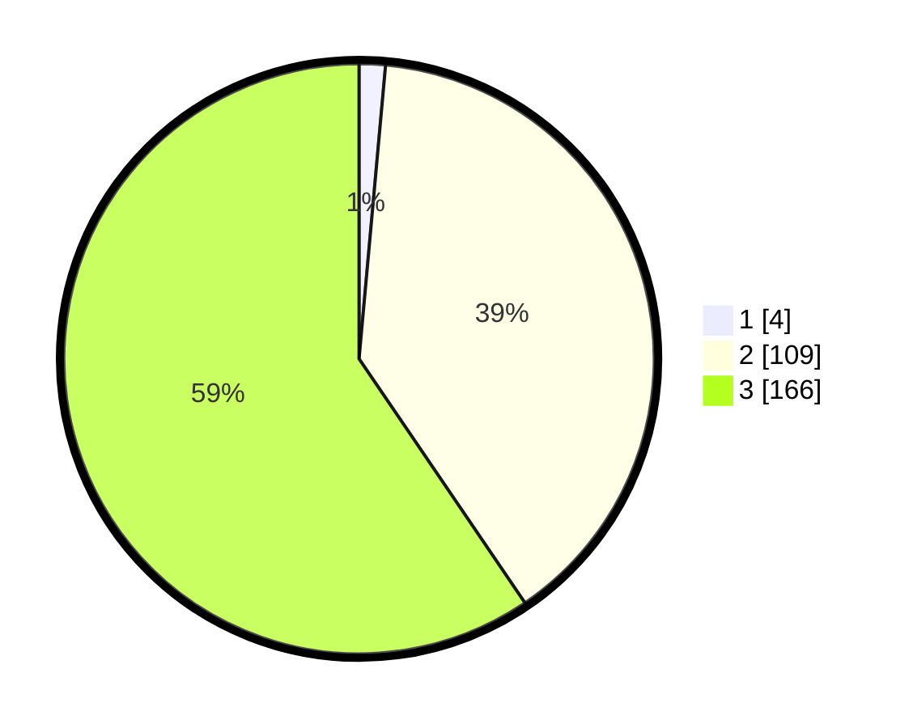

# Hasil

## Grafik

## Tabel

| No. | Nama Paslon    | Suara | Suara (raw) | Persentase |
|:--- |:-------------- | -----:| -----------:| ----------:|
| 1   | ANIES MUHAIMIN | 4     | [4][p-1]    | 1,43       |
| 2   | PRABOWO GIBRAN | 109   | [109][p-2]  | 39,07      |
| 3   | GANJAR MAHFUD  | 166   | [166][p-3]  | 59,50      |

[p-1]: https://github.com/gigit-pemilu/pemilu-2024-51-bali/blob/main/pilpres/hitung-suara/sub/51-bali/sub/03-badung/sub/03-abiansemal/sub/2010-taman/sub/001-tps/sub/paslon-1.txt
[p-2]: https://github.com/gigit-pemilu/pemilu-2024-51-bali/blob/main/pilpres/hitung-suara/sub/51-bali/sub/03-badung/sub/03-abiansemal/sub/2010-taman/sub/001-tps/sub/paslon-2.txt
[p-3]: https://github.com/gigit-pemilu/pemilu-2024-51-bali/blob/main/pilpres/hitung-suara/sub/51-bali/sub/03-badung/sub/03-abiansemal/sub/2010-taman/sub/001-tps/sub/paslon-3.txt

## Foto C Plano

https://sirekap-obj-formc.kpu.go.id/cb10/pemilu/ppwp/51/03/03/20/10/5103032010001-20240217-174910--5f6bd755-33d0-4fae-bae3-87032768c361.jpg

https://sirekap-obj-formc.kpu.go.id/cb10/pemilu/ppwp/51/03/03/20/10/5103032010001-20240217-174936--a2008a91-055a-403d-9a85-a6d80b7fb66a.jpg

https://sirekap-obj-formc.kpu.go.id/cb10/pemilu/ppwp/51/03/03/20/10/5103032010001-20240217-174959--84402974-0da7-48a2-a329-f156667a03e3.jpg

## Metadata

| Key        | Value               |
| ---------- | ------------------- |
| Time Stamp | 2024-02-17 18:00:00 |

## DATA PEMILIH TETAP

Jumlah pemilih dalam DPT: **296**.
 * L: **144**.
 * P: **152**.

## DATA PENGGUNA HAK PILIH

Jumlah pengguna hak pilih dalam DPT: **284**.
 * L: **142**.
 * P: **142**.

Jumlah pengguna hak pilih dalam DPTb: **0**.
 * L: **0**.
 * P: **0**.

Jumlah pengguna hak pilih dalam DPK: **0**.
 * L: **0**.
 * P: **0**.

Jumlah pengguna hak pilih: **284**.
 * L: **142**.
 * P: **142**.

## JUMLAH SUARA SAH DAN TIDAK SAH

JUMLAH SELURUH SUARA SAH: **279**.

JUMLAH SUARA TIDAK SAH: **5**.

JUMLAH SELURUH SUARA SAH DAN SUARA TIDAK SAH: **284**.

