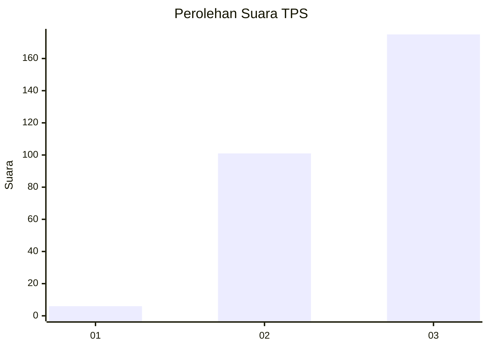
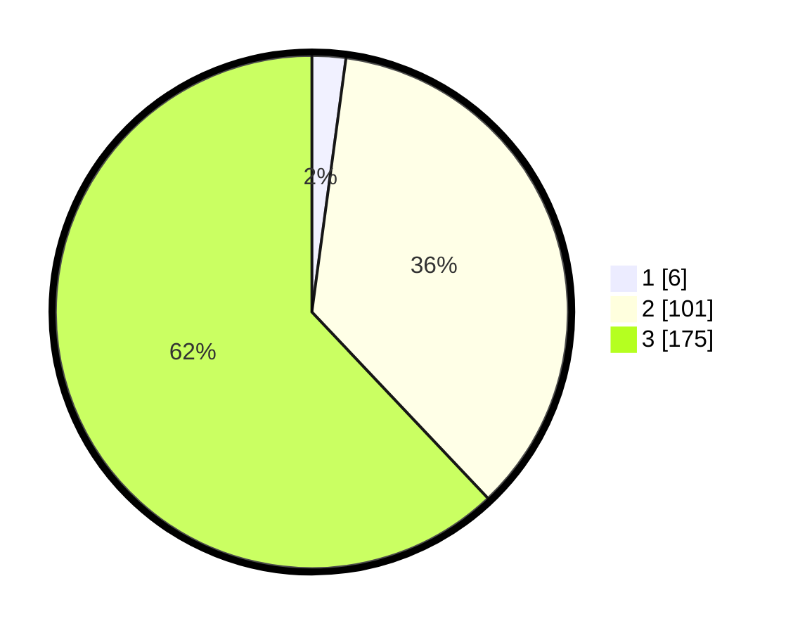

# Hasil

## Grafik

## Tabel

| No. | Nama Paslon    | Suara | Suara (raw) | Persentase |
|:--- |:-------------- | -----:| -----------:| ----------:|
| 1   | ANIES MUHAIMIN | 6     | [6][p-1]    | 2,13       |
| 2   | PRABOWO GIBRAN | 101   | [101][p-2]  | 35,82      |
| 3   | GANJAR MAHFUD  | 175   | [175][p-3]  | 62,06      |

[p-1]: https://github.com/gigit-pemilu/pemilu-2024-51-bali/blob/main/pilpres/hitung-suara/sub/51-bali/sub/03-badung/sub/03-abiansemal/sub/2010-taman/sub/002-tps/sub/paslon-1.txt
[p-2]: https://github.com/gigit-pemilu/pemilu-2024-51-bali/blob/main/pilpres/hitung-suara/sub/51-bali/sub/03-badung/sub/03-abiansemal/sub/2010-taman/sub/002-tps/sub/paslon-2.txt
[p-3]: https://github.com/gigit-pemilu/pemilu-2024-51-bali/blob/main/pilpres/hitung-suara/sub/51-bali/sub/03-badung/sub/03-abiansemal/sub/2010-taman/sub/002-tps/sub/paslon-3.txt

## Foto C Plano

https://sirekap-obj-formc.kpu.go.id/005b/pemilu/ppwp/51/03/03/20/10/5103032010002-20240216-122025--b622bc89-d7ac-4b03-8edd-f6567f62e106.jpg

https://sirekap-obj-formc.kpu.go.id/005b/pemilu/ppwp/51/03/03/20/10/5103032010002-20240214-155800--f731f8f5-d3e4-4241-89c6-79ec70aeab38.jpg

https://sirekap-obj-formc.kpu.go.id/005b/pemilu/ppwp/51/03/03/20/10/5103032010002-20240216-122027--da4fc771-23cf-4d66-990a-3d2d8fe2a4fb.jpg

## Metadata

| Key        | Value               |
| ---------- | ------------------- |
| Time Stamp | 2024-02-16 12:51:22 |

## DATA PEMILIH TETAP

Jumlah pemilih dalam DPT: **294**.
 * L: **136**.
 * P: **158**.

## DATA PENGGUNA HAK PILIH

Jumlah pengguna hak pilih dalam DPT: **288**.
 * L: **135**.
 * P: **153**.

Jumlah pengguna hak pilih dalam DPTb: **0**.
 * L: **0**.
 * P: **0**.

Jumlah pengguna hak pilih dalam DPK: **0**.
 * L: **0**.
 * P: **0**.

Jumlah pengguna hak pilih: **288**.
 * L: **135**.
 * P: **153**.

## JUMLAH SUARA SAH DAN TIDAK SAH

JUMLAH SELURUH SUARA SAH: **282**.

JUMLAH SUARA TIDAK SAH: **6**.

JUMLAH SELURUH SUARA SAH DAN SUARA TIDAK SAH: **288**.

