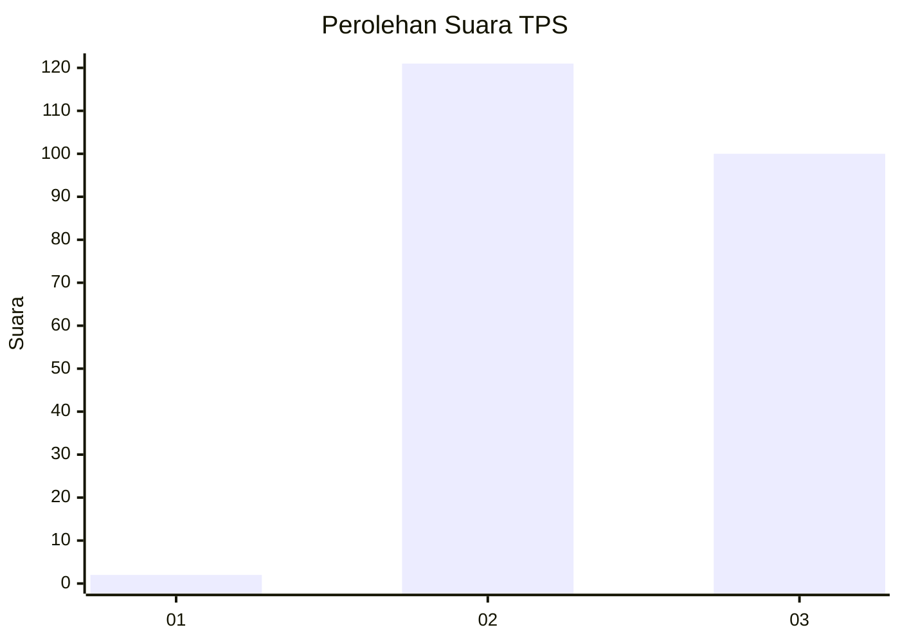
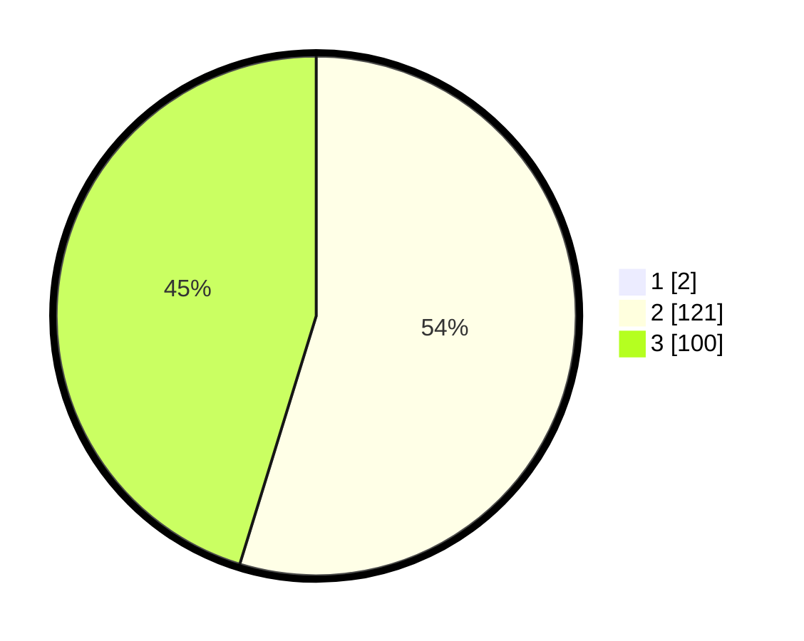

# Hasil

## Grafik

## Tabel

| No. | Nama Paslon    | Suara | Suara (raw) | Persentase |
|:--- |:-------------- | -----:| -----------:| ----------:|
| 1   | ANIES MUHAIMIN | 2     | [2][p-1]    | 0,90       |
| 2   | PRABOWO GIBRAN | 121   | [121][p-2]  | 54,26      |
| 3   | GANJAR MAHFUD  | 100   | [100][p-3]  | 44,84      |

[p-1]: https://github.com/gigit-pemilu/pemilu-2024-51-bali/blob/main/pilpres/hitung-suara/sub/51-bali/sub/03-badung/sub/03-abiansemal/sub/2010-taman/sub/004-tps/sub/paslon-1.txt
[p-2]: https://github.com/gigit-pemilu/pemilu-2024-51-bali/blob/main/pilpres/hitung-suara/sub/51-bali/sub/03-badung/sub/03-abiansemal/sub/2010-taman/sub/004-tps/sub/paslon-2.txt
[p-3]: https://github.com/gigit-pemilu/pemilu-2024-51-bali/blob/main/pilpres/hitung-suara/sub/51-bali/sub/03-badung/sub/03-abiansemal/sub/2010-taman/sub/004-tps/sub/paslon-3.txt

## Foto C Plano

https://sirekap-obj-formc.kpu.go.id/7a07/pemilu/ppwp/51/03/03/20/10/5103032010004-20240214-155208--9a6bb8c8-da4c-4ed3-bb54-5816670554cf.jpg

https://sirekap-obj-formc.kpu.go.id/7a07/pemilu/ppwp/51/03/03/20/10/5103032010004-20240214-155233--8f5b9111-6328-40e8-b614-d3ae0e7e814c.jpg

https://sirekap-obj-formc.kpu.go.id/7a07/pemilu/ppwp/51/03/03/20/10/5103032010004-20240214-155245--259081c3-4582-46b8-8563-efc8cb54f23b.jpg

## Metadata

| Key        | Value               |
| ---------- | ------------------- |
| Time Stamp | 2024-02-15 01:47:43 |

## DATA PEMILIH TETAP

Jumlah pemilih dalam DPT: **239**.
 * L: **118**.
 * P: **121**.

## DATA PENGGUNA HAK PILIH

Jumlah pengguna hak pilih dalam DPT: **225**.
 * L: **109**.
 * P: **116**.

Jumlah pengguna hak pilih dalam DPTb: **0**.
 * L: **0**.
 * P: **0**.

Jumlah pengguna hak pilih dalam DPK: **2**.
 * L: **1**.
 * P: **1**.

Jumlah pengguna hak pilih: **227**.
 * L: **110**.
 * P: **117**.

## JUMLAH SUARA SAH DAN TIDAK SAH

JUMLAH SELURUH SUARA SAH: **223**.

JUMLAH SUARA TIDAK SAH: **4**.

JUMLAH SELURUH SUARA SAH DAN SUARA TIDAK SAH: **227**.

