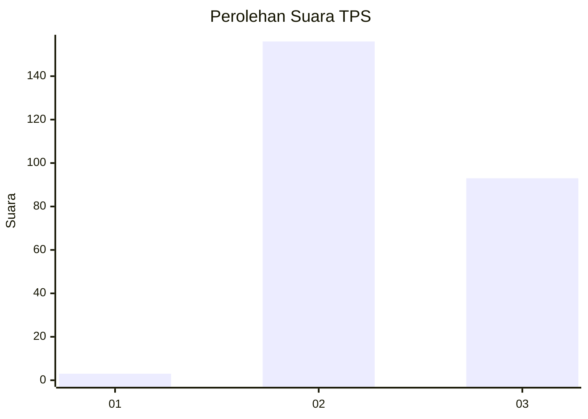
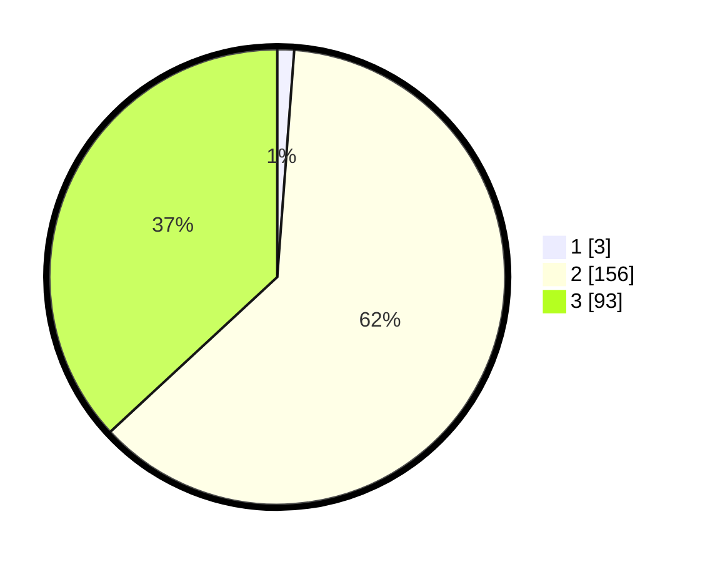

# Hasil

## Grafik

## Tabel

| No. | Nama Paslon    | Suara | Suara (raw) | Persentase |
|:--- |:-------------- | -----:| -----------:| ----------:|
| 1   | ANIES MUHAIMIN | 3     | [3][p-1]    | 1,19       |
| 2   | PRABOWO GIBRAN | 156   | [156][p-2]  | 61,90      |
| 3   | GANJAR MAHFUD  | 93    | [93][p-3]   | 36,90      |

[p-1]: https://github.com/gigit-pemilu/pemilu-2024-51-bali/blob/main/pilpres/hitung-suara/sub/51-bali/sub/03-badung/sub/03-abiansemal/sub/2010-taman/sub/009-tps/sub/paslon-1.txt
[p-2]: https://github.com/gigit-pemilu/pemilu-2024-51-bali/blob/main/pilpres/hitung-suara/sub/51-bali/sub/03-badung/sub/03-abiansemal/sub/2010-taman/sub/009-tps/sub/paslon-2.txt
[p-3]: https://github.com/gigit-pemilu/pemilu-2024-51-bali/blob/main/pilpres/hitung-suara/sub/51-bali/sub/03-badung/sub/03-abiansemal/sub/2010-taman/sub/009-tps/sub/paslon-3.txt

## Foto C Plano

https://sirekap-obj-formc.kpu.go.id/4b34/pemilu/ppwp/51/03/03/20/10/5103032010009-20240215-013434--28a5ec1d-c7bd-4746-a223-ecf48f7cb6fc.jpg

https://sirekap-obj-formc.kpu.go.id/4b34/pemilu/ppwp/51/03/03/20/10/5103032010009-20240215-013557--a7d955bf-8892-4537-bbbe-4f367f7798de.jpg

https://sirekap-obj-formc.kpu.go.id/4b34/pemilu/ppwp/51/03/03/20/10/5103032010009-20240215-013650--76ccf40d-768b-4a19-a8cb-4c91fad569da.jpg

## Metadata

| Key        | Value               |
| ---------- | ------------------- |
| Time Stamp | 2024-02-24 22:31:28 |

