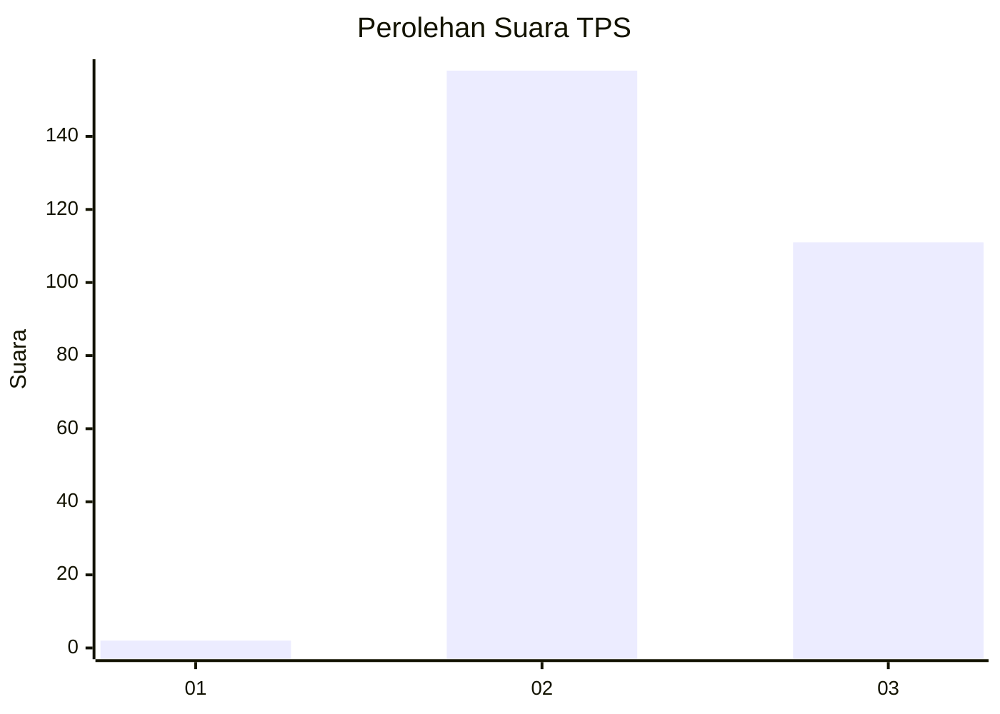
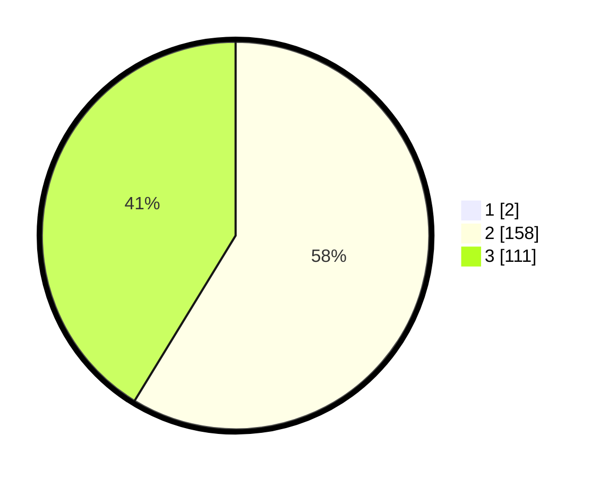

# Hasil

## Grafik

## Tabel

| No. | Nama Paslon    | Suara | Suara (raw) | Persentase |
|:--- |:-------------- | -----:| -----------:| ----------:|
| 1   | ANIES MUHAIMIN | 2     | [2][p-1]    | 0,74       |
| 2   | PRABOWO GIBRAN | 158   | [158][p-2]  | 58,30      |
| 3   | GANJAR MAHFUD  | 111   | [111][p-3]  | 40,96      |

[p-1]: https://github.com/gigit-pemilu/pemilu-2024-51-bali/blob/main/pilpres/hitung-suara/sub/51-bali/sub/03-badung/sub/03-abiansemal/sub/2010-taman/sub/010-tps/sub/paslon-1.txt
[p-2]: https://github.com/gigit-pemilu/pemilu-2024-51-bali/blob/main/pilpres/hitung-suara/sub/51-bali/sub/03-badung/sub/03-abiansemal/sub/2010-taman/sub/010-tps/sub/paslon-2.txt
[p-3]: https://github.com/gigit-pemilu/pemilu-2024-51-bali/blob/main/pilpres/hitung-suara/sub/51-bali/sub/03-badung/sub/03-abiansemal/sub/2010-taman/sub/010-tps/sub/paslon-3.txt

## Foto C Plano

https://sirekap-obj-formc.kpu.go.id/b5d8/pemilu/ppwp/51/03/03/20/10/5103032010010-20240214-162221--dfe9b019-e74d-4625-a26a-f9912ae96632.jpg

https://sirekap-obj-formc.kpu.go.id/b5d8/pemilu/ppwp/51/03/03/20/10/5103032010010-20240214-162226--83fd3106-f509-46e3-a10c-6d4f0f55cb2d.jpg

https://sirekap-obj-formc.kpu.go.id/b5d8/pemilu/ppwp/51/03/03/20/10/5103032010010-20240215-000040--66ed3f73-149e-46a6-a10f-a357181f91e6.jpg

## Metadata

| Key        | Value               |
| ---------- | ------------------- |
| Time Stamp | 2024-02-22 12:00:00 |

## DATA PEMILIH TETAP

Jumlah pemilih dalam DPT: **299**.
 * L: **155**.
 * P: **144**.

## DATA PENGGUNA HAK PILIH

Jumlah pengguna hak pilih dalam DPT: **287**.
 * L: **152**.
 * P: **135**.

Jumlah pengguna hak pilih dalam DPTb: **0**.
 * L: **0**.
 * P: **0**.

Jumlah pengguna hak pilih dalam DPK: **0**.
 * L: **0**.
 * P: **0**.

Jumlah pengguna hak pilih: **287**.
 * L: **152**.
 * P: **135**.

## JUMLAH SUARA SAH DAN TIDAK SAH

JUMLAH SELURUH SUARA SAH: **271**.

JUMLAH SUARA TIDAK SAH: **16**.

JUMLAH SELURUH SUARA SAH DAN SUARA TIDAK SAH: **287**.

