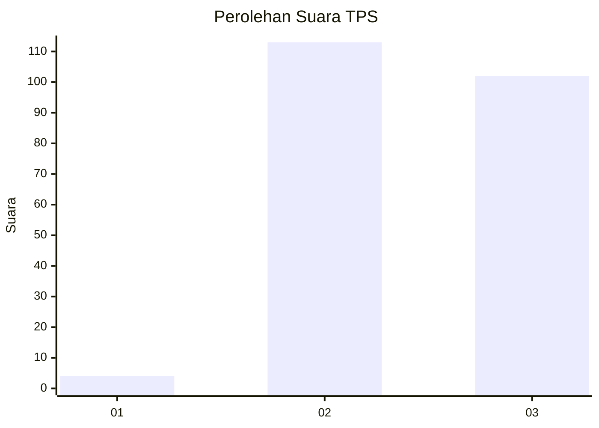
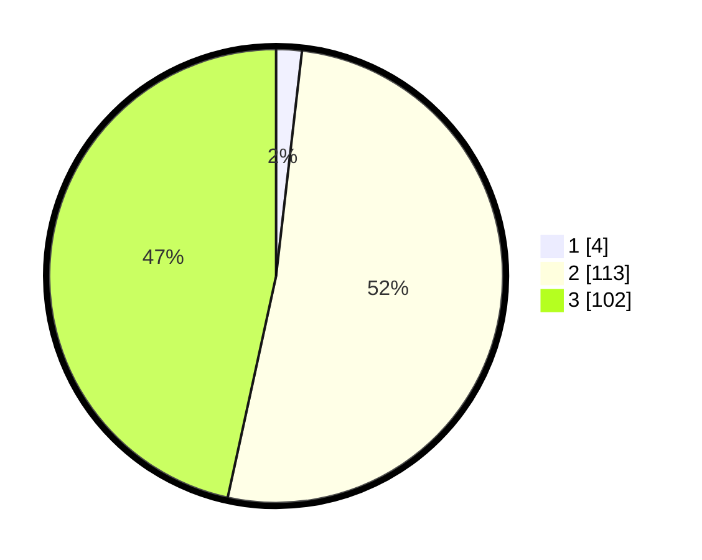

# Hasil

## Grafik

## Tabel

| No. | Nama Paslon    | Suara | Suara (raw) | Persentase |
|:--- |:-------------- | -----:| -----------:| ----------:|
| 1   | ANIES MUHAIMIN | 4     | [4][p-1]    | 1,83       |
| 2   | PRABOWO GIBRAN | 113   | [113][p-2]  | 51,60      |
| 3   | GANJAR MAHFUD  | 102   | [102][p-3]  | 46,58      |

[p-1]: https://github.com/gigit-pemilu/pemilu-2024-51-bali/blob/main/pilpres/hitung-suara/sub/51-bali/sub/03-badung/sub/03-abiansemal/sub/2010-taman/sub/011-tps/sub/paslon-1.txt
[p-2]: https://github.com/gigit-pemilu/pemilu-2024-51-bali/blob/main/pilpres/hitung-suara/sub/51-bali/sub/03-badung/sub/03-abiansemal/sub/2010-taman/sub/011-tps/sub/paslon-2.txt
[p-3]: https://github.com/gigit-pemilu/pemilu-2024-51-bali/blob/main/pilpres/hitung-suara/sub/51-bali/sub/03-badung/sub/03-abiansemal/sub/2010-taman/sub/011-tps/sub/paslon-3.txt

## Foto C Plano

https://sirekap-obj-formc.kpu.go.id/f9fc/pemilu/ppwp/51/03/03/20/10/5103032010011-20240214-211913--53c0fefd-1b4a-4959-8393-65d092e1f01a.jpg

https://sirekap-obj-formc.kpu.go.id/f9fc/pemilu/ppwp/51/03/03/20/10/5103032010011-20240214-211926--4074960b-d228-4079-8815-f2ebfb0aac02.jpg

## Metadata

| Key        | Value               |
| ---------- | ------------------- |
| Time Stamp | 2024-02-24 22:31:28 |

