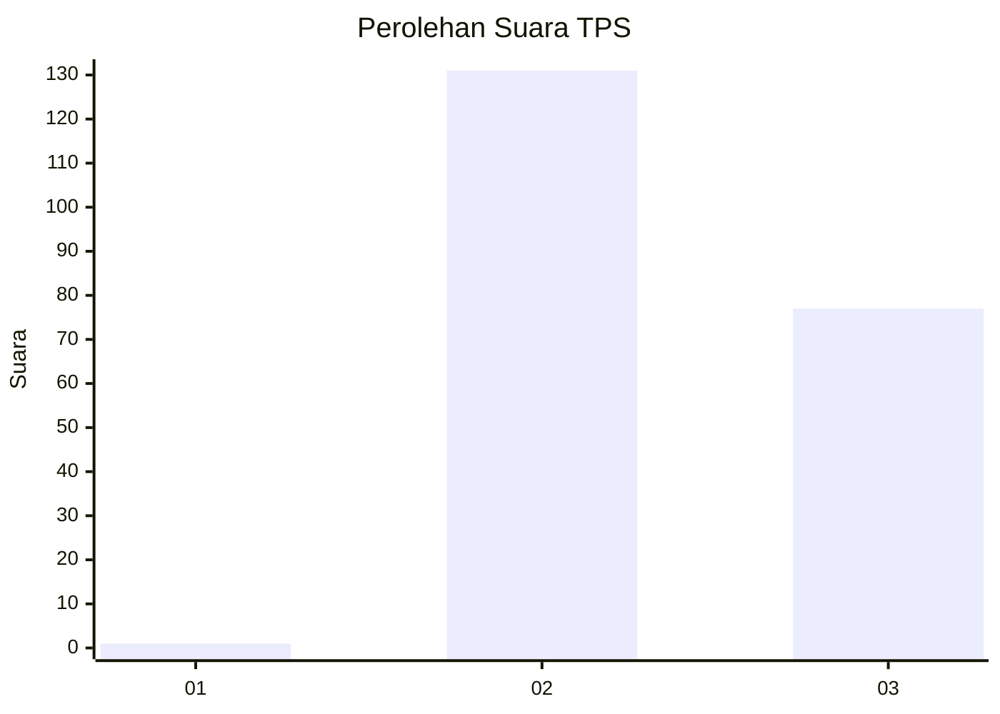
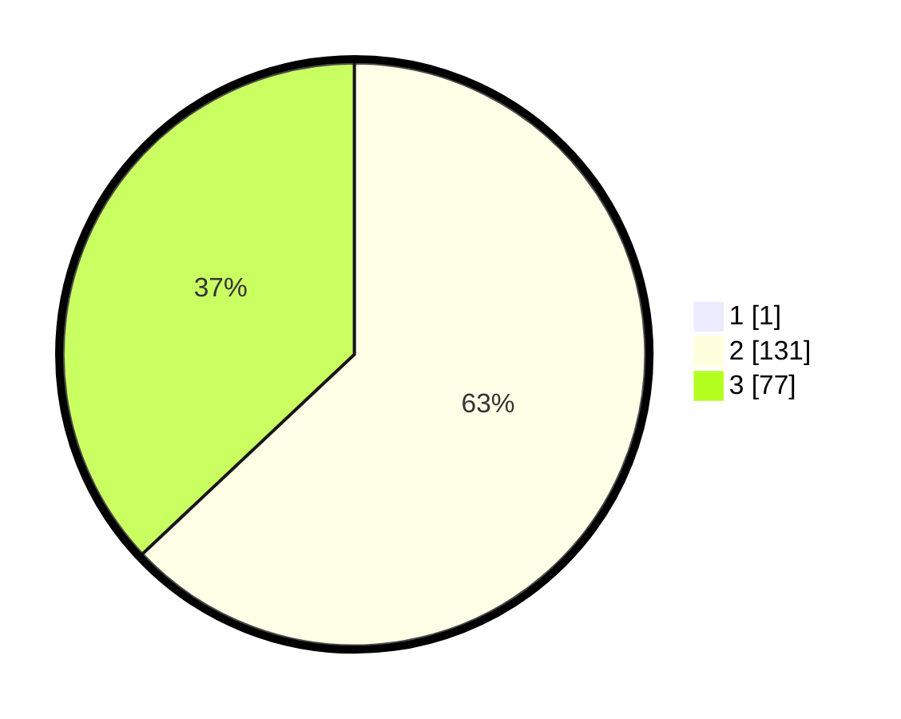

# Hasil

## Grafik

## Tabel

| No. | Nama Paslon    | Suara | Suara (raw) | Persentase |
|:--- |:-------------- | -----:| -----------:| ----------:|
| 1   | ANIES MUHAIMIN | 1     | [1][p-1]    | 0,48       |
| 2   | PRABOWO GIBRAN | 131   | [131][p-2]  | 62,68      |
| 3   | GANJAR MAHFUD  | 77    | [77][p-3]   | 36,84      |

[p-1]: https://github.com/gigit-pemilu/pemilu-2024-51-bali/blob/main/pilpres/hitung-suara/sub/51-bali/sub/03-badung/sub/03-abiansemal/sub/2010-taman/sub/013-tps/sub/paslon-1.txt
[p-2]: https://github.com/gigit-pemilu/pemilu-2024-51-bali/blob/main/pilpres/hitung-suara/sub/51-bali/sub/03-badung/sub/03-abiansemal/sub/2010-taman/sub/013-tps/sub/paslon-2.txt
[p-3]: https://github.com/gigit-pemilu/pemilu-2024-51-bali/blob/main/pilpres/hitung-suara/sub/51-bali/sub/03-badung/sub/03-abiansemal/sub/2010-taman/sub/013-tps/sub/paslon-3.txt

## Foto C Plano

https://sirekap-obj-formc.kpu.go.id/8a48/pemilu/ppwp/51/03/03/20/10/5103032010013-20240214-132242--b5c977b9-4541-45f4-b7f8-2f4d007ec226.jpg

https://sirekap-obj-formc.kpu.go.id/8a48/pemilu/ppwp/51/03/03/20/10/5103032010013-20240214-132607--a1113de4-a2e4-413e-9eaa-bc01118966be.jpg

https://sirekap-obj-formc.kpu.go.id/8a48/pemilu/ppwp/51/03/03/20/10/5103032010013-20240214-132823--196683fa-9240-4a0f-bc8f-635e2a868fa2.jpg

## Metadata

| Key        | Value               |
| ---------- | ------------------- |
| Time Stamp | 2024-02-24 22:31:28 |

