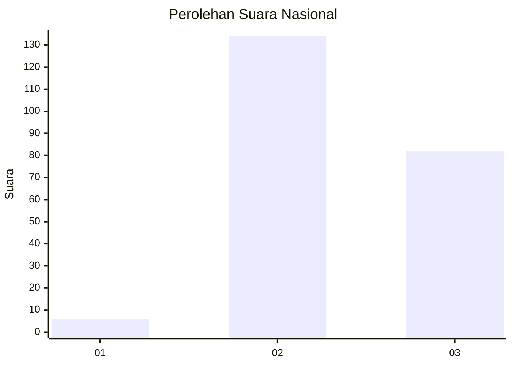
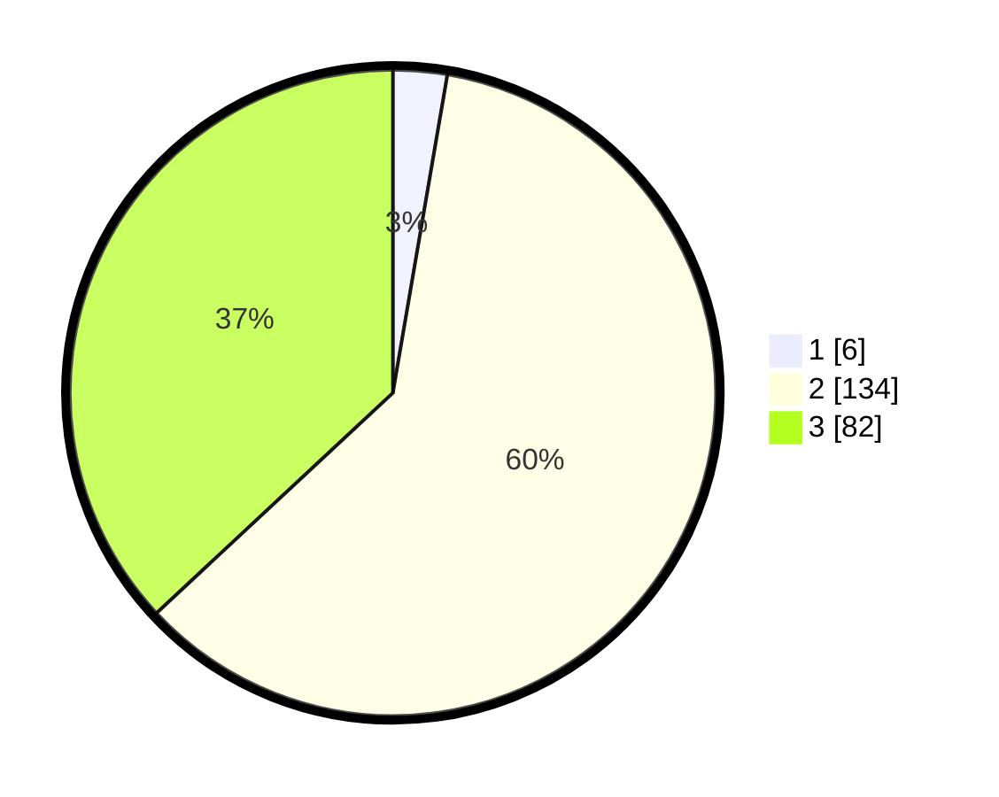

# Hasil

## Grafik

## Tabel

| No. | Nama Paslon    | Suara | Suara (raw) | Persentase |
|:--- |:-------------- | -----:| -----------:| ----------:|
| 1   | ANIES MUHAIMIN | 6     | [6][p-1]    | 2,70       |
| 2   | PRABOWO GIBRAN | 134   | [134][p-2]  | 60,36      |
| 3   | GANJAR MAHFUD  | 82    | [82][p-3]   | 36,94      |

[p-1]: https://github.com/gigit-pemilu/pemilu-2024/blob/main/pilpres/hitung-suara/sub/51-bali/sub/03-badung/sub/03-abiansemal/sub/2010-taman/sub/021-tps/sub/paslon-1.txt
[p-2]: https://github.com/gigit-pemilu/pemilu-2024/blob/main/pilpres/hitung-suara/sub/51-bali/sub/03-badung/sub/03-abiansemal/sub/2010-taman/sub/021-tps/sub/paslon-2.txt
[p-3]: https://github.com/gigit-pemilu/pemilu-2024/blob/main/pilpres/hitung-suara/sub/51-bali/sub/03-badung/sub/03-abiansemal/sub/2010-taman/sub/021-tps/sub/paslon-3.txt

## Foto C Plano

https://sirekap-obj-formc.kpu.go.id/c535/pemilu/ppwp/51/03/03/20/10/5103032010021-20240214-234340--487fc5a7-a9a2-496d-a8c3-645ac5e55a85.jpg

https://sirekap-obj-formc.kpu.go.id/c535/pemilu/ppwp/51/03/03/20/10/5103032010021-20240214-234616--a0b57d54-6e5d-4847-95f9-5865c6e3f222.jpg

https://sirekap-obj-formc.kpu.go.id/c535/pemilu/ppwp/51/03/03/20/10/5103032010021-20240214-203947--08d0b2cb-8618-45e8-844c-b9d7d581d5bc.jpg

## Metadata

| Key        | Value               |
| ---------- | ------------------- |
| Time Stamp | 2024-02-24 22:31:28 |

