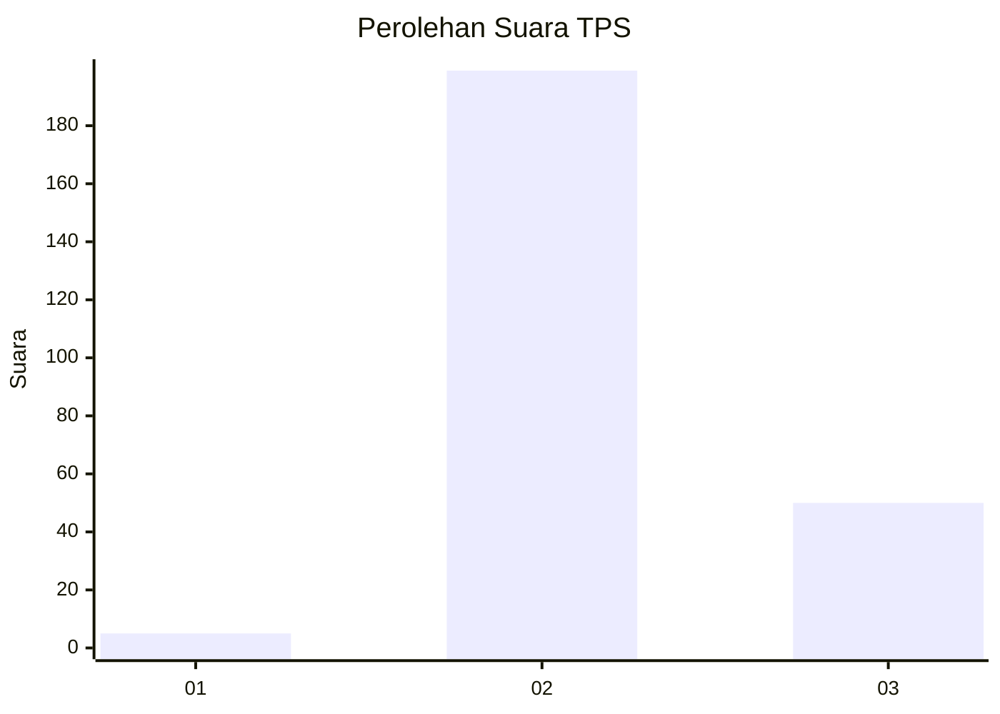

# Hasil

## Grafik

## Tabel

| No. | Nama Paslon    | Suara | Suara (raw) | Persentase |
|:--- |:-------------- | -----:| -----------:| ----------:|
| 1   | ANIES MUHAIMIN | 5     | [5][p-1]    | 1,97       |
| 2   | PRABOWO GIBRAN | 199   | [199][p-2]  | 78,35      |
| 3   | GANJAR MAHFUD  | 50    | [50][p-3]   | 19,69      |

[p-1]: https://github.com/gigit-pemilu/pemilu-2024-51-bali/blob/main/pilpres/hitung-suara/sub/51-bali/sub/03-badung/sub/03-abiansemal/sub/2011-blahkiuh/sub/001-tps/sub/paslon-1.txt
[p-2]: https://github.com/gigit-pemilu/pemilu-2024-51-bali/blob/main/pilpres/hitung-suara/sub/51-bali/sub/03-badung/sub/03-abiansemal/sub/2011-blahkiuh/sub/001-tps/sub/paslon-2.txt
[p-3]: https://github.com/gigit-pemilu/pemilu-2024-51-bali/blob/main/pilpres/hitung-suara/sub/51-bali/sub/03-badung/sub/03-abiansemal/sub/2011-blahkiuh/sub/001-tps/sub/paslon-3.txt

## Foto C Plano

https://sirekap-obj-formc.kpu.go.id/f361/pemilu/ppwp/51/03/03/20/11/5103032011001-20240216-035453--8cf0df7e-2fb1-42e9-9eb5-313266bd248b.jpg

https://sirekap-obj-formc.kpu.go.id/f361/pemilu/ppwp/51/03/03/20/11/5103032011001-20240216-040431--b2374773-d1a1-4452-9519-43b17d7da0e5.jpg

https://sirekap-obj-formc.kpu.go.id/f361/pemilu/ppwp/51/03/03/20/11/5103032011001-20240216-040424--17a586b4-a39e-4a47-8665-4f18e5adade2.jpg

## Metadata

| Key        | Value               |
| ---------- | ------------------- |
| Time Stamp | 2024-02-21 09:00:00 |

## DATA PEMILIH TETAP

Jumlah pemilih dalam DPT: **262**.
 * L: **130**.
 * P: **132**.

## DATA PENGGUNA HAK PILIH

Jumlah pengguna hak pilih dalam DPT: **258**.
 * L: **127**.
 * P: **131**.

Jumlah pengguna hak pilih dalam DPTb: **0**.
 * L: **0**.
 * P: **0**.

Jumlah pengguna hak pilih dalam DPK: **3**.
 * L: **0**.
 * P: **3**.

Jumlah pengguna hak pilih: **261**.
 * L: **127**.
 * P: **134**.

## JUMLAH SUARA SAH DAN TIDAK SAH

JUMLAH SELURUH SUARA SAH: **254**.

JUMLAH SUARA TIDAK SAH: **7**.

JUMLAH SELURUH SUARA SAH DAN SUARA TIDAK SAH: **261**.

