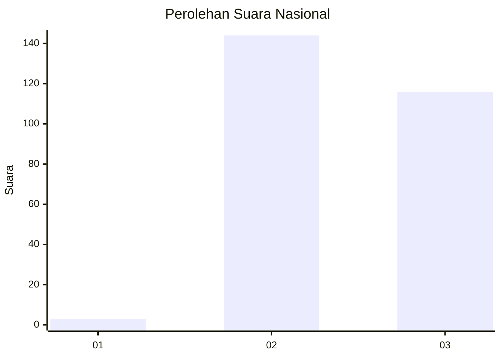
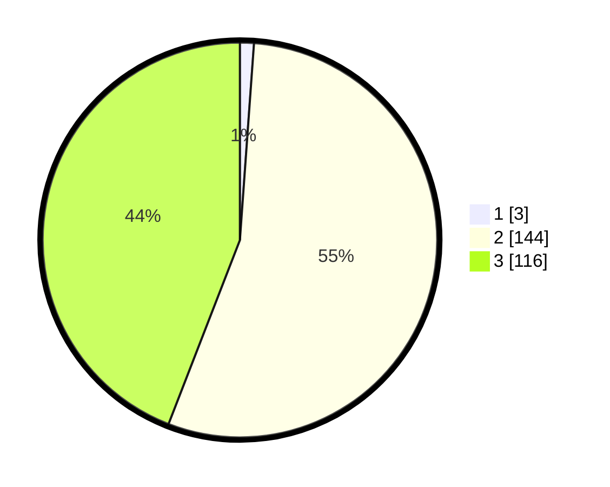

# Hasil

## Grafik

## Tabel

| No. | Nama Paslon    | Suara | Suara (raw) | Persentase |
|:--- |:-------------- | -----:| -----------:| ----------:|
| 1   | ANIES MUHAIMIN | 3     | [3][p-1]    | 1,14       |
| 2   | PRABOWO GIBRAN | 144   | [144][p-2]  | 54,75      |
| 3   | GANJAR MAHFUD  | 116   | [116][p-3]  | 44,11      |

[p-1]: https://github.com/gigit-pemilu/pemilu-2024/blob/main/pilpres/hitung-suara/sub/51-bali/sub/03-badung/sub/03-abiansemal/sub/2011-blahkiuh/sub/004-tps/sub/paslon-1.txt
[p-2]: https://github.com/gigit-pemilu/pemilu-2024/blob/main/pilpres/hitung-suara/sub/51-bali/sub/03-badung/sub/03-abiansemal/sub/2011-blahkiuh/sub/004-tps/sub/paslon-2.txt
[p-3]: https://github.com/gigit-pemilu/pemilu-2024/blob/main/pilpres/hitung-suara/sub/51-bali/sub/03-badung/sub/03-abiansemal/sub/2011-blahkiuh/sub/004-tps/sub/paslon-3.txt

## Foto C Plano

https://sirekap-obj-formc.kpu.go.id/c437/pemilu/ppwp/51/03/03/20/11/5103032011004-20240214-132538--0c8ddf32-c1a0-44ee-9a46-052981531b98.jpg

https://sirekap-obj-formc.kpu.go.id/c437/pemilu/ppwp/51/03/03/20/11/5103032011004-20240214-132747--bd012706-0c3c-415e-9ed8-5ebf07bfcb75.jpg

https://sirekap-obj-formc.kpu.go.id/c437/pemilu/ppwp/51/03/03/20/11/5103032011004-20240214-132848--9be4fe28-a0e7-4000-af8c-5b67ad20f4d9.jpg

## Metadata

| Key        | Value               |
| ---------- | ------------------- |
| Time Stamp | 2024-02-14 21:46:01 |

## DATA PEMILIH TETAP

Jumlah pemilih dalam DPT: **294**.
 * L: **149**.
 * P: **145**.

## DATA PENGGUNA HAK PILIH

Jumlah pengguna hak pilih dalam DPT: **264**.
 * L: **136**.
 * P: **128**.

Jumlah pengguna hak pilih dalam DPTb: **0**.
 * L: **0**.
 * P: **0**.

Jumlah pengguna hak pilih dalam DPK: **1**.
 * L: **0**.
 * P: **1**.

Jumlah pengguna hak pilih: **265**.
 * L: **136**.
 * P: **129**.

## JUMLAH SUARA SAH DAN TIDAK SAH

JUMLAH SELURUH SUARA SAH: **263**.

JUMLAH SUARA TIDAK SAH: **2**.

JUMLAH SELURUH SUARA SAH DAN SUARA TIDAK SAH: **265**.

