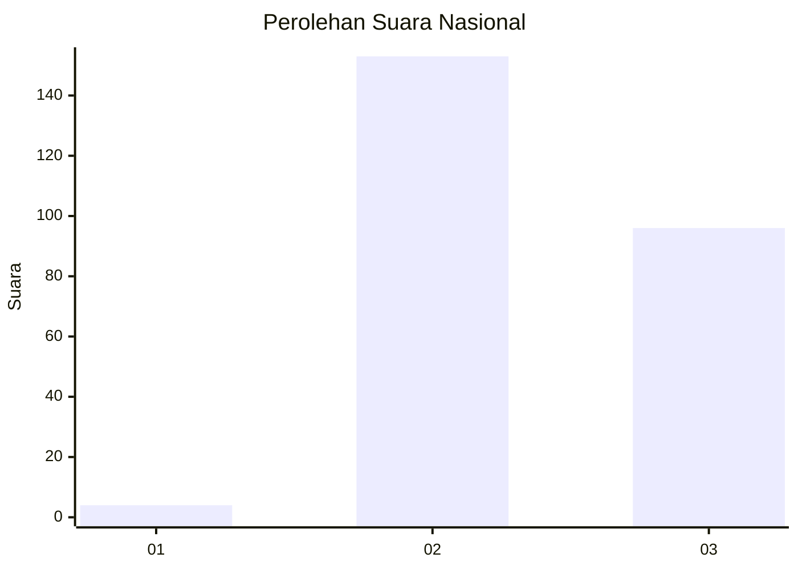
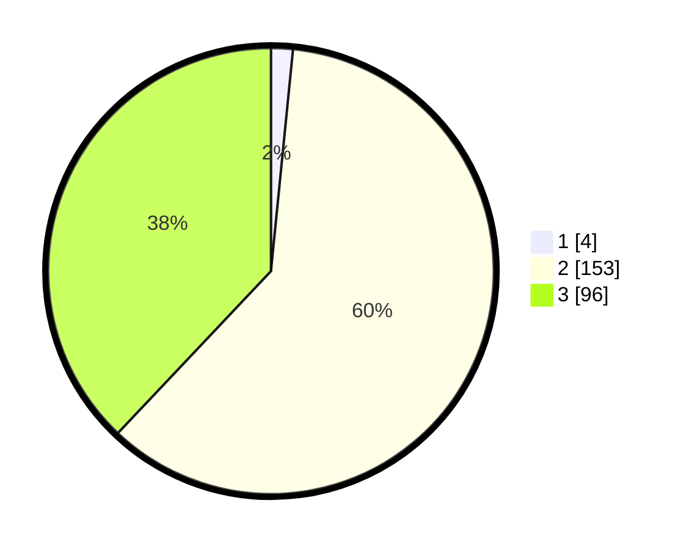

# Hasil

## Grafik

## Tabel

| No. | Nama Paslon    | Suara | Suara (raw) | Persentase |
|:--- |:-------------- | -----:| -----------:| ----------:|
| 1   | ANIES MUHAIMIN | 4     | [4][p-1]    | 1,58       |
| 2   | PRABOWO GIBRAN | 153   | [153][p-2]  | 60,47      |
| 3   | GANJAR MAHFUD  | 96    | [96][p-3]   | 37,94      |

[p-1]: https://github.com/gigit-pemilu/pemilu-2024/blob/main/pilpres/hitung-suara/sub/51-bali/sub/03-badung/sub/03-abiansemal/sub/2012-ayunan/sub/005-tps/sub/paslon-1.txt
[p-2]: https://github.com/gigit-pemilu/pemilu-2024/blob/main/pilpres/hitung-suara/sub/51-bali/sub/03-badung/sub/03-abiansemal/sub/2012-ayunan/sub/005-tps/sub/paslon-2.txt
[p-3]: https://github.com/gigit-pemilu/pemilu-2024/blob/main/pilpres/hitung-suara/sub/51-bali/sub/03-badung/sub/03-abiansemal/sub/2012-ayunan/sub/005-tps/sub/paslon-3.txt

## Foto C Plano

https://sirekap-obj-formc.kpu.go.id/b5cb/pemilu/ppwp/51/03/03/20/12/5103032012005-20240214-220611--9af7742a-0fae-4eb4-b989-49a65ec189ce.jpg

https://sirekap-obj-formc.kpu.go.id/b5cb/pemilu/ppwp/51/03/03/20/12/5103032012005-20240214-220938--2f0e13d2-78cd-4cff-af57-3634d88e1521.jpg

https://sirekap-obj-formc.kpu.go.id/b5cb/pemilu/ppwp/51/03/03/20/12/5103032012005-20240214-221023--515141ec-e5d5-4f9e-9690-aca0a6b7fe41.jpg

## Metadata

| Key        | Value               |
| ---------- | ------------------- |
| Time Stamp | 2024-02-24 22:31:28 |

