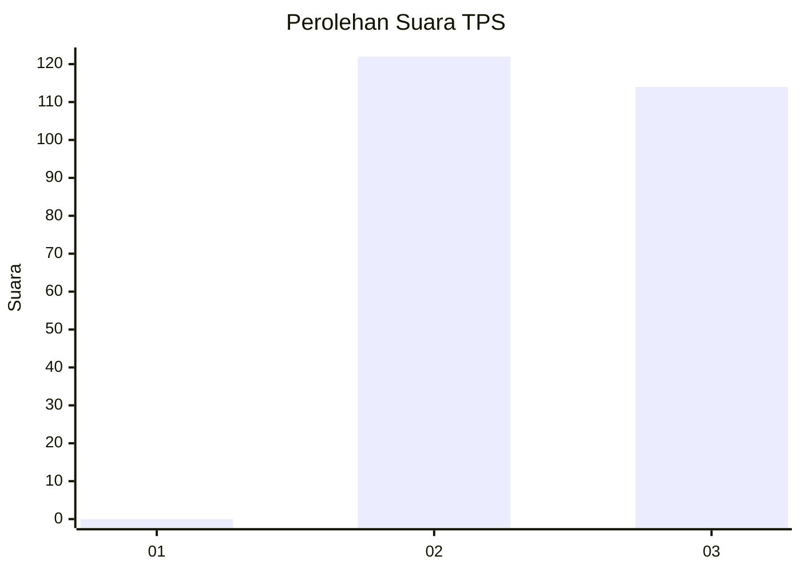
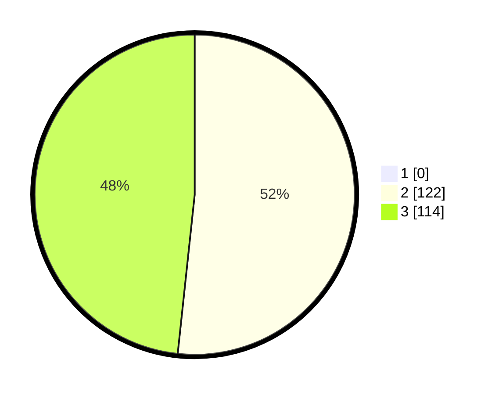

# Hasil

## Grafik

## Tabel

| No. | Nama Paslon    | Suara | Suara (raw) | Persentase |
|:--- |:-------------- | -----:| -----------:| ----------:|
| 1   | ANIES MUHAIMIN | 0     | [0][p-1]    | 0,00       |
| 2   | PRABOWO GIBRAN | 122   | [122][p-2]  | 51,69      |
| 3   | GANJAR MAHFUD  | 114   | [114][p-3]  | 48,31      |

[p-1]: https://github.com/gigit-pemilu/pemilu-2024-51-bali/blob/main/pilpres/hitung-suara/sub/51-bali/sub/03-badung/sub/03-abiansemal/sub/2013-sangeh/sub/004-tps/sub/paslon-1.txt
[p-2]: https://github.com/gigit-pemilu/pemilu-2024-51-bali/blob/main/pilpres/hitung-suara/sub/51-bali/sub/03-badung/sub/03-abiansemal/sub/2013-sangeh/sub/004-tps/sub/paslon-2.txt
[p-3]: https://github.com/gigit-pemilu/pemilu-2024-51-bali/blob/main/pilpres/hitung-suara/sub/51-bali/sub/03-badung/sub/03-abiansemal/sub/2013-sangeh/sub/004-tps/sub/paslon-3.txt

## Foto C Plano

https://sirekap-obj-formc.kpu.go.id/b97c/pemilu/ppwp/51/03/03/20/13/5103032013004-20240214-231250--d4e3cb44-25b5-4d54-8e61-859318f548b6.jpg

https://sirekap-obj-formc.kpu.go.id/b97c/pemilu/ppwp/51/03/03/20/13/5103032013004-20240214-231307--ca6d2a2f-3b5f-4161-933a-5d52979257fc.jpg

https://sirekap-obj-formc.kpu.go.id/b97c/pemilu/ppwp/51/03/03/20/13/5103032013004-20240214-231321--97a89f41-b6ec-45a6-97aa-03c788ecd3ef.jpg

## Metadata

| Key        | Value               |
| ---------- | ------------------- |
| Time Stamp | 2024-02-16 12:51:22 |

