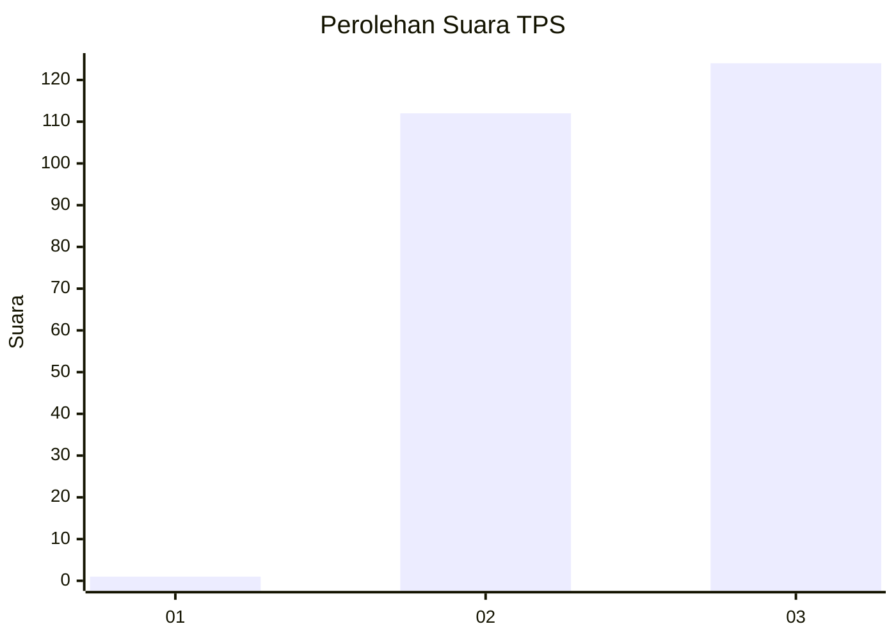
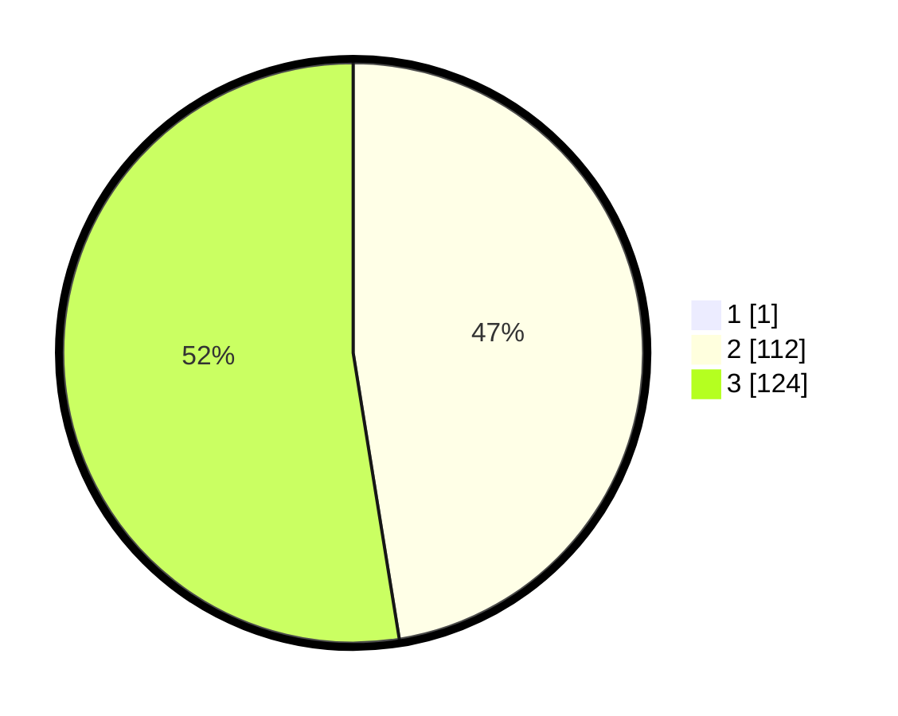

# Hasil

## Grafik

## Tabel

| No. | Nama Paslon    | Suara | Suara (raw) | Persentase |
|:--- |:-------------- | -----:| -----------:| ----------:|
| 1   | ANIES MUHAIMIN | 1     | [1][p-1]    | 0,42       |
| 2   | PRABOWO GIBRAN | 112   | [112][p-2]  | 47,26      |
| 3   | GANJAR MAHFUD  | 124   | [124][p-3]  | 52,32      |

[p-1]: https://github.com/gigit-pemilu/pemilu-2024-51-bali/blob/main/pilpres/hitung-suara/sub/51-bali/sub/03-badung/sub/03-abiansemal/sub/2013-sangeh/sub/007-tps/sub/paslon-1.txt
[p-2]: https://github.com/gigit-pemilu/pemilu-2024-51-bali/blob/main/pilpres/hitung-suara/sub/51-bali/sub/03-badung/sub/03-abiansemal/sub/2013-sangeh/sub/007-tps/sub/paslon-2.txt
[p-3]: https://github.com/gigit-pemilu/pemilu-2024-51-bali/blob/main/pilpres/hitung-suara/sub/51-bali/sub/03-badung/sub/03-abiansemal/sub/2013-sangeh/sub/007-tps/sub/paslon-3.txt

## Foto C Plano

https://sirekap-obj-formc.kpu.go.id/8d1c/pemilu/ppwp/51/03/03/20/13/5103032013007-20240214-205226--0e6bcee8-1e35-4861-9c27-0fead6443007.jpg

https://sirekap-obj-formc.kpu.go.id/8d1c/pemilu/ppwp/51/03/03/20/13/5103032013007-20240214-205842--d7a68d61-962e-4a6e-8b2c-86b5fed002ab.jpg

https://sirekap-obj-formc.kpu.go.id/8d1c/pemilu/ppwp/51/03/03/20/13/5103032013007-20240214-205939--666049b1-0559-4594-a796-c481a77c9a93.jpg

## Metadata

| Key        | Value               |
| ---------- | ------------------- |
| Time Stamp | 2024-02-24 22:31:28 |

