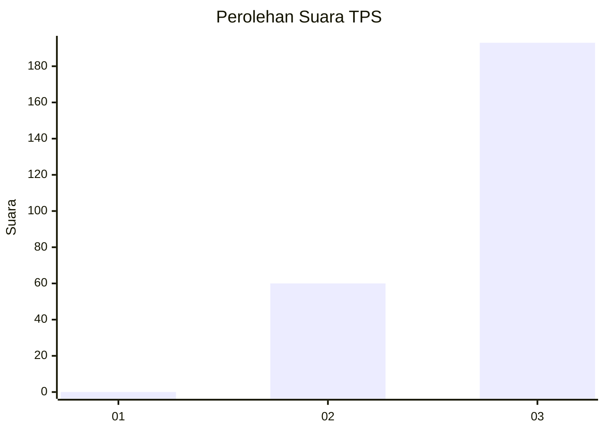
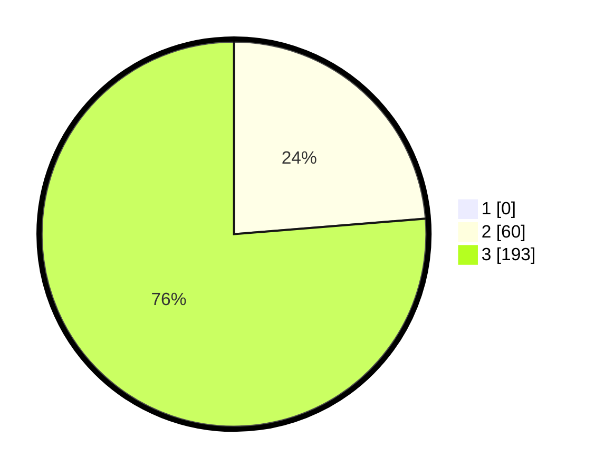

# Hasil

## Grafik

## Tabel

| No. | Nama Paslon    | Suara | Suara (raw) | Persentase |
|:--- |:-------------- | -----:| -----------:| ----------:|
| 1   | ANIES MUHAIMIN | 0     | [0][p-1]    | 0,00       |
| 2   | PRABOWO GIBRAN | 60    | [60][p-2]   | 23,72      |
| 3   | GANJAR MAHFUD  | 193   | [193][p-3]  | 76,28      |

[p-1]: https://github.com/gigit-pemilu/pemilu-2024-51-bali/blob/main/pilpres/hitung-suara/sub/51-bali/sub/03-badung/sub/03-abiansemal/sub/2013-sangeh/sub/010-tps/sub/paslon-1.txt
[p-2]: https://github.com/gigit-pemilu/pemilu-2024-51-bali/blob/main/pilpres/hitung-suara/sub/51-bali/sub/03-badung/sub/03-abiansemal/sub/2013-sangeh/sub/010-tps/sub/paslon-2.txt
[p-3]: https://github.com/gigit-pemilu/pemilu-2024-51-bali/blob/main/pilpres/hitung-suara/sub/51-bali/sub/03-badung/sub/03-abiansemal/sub/2013-sangeh/sub/010-tps/sub/paslon-3.txt

## Foto C Plano

https://sirekap-obj-formc.kpu.go.id/f461/pemilu/ppwp/51/03/03/20/13/5103032013010-20240214-204306--fbb14a5f-de6c-4ba8-9d0a-a75bb5a46287.jpg

https://sirekap-obj-formc.kpu.go.id/f461/pemilu/ppwp/51/03/03/20/13/5103032013010-20240214-204121--4020c7f1-4737-4ca1-b0fe-3a3756a95637.jpg

https://sirekap-obj-formc.kpu.go.id/f461/pemilu/ppwp/51/03/03/20/13/5103032013010-20240214-204413--26f3d34a-4fc3-4a11-a992-ef26f3f9e6bb.jpg

## Metadata

| Key        | Value               |
| ---------- | ------------------- |
| Time Stamp | 2024-02-24 22:31:28 |

