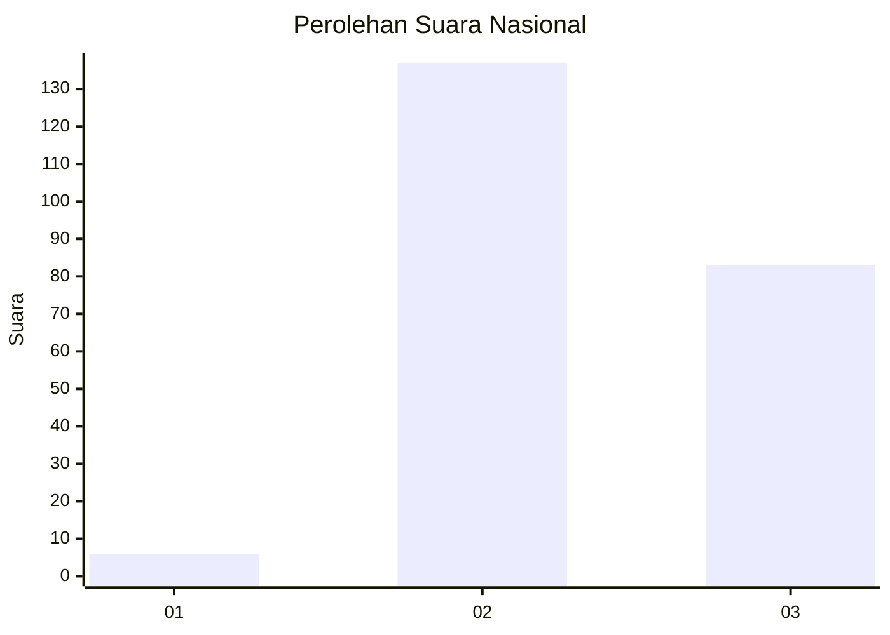
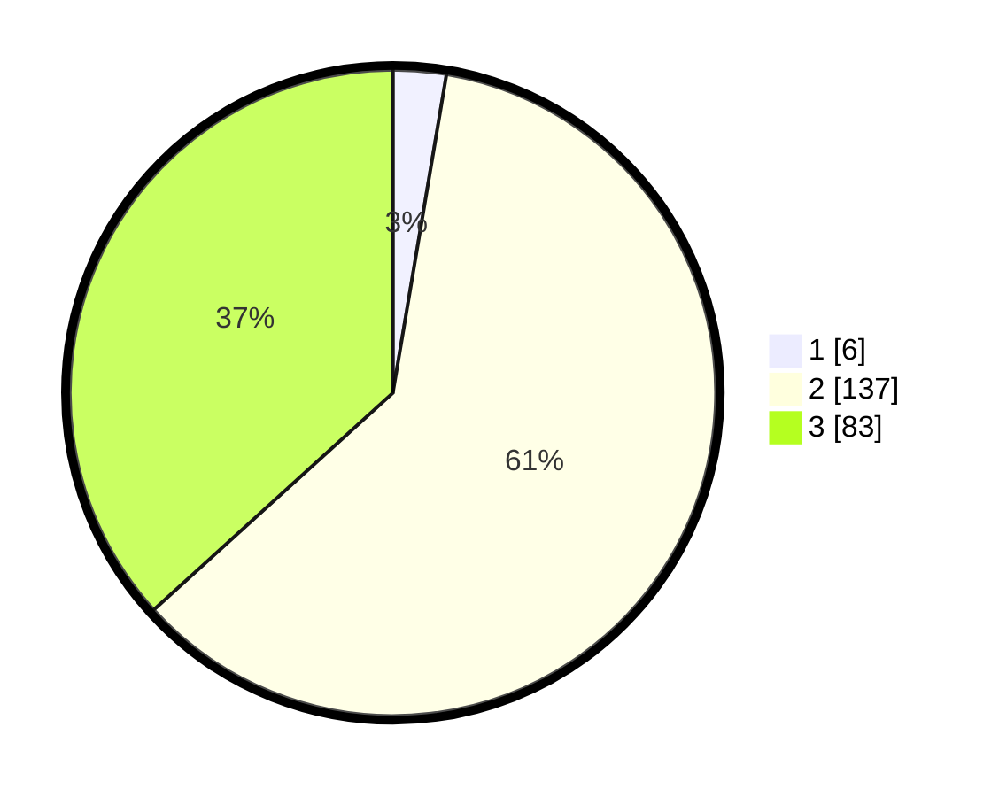

# Hasil

## Grafik

## Tabel

| No. | Nama Paslon    | Suara | Suara (raw) | Persentase |
|:--- |:-------------- | -----:| -----------:| ----------:|
| 1   | ANIES MUHAIMIN | 6     | [6][p-1]    | 2,65       |
| 2   | PRABOWO GIBRAN | 137   | [137][p-2]  | 60,62      |
| 3   | GANJAR MAHFUD  | 83    | [83][p-3]   | 36,73      |

[p-1]: https://github.com/gigit-pemilu/pemilu-2024/blob/main/pilpres/hitung-suara/sub/51-bali/sub/03-badung/sub/03-abiansemal/sub/2014-punggul/sub/002-tps/sub/paslon-1.txt
[p-2]: https://github.com/gigit-pemilu/pemilu-2024/blob/main/pilpres/hitung-suara/sub/51-bali/sub/03-badung/sub/03-abiansemal/sub/2014-punggul/sub/002-tps/sub/paslon-2.txt
[p-3]: https://github.com/gigit-pemilu/pemilu-2024/blob/main/pilpres/hitung-suara/sub/51-bali/sub/03-badung/sub/03-abiansemal/sub/2014-punggul/sub/002-tps/sub/paslon-3.txt

## Foto C Plano

https://sirekap-obj-formc.kpu.go.id/1eb2/pemilu/ppwp/51/03/03/20/14/5103032014002-20240216-131744--ae5da1d8-3070-4244-805e-73cc02c3155f.jpg

https://sirekap-obj-formc.kpu.go.id/1eb2/pemilu/ppwp/51/03/03/20/14/5103032014002-20240216-131745--7378815d-189a-4f8c-b659-f5d3e2d1d546.jpg

https://sirekap-obj-formc.kpu.go.id/1eb2/pemilu/ppwp/51/03/03/20/14/5103032014002-20240216-131745--bd7960f9-0323-4ae8-b8e8-d4d4edab581a.jpg

## Metadata

| Key        | Value               |
| ---------- | ------------------- |
| Time Stamp | 2024-02-21 13:00:00 |

## DATA PEMILIH TETAP

Jumlah pemilih dalam DPT: **245**.
 * L: **115**.
 * P: **130**.

## DATA PENGGUNA HAK PILIH

Jumlah pengguna hak pilih dalam DPT: **237**.
 * L: **112**.
 * P: **125**.

Jumlah pengguna hak pilih dalam DPTb: **1**.
 * L: **0**.
 * P: **1**.

Jumlah pengguna hak pilih dalam DPK: **0**.
 * L: **0**.
 * P: **0**.

Jumlah pengguna hak pilih: **238**.
 * L: **112**.
 * P: **126**.

## JUMLAH SUARA SAH DAN TIDAK SAH

JUMLAH SELURUH SUARA SAH: **226**.

JUMLAH SUARA TIDAK SAH: **12**.

JUMLAH SELURUH SUARA SAH DAN SUARA TIDAK SAH: **238**.

