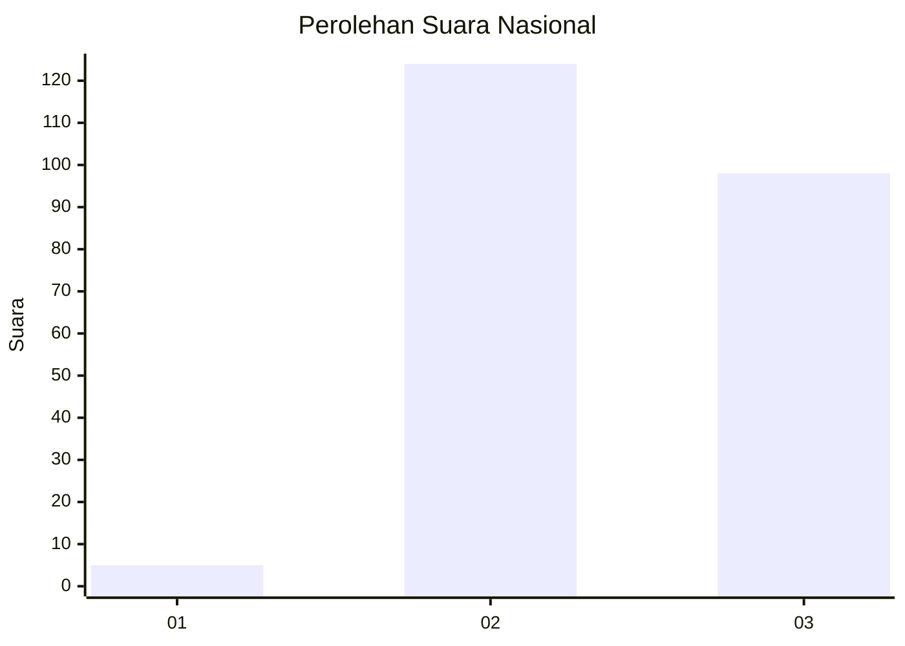
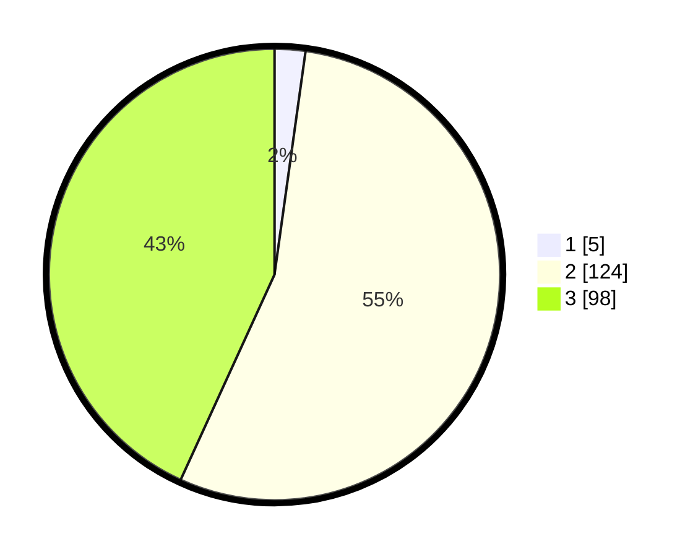

# Hasil

## Grafik

## Tabel

| No. | Nama Paslon    | Suara | Suara (raw) | Persentase |
|:--- |:-------------- | -----:| -----------:| ----------:|
| 1   | ANIES MUHAIMIN | 5     | [5][p-1]    | 2,20       |
| 2   | PRABOWO GIBRAN | 124   | [124][p-2]  | 54,63      |
| 3   | GANJAR MAHFUD  | 98    | [98][p-3]   | 43,17      |

[p-1]: https://github.com/gigit-pemilu/pemilu-2024/blob/main/pilpres/hitung-suara/sub/51-bali/sub/03-badung/sub/03-abiansemal/sub/2014-punggul/sub/006-tps/sub/paslon-1.txt
[p-2]: https://github.com/gigit-pemilu/pemilu-2024/blob/main/pilpres/hitung-suara/sub/51-bali/sub/03-badung/sub/03-abiansemal/sub/2014-punggul/sub/006-tps/sub/paslon-2.txt
[p-3]: https://github.com/gigit-pemilu/pemilu-2024/blob/main/pilpres/hitung-suara/sub/51-bali/sub/03-badung/sub/03-abiansemal/sub/2014-punggul/sub/006-tps/sub/paslon-3.txt

## Foto C Plano

https://sirekap-obj-formc.kpu.go.id/6cca/pemilu/ppwp/51/03/03/20/14/5103032014006-20240217-165508--c14f2447-37e1-49ad-80a7-c607cc97ee24.jpg

https://sirekap-obj-formc.kpu.go.id/6cca/pemilu/ppwp/51/03/03/20/14/5103032014006-20240217-165510--136aa0ed-6ac4-4282-9935-fe0633e0902f.jpg

https://sirekap-obj-formc.kpu.go.id/6cca/pemilu/ppwp/51/03/03/20/14/5103032014006-20240217-165509--8306cd91-11e3-4e4f-9484-721a92063f64.jpg

## Metadata

| Key        | Value               |
| ---------- | ------------------- |
| Time Stamp | 2024-02-21 22:00:00 |

## DATA PEMILIH TETAP

Jumlah pemilih dalam DPT: **263**.
 * L: **124**.
 * P: **139**.

## DATA PENGGUNA HAK PILIH

Jumlah pengguna hak pilih dalam DPT: **237**.
 * L: **111**.
 * P: **126**.

Jumlah pengguna hak pilih dalam DPTb: **2**.
 * L: **1**.
 * P: **1**.

Jumlah pengguna hak pilih dalam DPK: **1**.
 * L: **1**.
 * P: **0**.

Jumlah pengguna hak pilih: **240**.
 * L: **113**.
 * P: **127**.

## JUMLAH SUARA SAH DAN TIDAK SAH

JUMLAH SELURUH SUARA SAH: **227**.

JUMLAH SUARA TIDAK SAH: **0**.

JUMLAH SELURUH SUARA SAH DAN SUARA TIDAK SAH: **0**.

