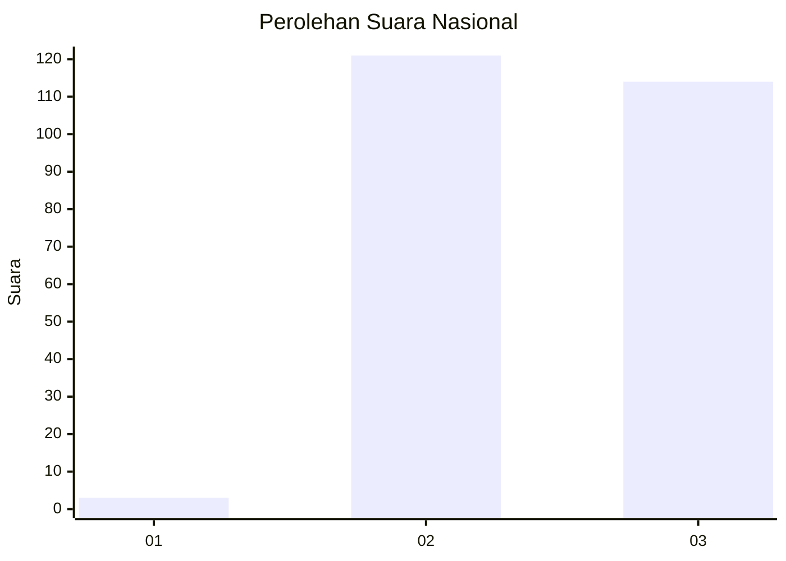
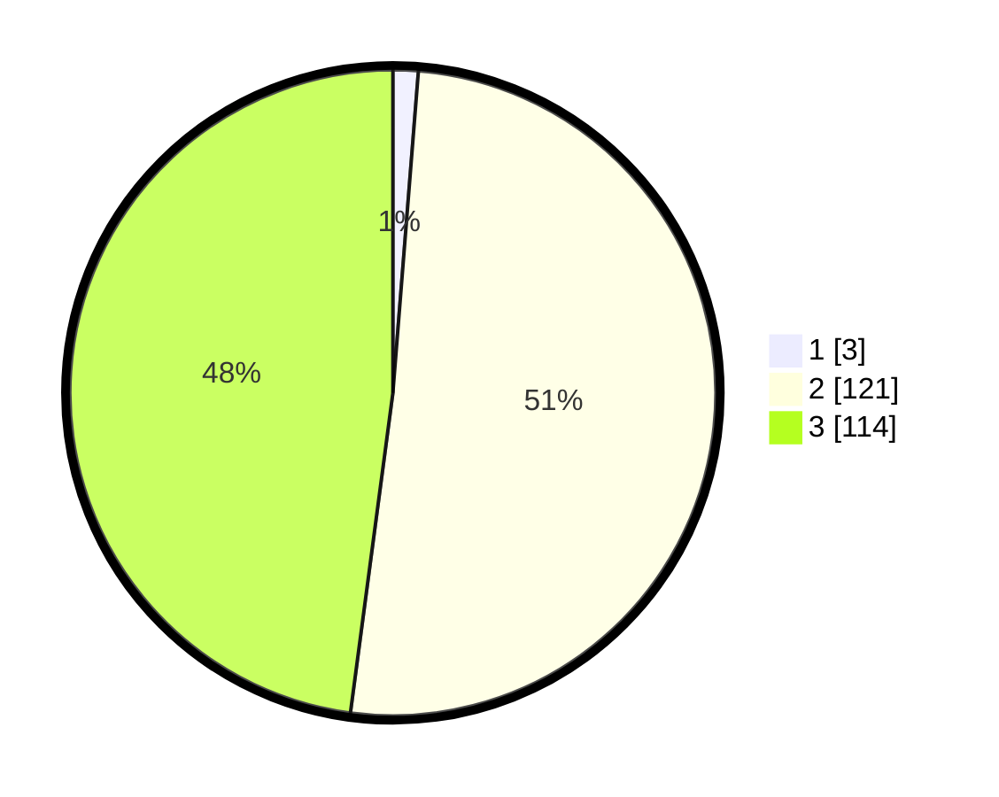

# Hasil

## Grafik

## Tabel

| No. | Nama Paslon    | Suara | Suara (raw) | Persentase |
|:--- |:-------------- | -----:| -----------:| ----------:|
| 1   | ANIES MUHAIMIN | 3     | [3][p-1]    | 1,26       |
| 2   | PRABOWO GIBRAN | 121   | [121][p-2]  | 50,84      |
| 3   | GANJAR MAHFUD  | 114   | [114][p-3]  | 47,90      |

[p-1]: https://github.com/gigit-pemilu/pemilu-2024/blob/main/pilpres/hitung-suara/sub/51-bali/sub/03-badung/sub/03-abiansemal/sub/2014-punggul/sub/008-tps/sub/paslon-1.txt
[p-2]: https://github.com/gigit-pemilu/pemilu-2024/blob/main/pilpres/hitung-suara/sub/51-bali/sub/03-badung/sub/03-abiansemal/sub/2014-punggul/sub/008-tps/sub/paslon-2.txt
[p-3]: https://github.com/gigit-pemilu/pemilu-2024/blob/main/pilpres/hitung-suara/sub/51-bali/sub/03-badung/sub/03-abiansemal/sub/2014-punggul/sub/008-tps/sub/paslon-3.txt

## Foto C Plano

https://sirekap-obj-formc.kpu.go.id/5458/pemilu/ppwp/51/03/03/20/14/5103032014008-20240214-201129--08dad6d6-64a5-4efc-96f9-6f7033537461.jpg

https://sirekap-obj-formc.kpu.go.id/5458/pemilu/ppwp/51/03/03/20/14/5103032014008-20240214-201004--6ae3f982-a1f6-4edd-8897-69d7e27dd484.jpg

https://sirekap-obj-formc.kpu.go.id/5458/pemilu/ppwp/51/03/03/20/14/5103032014008-20240214-201433--cf5f1516-19c8-4549-a023-dccbc7c532c0.jpg

## Metadata

| Key        | Value               |
| ---------- | ------------------- |
| Time Stamp | 2024-02-17 09:00:02 |

