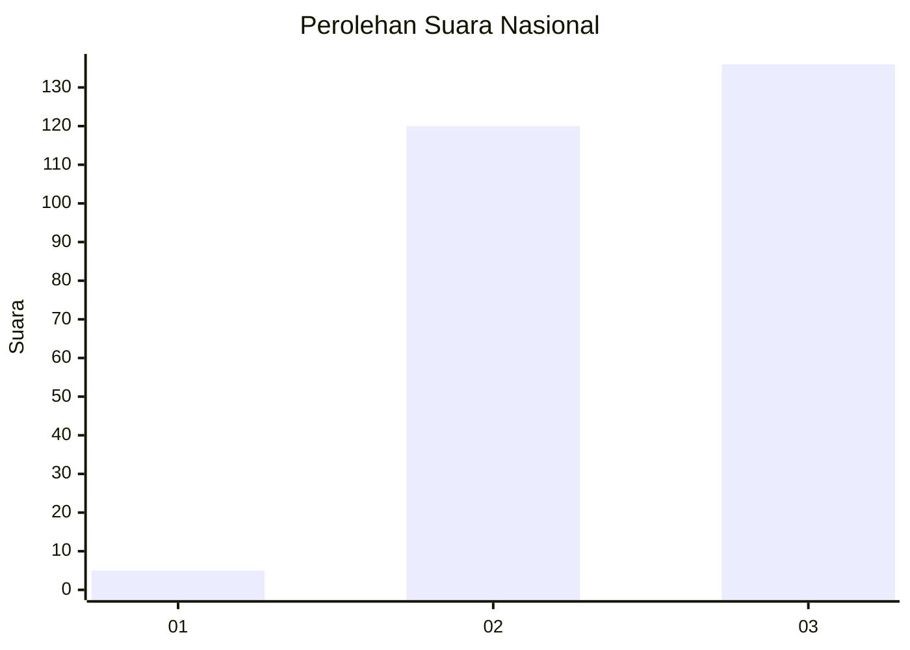
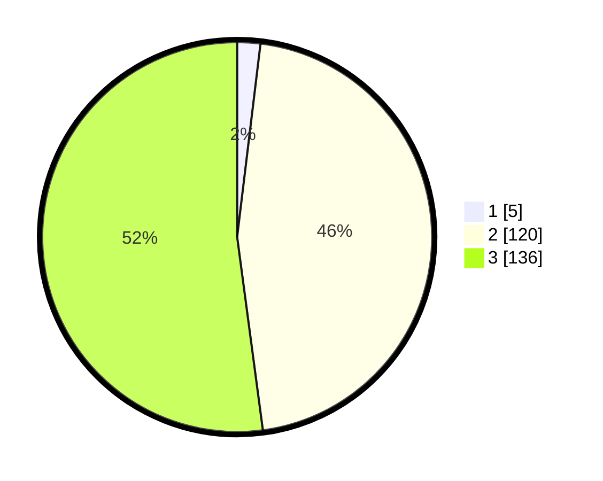

# Hasil

## Grafik

## Tabel

| No. | Nama Paslon    | Suara | Suara (raw) | Persentase |
|:--- |:-------------- | -----:| -----------:| ----------:|
| 1   | ANIES MUHAIMIN | 5     | [5][p-1]    | 1,92       |
| 2   | PRABOWO GIBRAN | 120   | [120][p-2]  | 45,98      |
| 3   | GANJAR MAHFUD  | 136   | [136][p-3]  | 52,11      |

[p-1]: https://github.com/gigit-pemilu/pemilu-2024/blob/main/pilpres/hitung-suara/sub/51-bali/sub/03-badung/sub/03-abiansemal/sub/2015-mekar-bhuwana/sub/001-tps/sub/paslon-1.txt
[p-2]: https://github.com/gigit-pemilu/pemilu-2024/blob/main/pilpres/hitung-suara/sub/51-bali/sub/03-badung/sub/03-abiansemal/sub/2015-mekar-bhuwana/sub/001-tps/sub/paslon-2.txt
[p-3]: https://github.com/gigit-pemilu/pemilu-2024/blob/main/pilpres/hitung-suara/sub/51-bali/sub/03-badung/sub/03-abiansemal/sub/2015-mekar-bhuwana/sub/001-tps/sub/paslon-3.txt

## Foto C Plano

https://sirekap-obj-formc.kpu.go.id/c98e/pemilu/ppwp/51/03/03/20/15/5103032015001-20240216-144848--a6a9d2e2-5db6-489e-8548-24fd6b904f37.jpg

https://sirekap-obj-formc.kpu.go.id/c98e/pemilu/ppwp/51/03/03/20/15/5103032015001-20240218-132537--df574f16-ac5b-476d-a218-9dda74ddd668.jpg

https://sirekap-obj-formc.kpu.go.id/c98e/pemilu/ppwp/51/03/03/20/15/5103032015001-20240216-144909--4df1660f-9499-406b-98c9-b1edf9106549.jpg

## Metadata

| Key        | Value               |
| ---------- | ------------------- |
| Time Stamp | 2024-02-24 22:31:28 |

