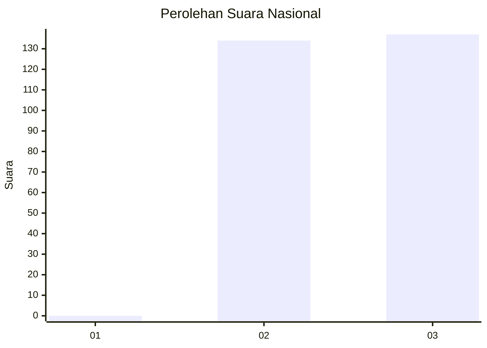
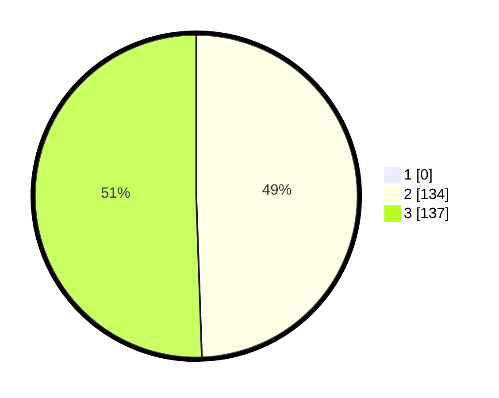

# Hasil

## Grafik

## Tabel

| No. | Nama Paslon    | Suara | Suara (raw) | Persentase |
|:--- |:-------------- | -----:| -----------:| ----------:|
| 1   | ANIES MUHAIMIN | 0     | [0][p-1]    | 0,00       |
| 2   | PRABOWO GIBRAN | 134   | [134][p-2]  | 49,45      |
| 3   | GANJAR MAHFUD  | 137   | [137][p-3]  | 50,55      |

[p-1]: https://github.com/gigit-pemilu/pemilu-2024/blob/main/pilpres/hitung-suara/sub/51-bali/sub/03-badung/sub/03-abiansemal/sub/2015-mekar-bhuwana/sub/004-tps/sub/paslon-1.txt
[p-2]: https://github.com/gigit-pemilu/pemilu-2024/blob/main/pilpres/hitung-suara/sub/51-bali/sub/03-badung/sub/03-abiansemal/sub/2015-mekar-bhuwana/sub/004-tps/sub/paslon-2.txt
[p-3]: https://github.com/gigit-pemilu/pemilu-2024/blob/main/pilpres/hitung-suara/sub/51-bali/sub/03-badung/sub/03-abiansemal/sub/2015-mekar-bhuwana/sub/004-tps/sub/paslon-3.txt

## Foto C Plano

https://sirekap-obj-formc.kpu.go.id/cf4f/pemilu/ppwp/51/03/03/20/15/5103032015004-20240216-120543--8dcfcf75-4dec-4437-b0bb-0a64da51ff74.jpg

https://sirekap-obj-formc.kpu.go.id/cf4f/pemilu/ppwp/51/03/03/20/15/5103032015004-20240215-001705--11ac3292-b0a9-4fa1-a384-6620bad874a7.jpg

https://sirekap-obj-formc.kpu.go.id/cf4f/pemilu/ppwp/51/03/03/20/15/5103032015004-20240216-120544--6fc428f0-7725-4531-9119-5bccc50b9fc3.jpg

## Metadata

| Key        | Value               |
| ---------- | ------------------- |
| Time Stamp | 2024-02-24 22:31:28 |

## DATA PEMILIH TETAP

Jumlah pemilih dalam DPT: **285**.
 * L: **146**.
 * P: **139**.

## DATA PENGGUNA HAK PILIH

Jumlah pengguna hak pilih dalam DPT: **273**.
 * L: **140**.
 * P: **133**.

Jumlah pengguna hak pilih dalam DPTb: **1**.
 * L: **0**.
 * P: **1**.

Jumlah pengguna hak pilih dalam DPK: **1**.
 * L: **0**.
 * P: **1**.

Jumlah pengguna hak pilih: **275**.
 * L: **140**.
 * P: **135**.

## JUMLAH SUARA SAH DAN TIDAK SAH

JUMLAH SELURUH SUARA SAH: **271**.

JUMLAH SUARA TIDAK SAH: **4**.

JUMLAH SELURUH SUARA SAH DAN SUARA TIDAK SAH: **275**.

