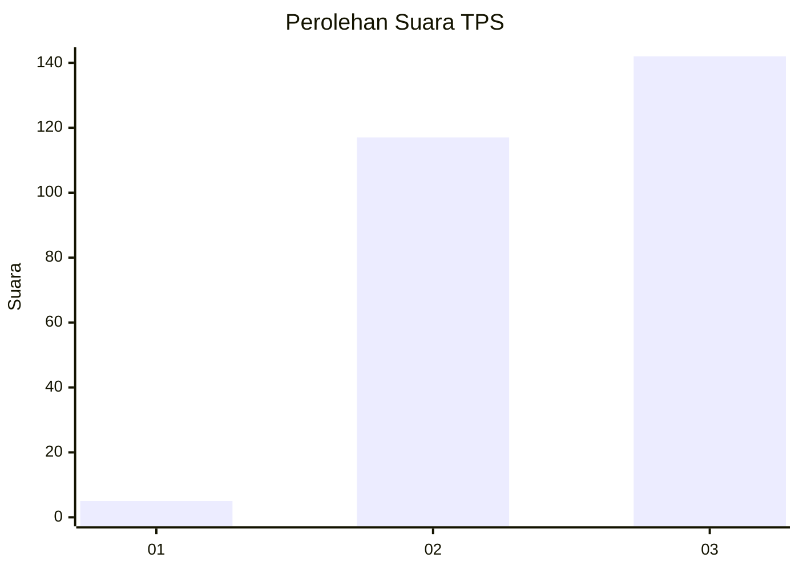
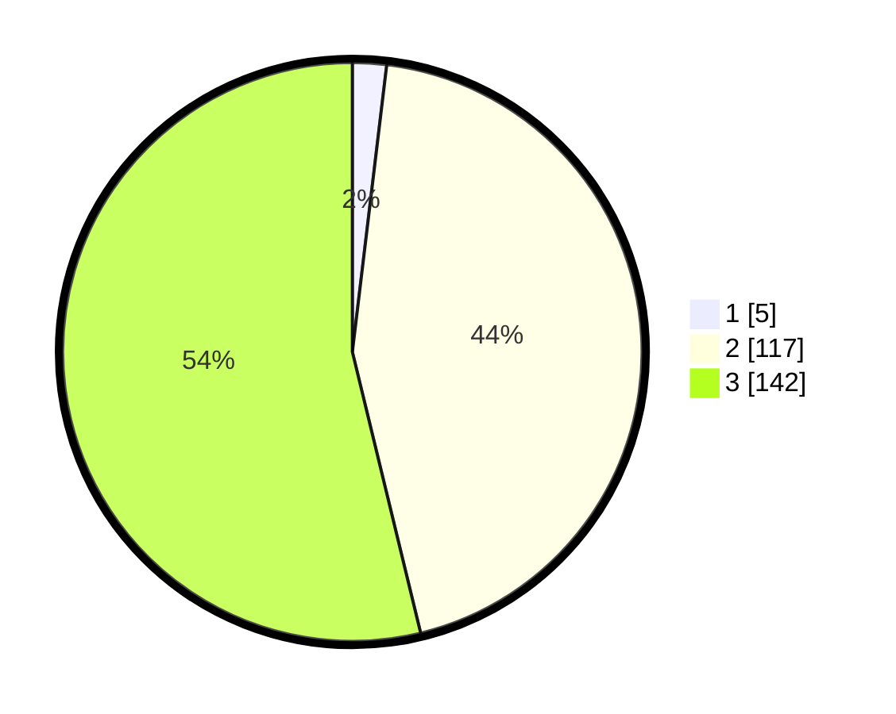

# Hasil

## Grafik

## Tabel

| No. | Nama Paslon    | Suara | Suara (raw) | Persentase |
|:--- |:-------------- | -----:| -----------:| ----------:|
| 1   | ANIES MUHAIMIN | 5     | [5][p-1]    | 1,89       |
| 2   | PRABOWO GIBRAN | 117   | [117][p-2]  | 44,32      |
| 3   | GANJAR MAHFUD  | 142   | [142][p-3]  | 53,79      |

[p-1]: https://github.com/gigit-pemilu/pemilu-2024-51-bali/blob/main/pilpres/hitung-suara/sub/51-bali/sub/03-badung/sub/03-abiansemal/sub/2015-mekar-bhuwana/sub/012-tps/sub/paslon-1.txt
[p-2]: https://github.com/gigit-pemilu/pemilu-2024-51-bali/blob/main/pilpres/hitung-suara/sub/51-bali/sub/03-badung/sub/03-abiansemal/sub/2015-mekar-bhuwana/sub/012-tps/sub/paslon-2.txt
[p-3]: https://github.com/gigit-pemilu/pemilu-2024-51-bali/blob/main/pilpres/hitung-suara/sub/51-bali/sub/03-badung/sub/03-abiansemal/sub/2015-mekar-bhuwana/sub/012-tps/sub/paslon-3.txt

## Foto C Plano

https://sirekap-obj-formc.kpu.go.id/3501/pemilu/ppwp/51/03/03/20/15/5103032015012-20240214-194807--932acd6d-0e6a-41bb-a868-71058d013ac1.jpg

https://sirekap-obj-formc.kpu.go.id/3501/pemilu/ppwp/51/03/03/20/15/5103032015012-20240214-194912--b7fbf10b-ada1-4fcf-9cb0-508895327fdd.jpg

https://sirekap-obj-formc.kpu.go.id/3501/pemilu/ppwp/51/03/03/20/15/5103032015012-20240216-091229--a3992cc2-f2dc-43e1-bc76-c1c9a6f9b624.jpg

## Metadata

| Key        | Value               |
| ---------- | ------------------- |
| Time Stamp | 2024-02-22 11:00:00 |

