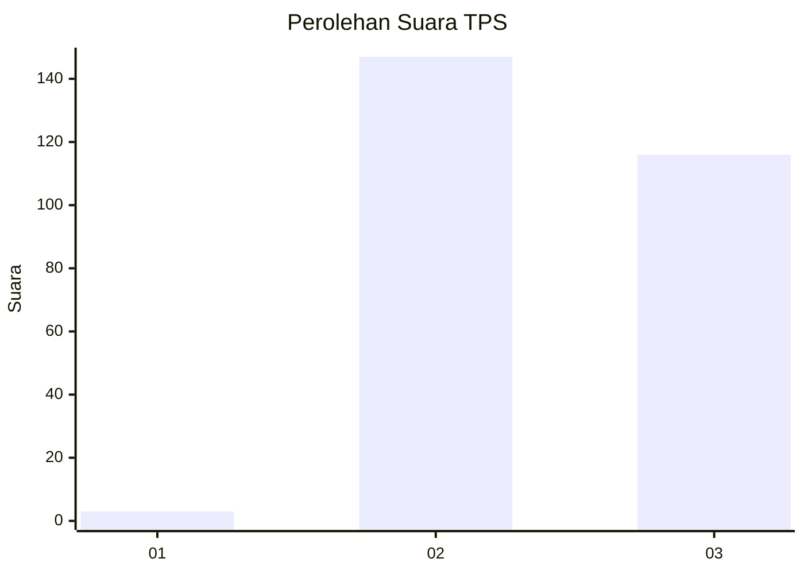
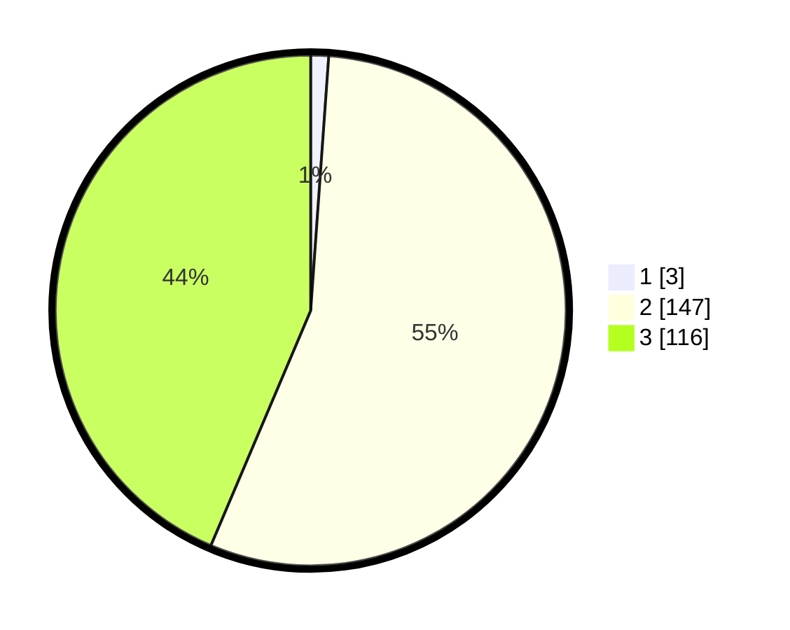

# Hasil

## Grafik

## Tabel

| No. | Nama Paslon    | Suara | Suara (raw) | Persentase |
|:--- |:-------------- | -----:| -----------:| ----------:|
| 1   | ANIES MUHAIMIN | 3     | [3][p-1]    | 1,13       |
| 2   | PRABOWO GIBRAN | 147   | [147][p-2]  | 55,26      |
| 3   | GANJAR MAHFUD  | 116   | [116][p-3]  | 43,61      |

[p-1]: https://github.com/gigit-pemilu/pemilu-2024-51-bali/blob/main/pilpres/hitung-suara/sub/51-bali/sub/03-badung/sub/03-abiansemal/sub/2015-mekar-bhuwana/sub/014-tps/sub/paslon-1.txt
[p-2]: https://github.com/gigit-pemilu/pemilu-2024-51-bali/blob/main/pilpres/hitung-suara/sub/51-bali/sub/03-badung/sub/03-abiansemal/sub/2015-mekar-bhuwana/sub/014-tps/sub/paslon-2.txt
[p-3]: https://github.com/gigit-pemilu/pemilu-2024-51-bali/blob/main/pilpres/hitung-suara/sub/51-bali/sub/03-badung/sub/03-abiansemal/sub/2015-mekar-bhuwana/sub/014-tps/sub/paslon-3.txt

## Foto C Plano

https://sirekap-obj-formc.kpu.go.id/16fb/pemilu/ppwp/51/03/03/20/15/5103032015014-20240214-205514--0d3f5dc7-0324-48b0-935a-6ee02006d409.jpg

https://sirekap-obj-formc.kpu.go.id/16fb/pemilu/ppwp/51/03/03/20/15/5103032015014-20240214-211424--1f42eb38-ce42-4477-8835-3e0ea796dd40.jpg

https://sirekap-obj-formc.kpu.go.id/16fb/pemilu/ppwp/51/03/03/20/15/5103032015014-20240214-213303--b56a850a-609c-45f0-beb2-1db34bc80918.jpg

## Metadata

| Key        | Value               |
| ---------- | ------------------- |
| Time Stamp | 2024-02-24 22:31:28 |

