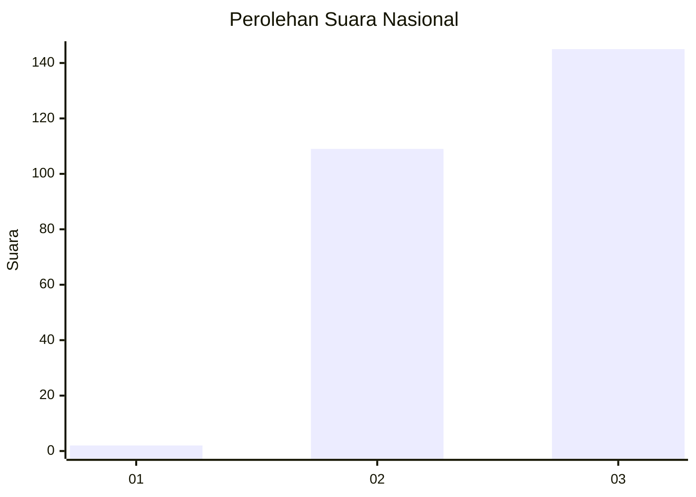
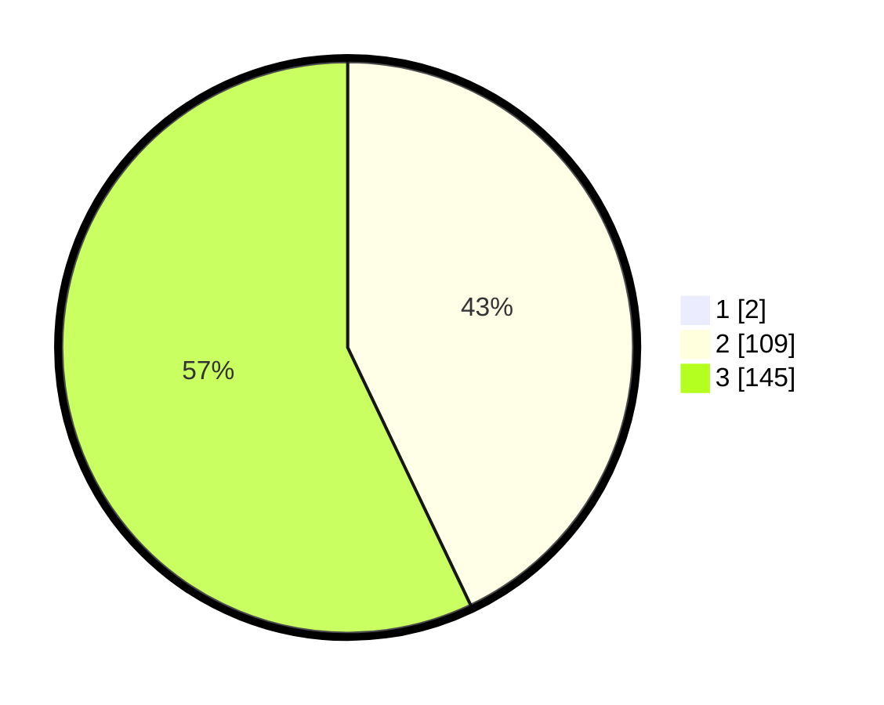

# Hasil

## Grafik

## Tabel

| No. | Nama Paslon    | Suara | Suara (raw) | Persentase |
|:--- |:-------------- | -----:| -----------:| ----------:|
| 1   | ANIES MUHAIMIN | 2     | [2][p-1]    | 0,78       |
| 2   | PRABOWO GIBRAN | 109   | [109][p-2]  | 42,58      |
| 3   | GANJAR MAHFUD  | 145   | [145][p-3]  | 56,64      |

[p-1]: https://github.com/gigit-pemilu/pemilu-2024/blob/main/pilpres/hitung-suara/sub/51-bali/sub/03-badung/sub/03-abiansemal/sub/2015-mekar-bhuwana/sub/015-tps/sub/paslon-1.txt
[p-2]: https://github.com/gigit-pemilu/pemilu-2024/blob/main/pilpres/hitung-suara/sub/51-bali/sub/03-badung/sub/03-abiansemal/sub/2015-mekar-bhuwana/sub/015-tps/sub/paslon-2.txt
[p-3]: https://github.com/gigit-pemilu/pemilu-2024/blob/main/pilpres/hitung-suara/sub/51-bali/sub/03-badung/sub/03-abiansemal/sub/2015-mekar-bhuwana/sub/015-tps/sub/paslon-3.txt

## Foto C Plano

https://sirekap-obj-formc.kpu.go.id/75e7/pemilu/ppwp/51/03/03/20/15/5103032015015-20240215-023056--6aecaae3-0c8d-441a-8eba-3bf884ba121f.jpg

https://sirekap-obj-formc.kpu.go.id/75e7/pemilu/ppwp/51/03/03/20/15/5103032015015-20240215-023353--c2b0cd91-c3d8-4827-a29a-2190242acef7.jpg

https://sirekap-obj-formc.kpu.go.id/75e7/pemilu/ppwp/51/03/03/20/15/5103032015015-20240215-023630--b0ffb3fb-3d55-4020-81b1-8bc514f4dfe6.jpg

## Metadata

| Key        | Value               |
| ---------- | ------------------- |
| Time Stamp | 2024-02-24 22:31:28 |

