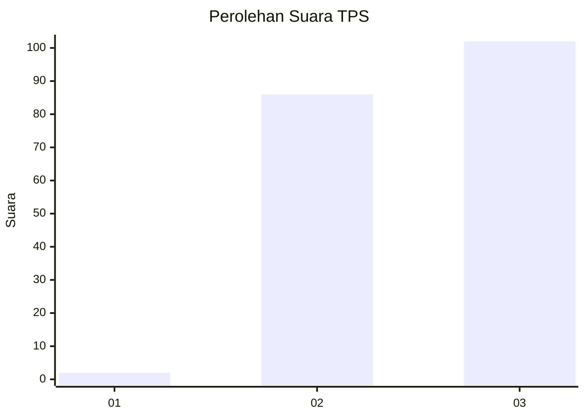
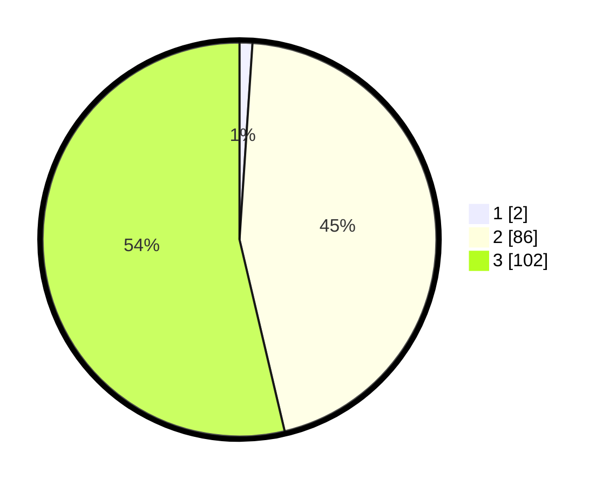

# Hasil

## Grafik

## Tabel

| No. | Nama Paslon    | Suara | Suara (raw) | Persentase |
|:--- |:-------------- | -----:| -----------:| ----------:|
| 1   | ANIES MUHAIMIN | 2     | [2][p-1]    | 1,05       |
| 2   | PRABOWO GIBRAN | 86    | [86][p-2]   | 45,26      |
| 3   | GANJAR MAHFUD  | 102   | [102][p-3]  | 53,68      |

[p-1]: https://github.com/gigit-pemilu/pemilu-2024-51-bali/blob/main/pilpres/hitung-suara/sub/51-bali/sub/03-badung/sub/03-abiansemal/sub/2016-abiansemal-dauh-yeh-cani/sub/002-tps/sub/paslon-1.txt
[p-2]: https://github.com/gigit-pemilu/pemilu-2024-51-bali/blob/main/pilpres/hitung-suara/sub/51-bali/sub/03-badung/sub/03-abiansemal/sub/2016-abiansemal-dauh-yeh-cani/sub/002-tps/sub/paslon-2.txt
[p-3]: https://github.com/gigit-pemilu/pemilu-2024-51-bali/blob/main/pilpres/hitung-suara/sub/51-bali/sub/03-badung/sub/03-abiansemal/sub/2016-abiansemal-dauh-yeh-cani/sub/002-tps/sub/paslon-3.txt

## Foto C Plano

https://sirekap-obj-formc.kpu.go.id/775b/pemilu/ppwp/51/03/03/20/16/5103032016002-20240214-214338--f1b9d6ad-b746-499e-9ee4-1882206c9ba1.jpg

https://sirekap-obj-formc.kpu.go.id/775b/pemilu/ppwp/51/03/03/20/16/5103032016002-20240214-215006--4c95fd18-7408-4cca-a663-782cae9b320c.jpg

https://sirekap-obj-formc.kpu.go.id/775b/pemilu/ppwp/51/03/03/20/16/5103032016002-20240214-215147--3f6da0d7-c541-4a4c-924f-21dd3a270611.jpg

## Metadata

| Key        | Value               |
| ---------- | ------------------- |
| Time Stamp | 2024-02-24 22:31:28 |

