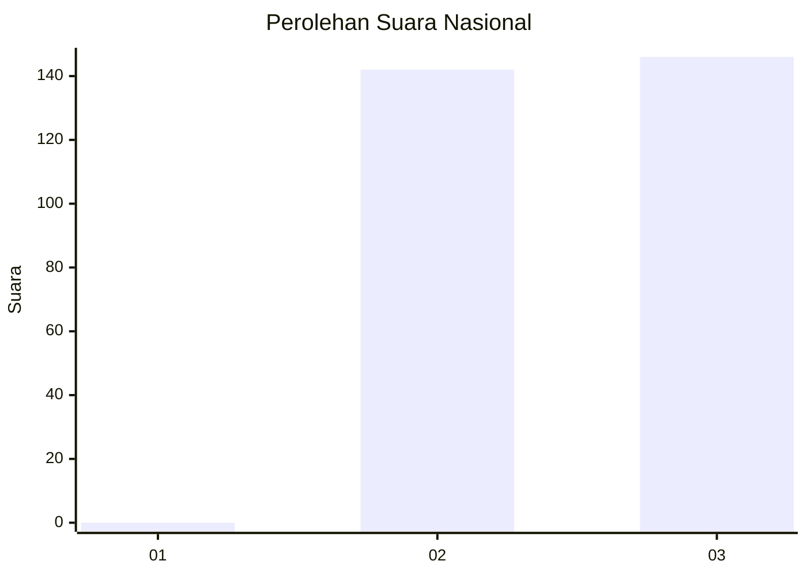
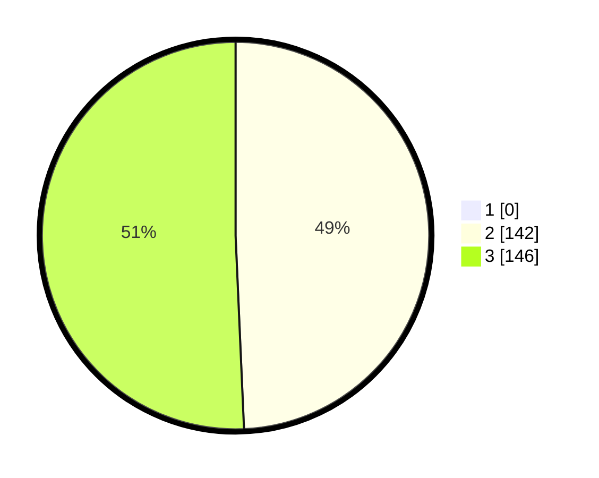

# Hasil

## Grafik

## Tabel

| No. | Nama Paslon    | Suara | Suara (raw) | Persentase |
|:--- |:-------------- | -----:| -----------:| ----------:|
| 1   | ANIES MUHAIMIN | 0     | [0][p-1]    | 0,00       |
| 2   | PRABOWO GIBRAN | 142   | [142][p-2]  | 49,31      |
| 3   | GANJAR MAHFUD  | 146   | [146][p-3]  | 50,69      |

[p-1]: https://github.com/gigit-pemilu/pemilu-2024/blob/main/pilpres/hitung-suara/sub/51-bali/sub/03-badung/sub/03-abiansemal/sub/2016-abiansemal-dauh-yeh-cani/sub/004-tps/sub/paslon-1.txt
[p-2]: https://github.com/gigit-pemilu/pemilu-2024/blob/main/pilpres/hitung-suara/sub/51-bali/sub/03-badung/sub/03-abiansemal/sub/2016-abiansemal-dauh-yeh-cani/sub/004-tps/sub/paslon-2.txt
[p-3]: https://github.com/gigit-pemilu/pemilu-2024/blob/main/pilpres/hitung-suara/sub/51-bali/sub/03-badung/sub/03-abiansemal/sub/2016-abiansemal-dauh-yeh-cani/sub/004-tps/sub/paslon-3.txt

## Foto C Plano

https://sirekap-obj-formc.kpu.go.id/98f5/pemilu/ppwp/51/03/03/20/16/5103032016004-20240214-141615--cf0b95f9-40a3-47aa-b3c4-ba1aaffd6661.jpg

https://sirekap-obj-formc.kpu.go.id/98f5/pemilu/ppwp/51/03/03/20/16/5103032016004-20240214-141834--5f258687-57ed-4f07-b045-cab9d8019f4e.jpg

https://sirekap-obj-formc.kpu.go.id/98f5/pemilu/ppwp/51/03/03/20/16/5103032016004-20240214-141715--7e073a9d-fefc-440c-b429-ff63316d2d3c.jpg

## Metadata

| Key        | Value               |
| ---------- | ------------------- |
| Time Stamp | 2024-02-20 23:00:00 |

## DATA PEMILIH TETAP

Jumlah pemilih dalam DPT: **296**.
 * L: **145**.
 * P: **151**.

## DATA PENGGUNA HAK PILIH

Jumlah pengguna hak pilih dalam DPT: **289**.
 * L: **139**.
 * P: **150**.

Jumlah pengguna hak pilih dalam DPTb: **0**.
 * L: **0**.
 * P: **0**.

Jumlah pengguna hak pilih dalam DPK: **0**.
 * L: **2**.
 * P: **0**.

Jumlah pengguna hak pilih: **291**.
 * L: **141**.
 * P: **150**.

## JUMLAH SUARA SAH DAN TIDAK SAH

JUMLAH SELURUH SUARA SAH: **288**.

JUMLAH SUARA TIDAK SAH: **3**.

JUMLAH SELURUH SUARA SAH DAN SUARA TIDAK SAH: **291**.

