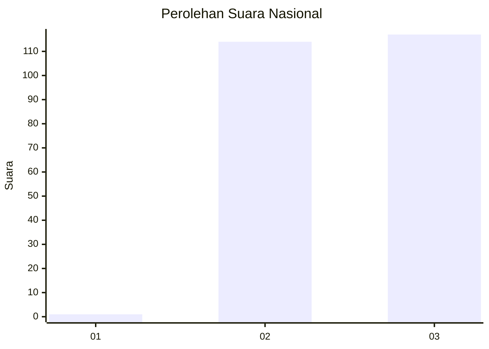
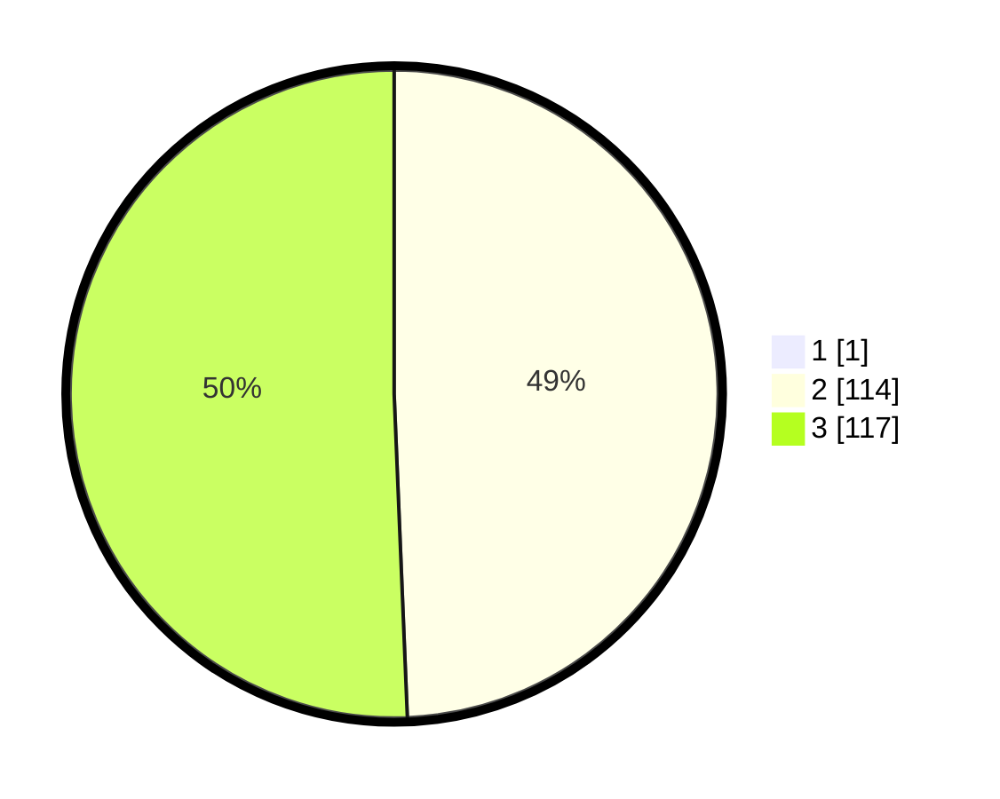

# Hasil

## Grafik

## Tabel

| No. | Nama Paslon    | Suara | Suara (raw) | Persentase |
|:--- |:-------------- | -----:| -----------:| ----------:|
| 1   | ANIES MUHAIMIN | 1     | [1][p-1]    | 0,43       |
| 2   | PRABOWO GIBRAN | 114   | [114][p-2]  | 49,14      |
| 3   | GANJAR MAHFUD  | 117   | [117][p-3]  | 50,43      |

[p-1]: https://github.com/gigit-pemilu/pemilu-2024/blob/main/pilpres/hitung-suara/sub/51-bali/sub/03-badung/sub/03-abiansemal/sub/2016-abiansemal-dauh-yeh-cani/sub/007-tps/sub/paslon-1.txt
[p-2]: https://github.com/gigit-pemilu/pemilu-2024/blob/main/pilpres/hitung-suara/sub/51-bali/sub/03-badung/sub/03-abiansemal/sub/2016-abiansemal-dauh-yeh-cani/sub/007-tps/sub/paslon-2.txt
[p-3]: https://github.com/gigit-pemilu/pemilu-2024/blob/main/pilpres/hitung-suara/sub/51-bali/sub/03-badung/sub/03-abiansemal/sub/2016-abiansemal-dauh-yeh-cani/sub/007-tps/sub/paslon-3.txt

## Foto C Plano

https://sirekap-obj-formc.kpu.go.id/b22d/pemilu/ppwp/51/03/03/20/16/5103032016007-20240215-000937--a4e01c20-2100-498e-8b4d-31df3ce50d3a.jpg

https://sirekap-obj-formc.kpu.go.id/b22d/pemilu/ppwp/51/03/03/20/16/5103032016007-20240214-190352--4428bc46-0558-4035-b26b-d075226b5c32.jpg

## Metadata

| Key        | Value               |
| ---------- | ------------------- |
| Time Stamp | 2024-02-24 22:31:28 |

