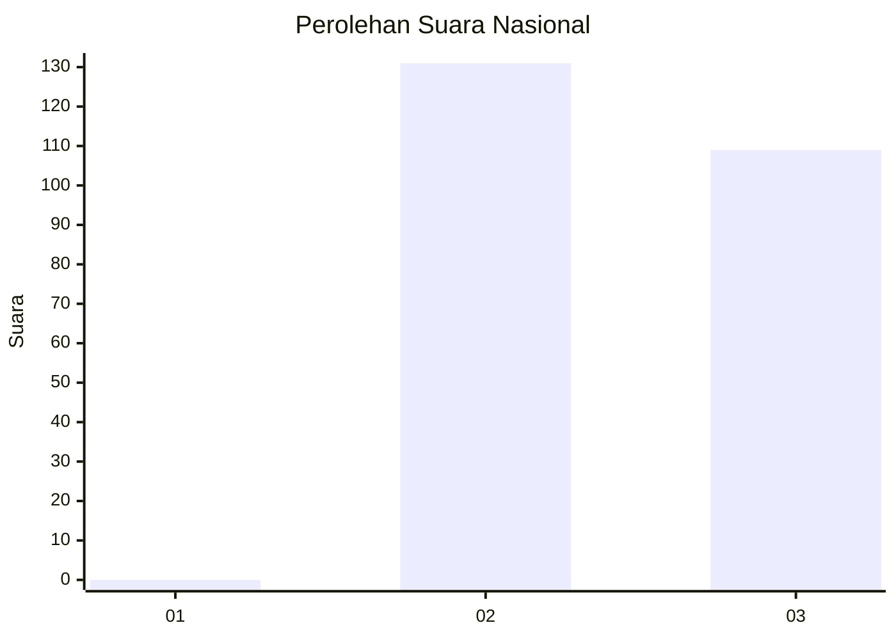
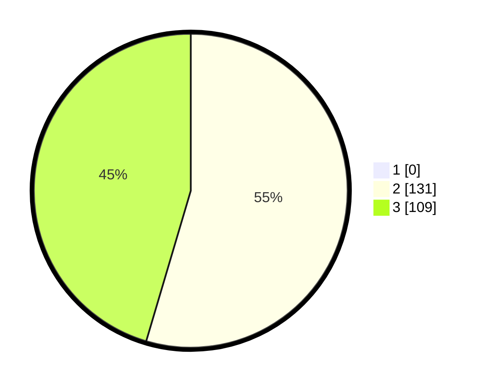

# Hasil

## Grafik

## Tabel

| No. | Nama Paslon    | Suara | Suara (raw) | Persentase |
|:--- |:-------------- | -----:| -----------:| ----------:|
| 1   | ANIES MUHAIMIN | 0     | [0][p-1]    | 0,00       |
| 2   | PRABOWO GIBRAN | 131   | [131][p-2]  | 54,58      |
| 3   | GANJAR MAHFUD  | 109   | [109][p-3]  | 45,42      |

[p-1]: https://github.com/gigit-pemilu/pemilu-2024/blob/main/pilpres/hitung-suara/sub/51-bali/sub/03-badung/sub/03-abiansemal/sub/2016-abiansemal-dauh-yeh-cani/sub/008-tps/sub/paslon-1.txt
[p-2]: https://github.com/gigit-pemilu/pemilu-2024/blob/main/pilpres/hitung-suara/sub/51-bali/sub/03-badung/sub/03-abiansemal/sub/2016-abiansemal-dauh-yeh-cani/sub/008-tps/sub/paslon-2.txt
[p-3]: https://github.com/gigit-pemilu/pemilu-2024/blob/main/pilpres/hitung-suara/sub/51-bali/sub/03-badung/sub/03-abiansemal/sub/2016-abiansemal-dauh-yeh-cani/sub/008-tps/sub/paslon-3.txt

## Foto C Plano

https://sirekap-obj-formc.kpu.go.id/b8a6/pemilu/ppwp/51/03/03/20/16/5103032016008-20240214-235353--eb9a7b7f-9f5e-4baa-a7f6-3f036d828fcc.jpg

https://sirekap-obj-formc.kpu.go.id/b8a6/pemilu/ppwp/51/03/03/20/16/5103032016008-20240214-235336--e87c9dcf-decd-4e05-ab24-cb651438a570.jpg

https://sirekap-obj-formc.kpu.go.id/b8a6/pemilu/ppwp/51/03/03/20/16/5103032016008-20240214-235338--3137f9e1-515b-4a6b-b6e5-75e57c4c5dc3.jpg

## Metadata

| Key        | Value               |
| ---------- | ------------------- |
| Time Stamp | 2024-02-24 22:31:28 |

