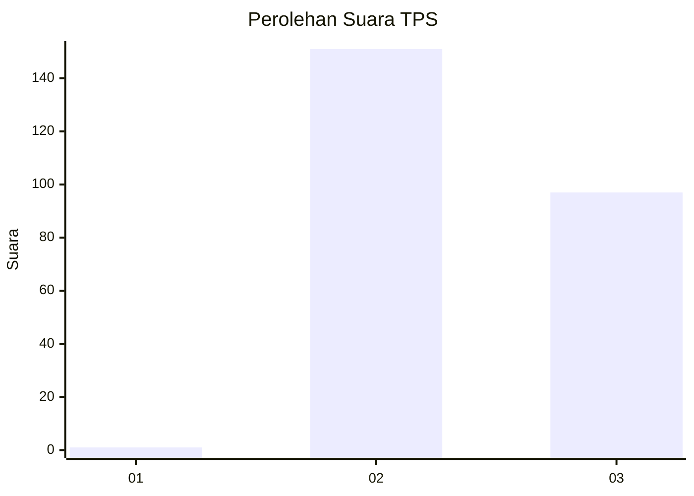
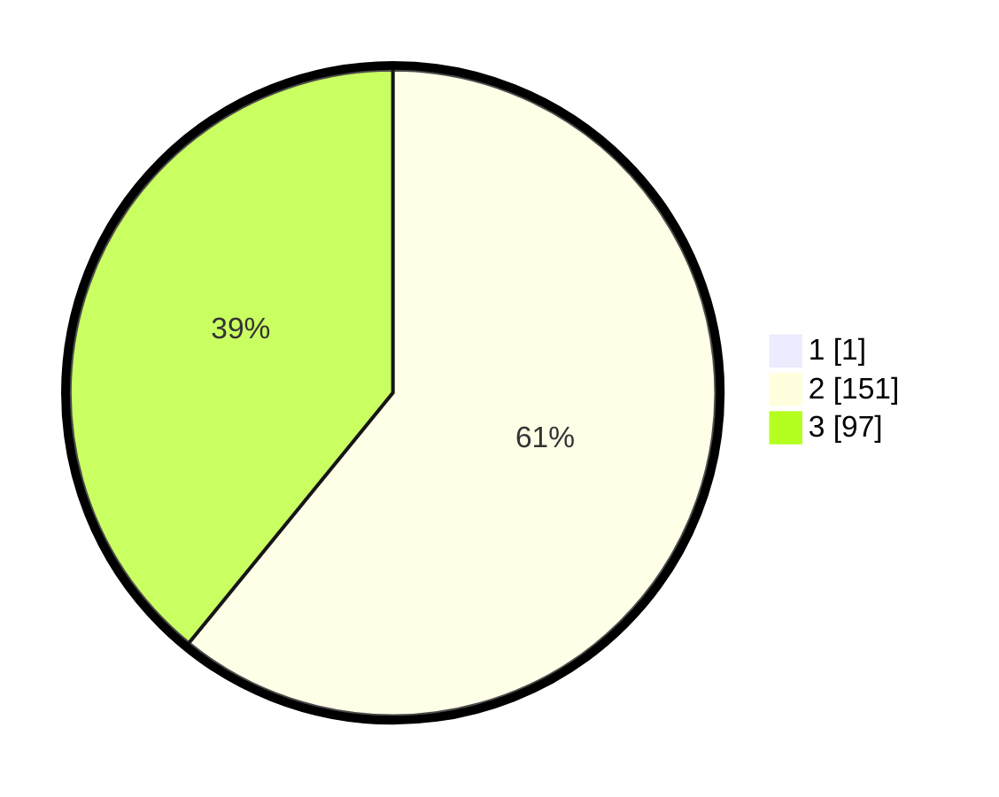

# Hasil

## Grafik

## Tabel

| No. | Nama Paslon    | Suara | Suara (raw) | Persentase |
|:--- |:-------------- | -----:| -----------:| ----------:|
| 1   | ANIES MUHAIMIN | 1     | [1][p-1]    | 0,40       |
| 2   | PRABOWO GIBRAN | 151   | [151][p-2]  | 60,64      |
| 3   | GANJAR MAHFUD  | 97    | [97][p-3]   | 38,96      |

[p-1]: https://github.com/gigit-pemilu/pemilu-2024-51-bali/blob/main/pilpres/hitung-suara/sub/51-bali/sub/03-badung/sub/03-abiansemal/sub/2016-abiansemal-dauh-yeh-cani/sub/017-tps/sub/paslon-1.txt
[p-2]: https://github.com/gigit-pemilu/pemilu-2024-51-bali/blob/main/pilpres/hitung-suara/sub/51-bali/sub/03-badung/sub/03-abiansemal/sub/2016-abiansemal-dauh-yeh-cani/sub/017-tps/sub/paslon-2.txt
[p-3]: https://github.com/gigit-pemilu/pemilu-2024-51-bali/blob/main/pilpres/hitung-suara/sub/51-bali/sub/03-badung/sub/03-abiansemal/sub/2016-abiansemal-dauh-yeh-cani/sub/017-tps/sub/paslon-3.txt

## Foto C Plano

https://sirekap-obj-formc.kpu.go.id/8f0e/pemilu/ppwp/51/03/03/20/16/5103032016017-20240214-231815--04c42f02-216e-403d-819d-90caef624e19.jpg

https://sirekap-obj-formc.kpu.go.id/8f0e/pemilu/ppwp/51/03/03/20/16/5103032016017-20240214-200449--de10417e-8b27-430a-90bf-93535474a9c1.jpg

https://sirekap-obj-formc.kpu.go.id/8f0e/pemilu/ppwp/51/03/03/20/16/5103032016017-20240214-200545--437e1e7b-198c-4687-9638-d3ba2cb701c4.jpg

## Metadata

| Key        | Value               |
| ---------- | ------------------- |
| Time Stamp | 2024-02-24 22:31:28 |

