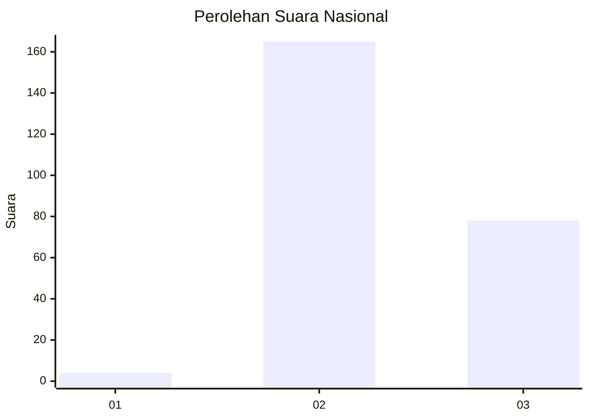
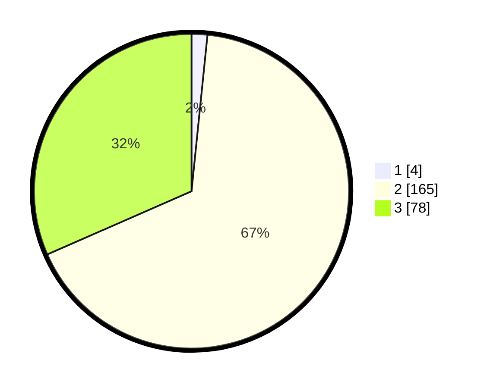

# Hasil

## Grafik

## Tabel

| No. | Nama Paslon    | Suara | Suara (raw) | Persentase |
|:--- |:-------------- | -----:| -----------:| ----------:|
| 1   | ANIES MUHAIMIN | 4     | [4][p-1]    | 1,62       |
| 2   | PRABOWO GIBRAN | 165   | [165][p-2]  | 66,80      |
| 3   | GANJAR MAHFUD  | 78    | [78][p-3]   | 31,58      |

[p-1]: https://github.com/gigit-pemilu/pemilu-2024/blob/main/pilpres/hitung-suara/sub/51-bali/sub/03-badung/sub/03-abiansemal/sub/2016-abiansemal-dauh-yeh-cani/sub/018-tps/sub/paslon-1.txt
[p-2]: https://github.com/gigit-pemilu/pemilu-2024/blob/main/pilpres/hitung-suara/sub/51-bali/sub/03-badung/sub/03-abiansemal/sub/2016-abiansemal-dauh-yeh-cani/sub/018-tps/sub/paslon-2.txt
[p-3]: https://github.com/gigit-pemilu/pemilu-2024/blob/main/pilpres/hitung-suara/sub/51-bali/sub/03-badung/sub/03-abiansemal/sub/2016-abiansemal-dauh-yeh-cani/sub/018-tps/sub/paslon-3.txt

## Foto C Plano

https://sirekap-obj-formc.kpu.go.id/5395/pemilu/ppwp/51/03/03/20/16/5103032016018-20240214-234908--e7533fd5-d69c-4361-862c-d38b9cbb3511.jpg

https://sirekap-obj-formc.kpu.go.id/5395/pemilu/ppwp/51/03/03/20/16/5103032016018-20240214-235004--767b05c9-c4f8-4860-aa97-8b90120d7732.jpg

https://sirekap-obj-formc.kpu.go.id/5395/pemilu/ppwp/51/03/03/20/16/5103032016018-20240214-235050--5ecb0288-e999-4610-a151-c0d78885a66a.jpg

## Metadata

| Key        | Value               |
| ---------- | ------------------- |
| Time Stamp | 2024-02-24 22:31:28 |

