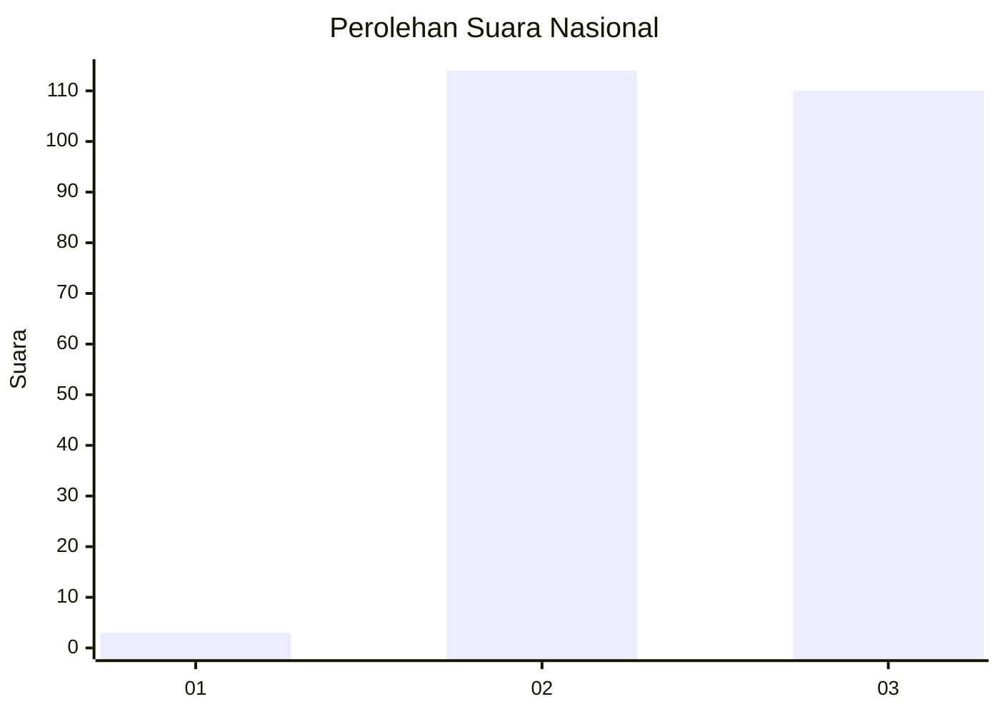
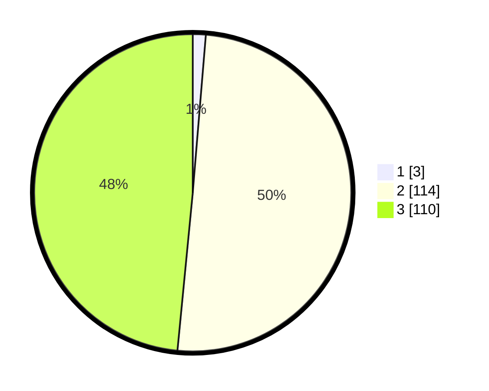

# Hasil

## Grafik

## Tabel

| No. | Nama Paslon    | Suara | Suara (raw) | Persentase |
|:--- |:-------------- | -----:| -----------:| ----------:|
| 1   | ANIES MUHAIMIN | 3     | [3][p-1]    | 1,32       |
| 2   | PRABOWO GIBRAN | 114   | [114][p-2]  | 50,22      |
| 3   | GANJAR MAHFUD  | 110   | [110][p-3]  | 48,46      |

[p-1]: https://github.com/gigit-pemilu/pemilu-2024/blob/main/pilpres/hitung-suara/sub/51-bali/sub/03-badung/sub/03-abiansemal/sub/2018-bongkasa-pertiwi/sub/002-tps/sub/paslon-1.txt
[p-2]: https://github.com/gigit-pemilu/pemilu-2024/blob/main/pilpres/hitung-suara/sub/51-bali/sub/03-badung/sub/03-abiansemal/sub/2018-bongkasa-pertiwi/sub/002-tps/sub/paslon-2.txt
[p-3]: https://github.com/gigit-pemilu/pemilu-2024/blob/main/pilpres/hitung-suara/sub/51-bali/sub/03-badung/sub/03-abiansemal/sub/2018-bongkasa-pertiwi/sub/002-tps/sub/paslon-3.txt

## Foto C Plano

https://sirekap-obj-formc.kpu.go.id/0176/pemilu/ppwp/51/03/03/20/18/5103032018002-20240216-055707--2d74483c-4d25-4dc1-be90-04c5316ff9d4.jpg

https://sirekap-obj-formc.kpu.go.id/0176/pemilu/ppwp/51/03/03/20/18/5103032018002-20240216-060248--99697d12-5d10-4198-bc49-5b3dceaadbdb.jpg

https://sirekap-obj-formc.kpu.go.id/0176/pemilu/ppwp/51/03/03/20/18/5103032018002-20240216-060244--b03f21f8-5d82-445c-b8d3-15dc9ea1cfa7.jpg

## Metadata

| Key        | Value               |
| ---------- | ------------------- |
| Time Stamp | 2024-02-24 22:31:28 |

## DATA PEMILIH TETAP

Jumlah pemilih dalam DPT: **253**.
 * L: **125**.
 * P: **128**.

## DATA PENGGUNA HAK PILIH

Jumlah pengguna hak pilih dalam DPT: **240**.
 * L: **120**.
 * P: **120**.

Jumlah pengguna hak pilih dalam DPTb: **0**.
 * L: **0**.
 * P: **0**.

Jumlah pengguna hak pilih dalam DPK: **1**.
 * L: **1**.
 * P: **0**.

Jumlah pengguna hak pilih: **241**.
 * L: **121**.
 * P: **120**.

## JUMLAH SUARA SAH DAN TIDAK SAH

JUMLAH SELURUH SUARA SAH: **227**.

JUMLAH SUARA TIDAK SAH: **14**.

JUMLAH SELURUH SUARA SAH DAN SUARA TIDAK SAH: **241**.

