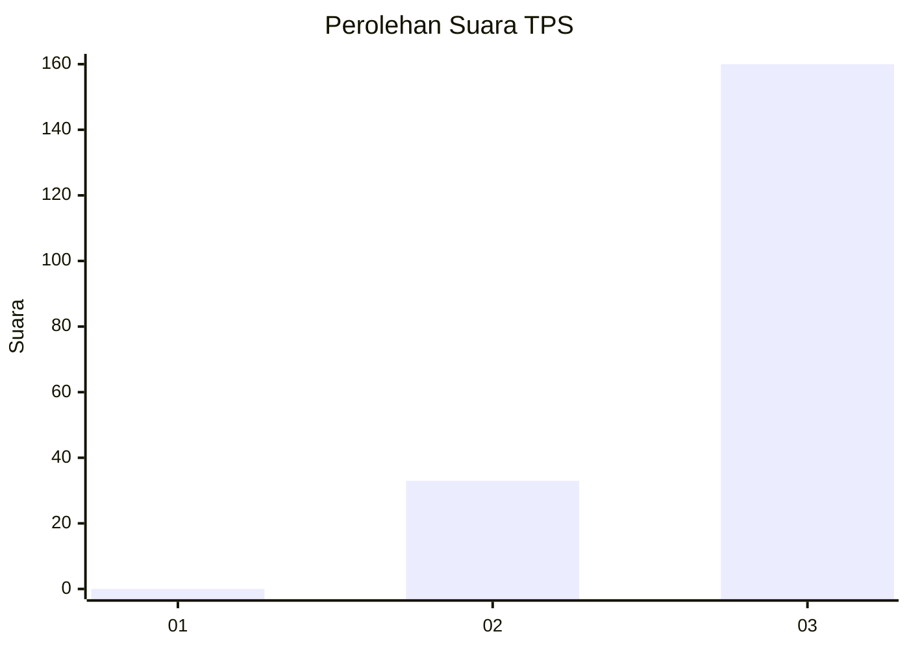
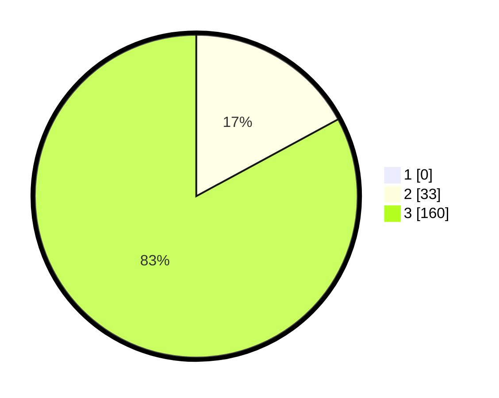

# Hasil

## Grafik

## Tabel

| No. | Nama Paslon    | Suara | Suara (raw) | Persentase |
|:--- |:-------------- | -----:| -----------:| ----------:|
| 1   | ANIES MUHAIMIN | 0     | [0][p-1]    | 0,00       |
| 2   | PRABOWO GIBRAN | 33    | [33][p-2]   | 17,10      |
| 3   | GANJAR MAHFUD  | 160   | [160][p-3]  | 82,90      |

[p-1]: https://github.com/gigit-pemilu/pemilu-2024-51-bali/blob/main/pilpres/hitung-suara/sub/51-bali/sub/03-badung/sub/03-abiansemal/sub/2018-bongkasa-pertiwi/sub/003-tps/sub/paslon-1.txt
[p-2]: https://github.com/gigit-pemilu/pemilu-2024-51-bali/blob/main/pilpres/hitung-suara/sub/51-bali/sub/03-badung/sub/03-abiansemal/sub/2018-bongkasa-pertiwi/sub/003-tps/sub/paslon-2.txt
[p-3]: https://github.com/gigit-pemilu/pemilu-2024-51-bali/blob/main/pilpres/hitung-suara/sub/51-bali/sub/03-badung/sub/03-abiansemal/sub/2018-bongkasa-pertiwi/sub/003-tps/sub/paslon-3.txt

## Foto C Plano

https://sirekap-obj-formc.kpu.go.id/44d3/pemilu/ppwp/51/03/03/20/18/5103032018003-20240216-003019--a8441c4d-cdf4-4119-aa09-a11cbcaf24a8.jpg

https://sirekap-obj-formc.kpu.go.id/44d3/pemilu/ppwp/51/03/03/20/18/5103032018003-20240216-003022--68e32166-2532-4efc-b8dc-15a6d40d6dee.jpg

https://sirekap-obj-formc.kpu.go.id/44d3/pemilu/ppwp/51/03/03/20/18/5103032018003-20240216-003021--dddd7a8f-ef51-4d3f-b87b-3f8ecd326fb7.jpg

## Metadata

| Key        | Value               |
| ---------- | ------------------- |
| Time Stamp | 2024-02-21 15:00:00 |

## DATA PEMILIH TETAP

Jumlah pemilih dalam DPT: **253**.
 * L: **130**.
 * P: **123**.

## DATA PENGGUNA HAK PILIH

Jumlah pengguna hak pilih dalam DPT: **235**.
 * L: **118**.
 * P: **117**.

Jumlah pengguna hak pilih dalam DPTb: **0**.
 * L: **0**.
 * P: **0**.

Jumlah pengguna hak pilih dalam DPK: **0**.
 * L: **0**.
 * P: **0**.

Jumlah pengguna hak pilih: **235**.
 * L: **118**.
 * P: **117**.

## JUMLAH SUARA SAH DAN TIDAK SAH

JUMLAH SELURUH SUARA SAH: **193**.

JUMLAH SUARA TIDAK SAH: **42**.

JUMLAH SELURUH SUARA SAH DAN SUARA TIDAK SAH: **235**.

