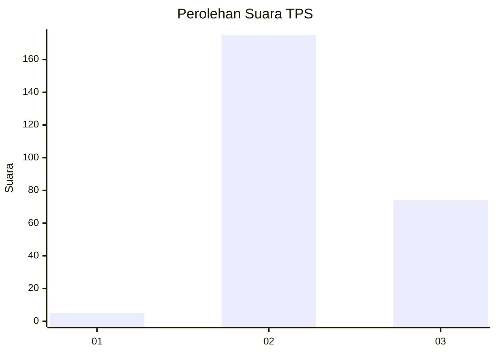

# Hasil

## Grafik

## Tabel

| No. | Nama Paslon    | Suara | Suara (raw) | Persentase |
|:--- |:-------------- | -----:| -----------:| ----------:|
| 1   | ANIES MUHAIMIN | 5     | [5][p-1]    | 1,97       |
| 2   | PRABOWO GIBRAN | 175   | [175][p-2]  | 68,90      |
| 3   | GANJAR MAHFUD  | 74    | [74][p-3]   | 29,13      |

[p-1]: https://github.com/gigit-pemilu/pemilu-2024-51-bali/blob/main/pilpres/hitung-suara/sub/51-bali/sub/03-badung/sub/04-petang/sub/2001-carangsari/sub/001-tps/sub/paslon-1.txt
[p-2]: https://github.com/gigit-pemilu/pemilu-2024-51-bali/blob/main/pilpres/hitung-suara/sub/51-bali/sub/03-badung/sub/04-petang/sub/2001-carangsari/sub/001-tps/sub/paslon-2.txt
[p-3]: https://github.com/gigit-pemilu/pemilu-2024-51-bali/blob/main/pilpres/hitung-suara/sub/51-bali/sub/03-badung/sub/04-petang/sub/2001-carangsari/sub/001-tps/sub/paslon-3.txt

## Foto C Plano

https://sirekap-obj-formc.kpu.go.id/b439/pemilu/ppwp/51/03/04/20/01/5103042001001-20240223-130643--9df4ed28-c777-4a9f-bb56-22f8c33a2195.jpg

https://sirekap-obj-formc.kpu.go.id/b439/pemilu/ppwp/51/03/04/20/01/5103042001001-20240223-130735--c5bc5597-b1b3-4720-90ca-ef86c5896ab4.jpg

https://sirekap-obj-formc.kpu.go.id/b439/pemilu/ppwp/51/03/04/20/01/5103042001001-20240223-130754--fb3573c1-6d27-4282-a260-59cac555c1d4.jpg

## Metadata

| Key        | Value               |
| ---------- | ------------------- |
| Time Stamp | 2024-02-24 22:31:28 |

