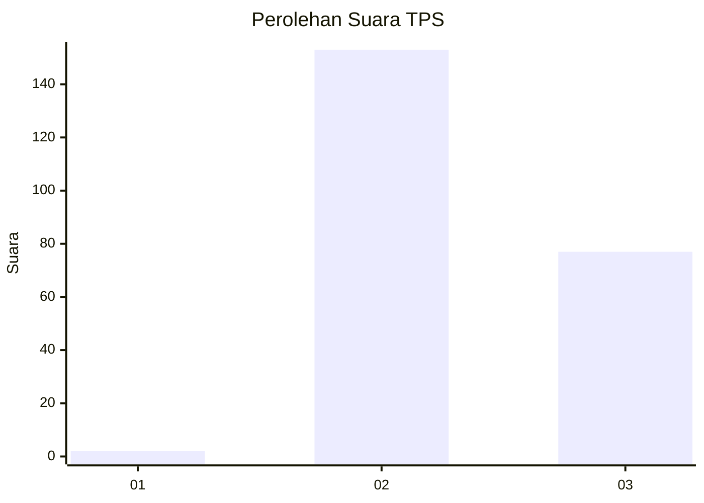
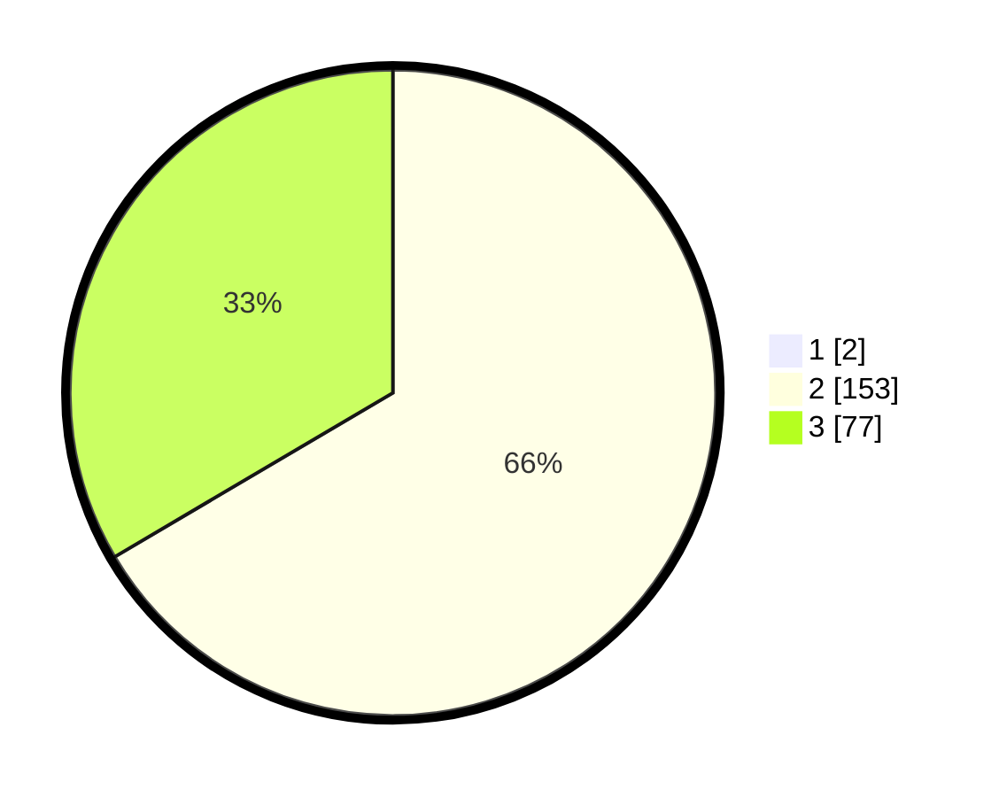

# Hasil

## Grafik

## Tabel

| No. | Nama Paslon    | Suara | Suara (raw) | Persentase |
|:--- |:-------------- | -----:| -----------:| ----------:|
| 1   | ANIES MUHAIMIN | 2     | [2][p-1]    | 0,86       |
| 2   | PRABOWO GIBRAN | 153   | [153][p-2]  | 65,95      |
| 3   | GANJAR MAHFUD  | 77    | [77][p-3]   | 33,19      |

[p-1]: https://github.com/gigit-pemilu/pemilu-2024-51-bali/blob/main/pilpres/hitung-suara/sub/51-bali/sub/03-badung/sub/04-petang/sub/2001-carangsari/sub/004-tps/sub/paslon-1.txt
[p-2]: https://github.com/gigit-pemilu/pemilu-2024-51-bali/blob/main/pilpres/hitung-suara/sub/51-bali/sub/03-badung/sub/04-petang/sub/2001-carangsari/sub/004-tps/sub/paslon-2.txt
[p-3]: https://github.com/gigit-pemilu/pemilu-2024-51-bali/blob/main/pilpres/hitung-suara/sub/51-bali/sub/03-badung/sub/04-petang/sub/2001-carangsari/sub/004-tps/sub/paslon-3.txt

## Foto C Plano

https://sirekap-obj-formc.kpu.go.id/1221/pemilu/ppwp/51/03/04/20/01/5103042001004-20240214-213949--247260e0-4eb0-474a-9ccb-68566cbbd296.jpg

https://sirekap-obj-formc.kpu.go.id/1221/pemilu/ppwp/51/03/04/20/01/5103042001004-20240214-214213--af768188-5274-4620-9389-e9fc7b323e05.jpg

https://sirekap-obj-formc.kpu.go.id/1221/pemilu/ppwp/51/03/04/20/01/5103042001004-20240214-214358--5c373fae-7574-4624-bc6c-3637d685109d.jpg

## Metadata

| Key        | Value               |
| ---------- | ------------------- |
| Time Stamp | 2024-02-24 22:31:28 |

