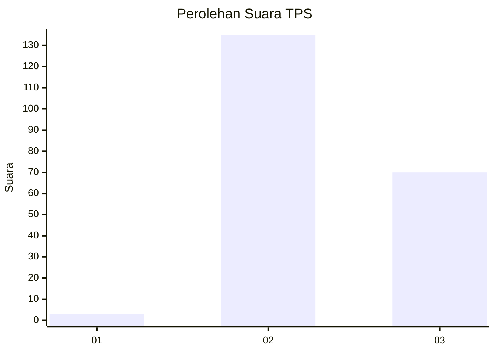
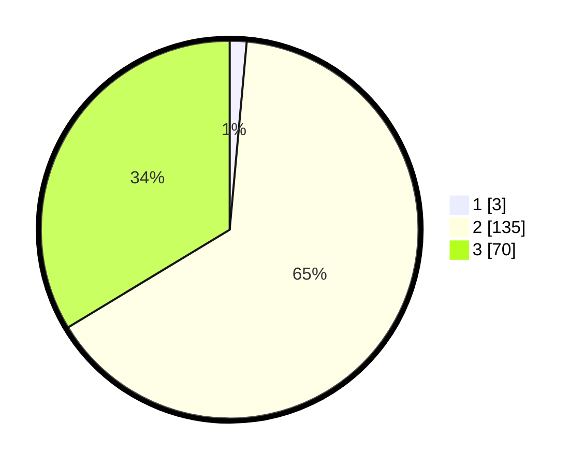

# Hasil

## Grafik

## Tabel

| No. | Nama Paslon    | Suara | Suara (raw) | Persentase |
|:--- |:-------------- | -----:| -----------:| ----------:|
| 1   | ANIES MUHAIMIN | 3     | [3][p-1]    | 1,44       |
| 2   | PRABOWO GIBRAN | 135   | [135][p-2]  | 64,90      |
| 3   | GANJAR MAHFUD  | 70    | [70][p-3]   | 33,65      |

[p-1]: https://github.com/gigit-pemilu/pemilu-2024-51-bali/blob/main/pilpres/hitung-suara/sub/51-bali/sub/03-badung/sub/04-petang/sub/2001-carangsari/sub/006-tps/sub/paslon-1.txt
[p-2]: https://github.com/gigit-pemilu/pemilu-2024-51-bali/blob/main/pilpres/hitung-suara/sub/51-bali/sub/03-badung/sub/04-petang/sub/2001-carangsari/sub/006-tps/sub/paslon-2.txt
[p-3]: https://github.com/gigit-pemilu/pemilu-2024-51-bali/blob/main/pilpres/hitung-suara/sub/51-bali/sub/03-badung/sub/04-petang/sub/2001-carangsari/sub/006-tps/sub/paslon-3.txt

## Foto C Plano

https://sirekap-obj-formc.kpu.go.id/4e42/pemilu/ppwp/51/03/04/20/01/5103042001006-20240214-141012--ae7a3694-8673-4953-849e-d1a50b60a196.jpg

https://sirekap-obj-formc.kpu.go.id/4e42/pemilu/ppwp/51/03/04/20/01/5103042001006-20240214-141007--70235eb0-8c1f-4fc5-a0bc-dfd88afd298b.jpg

https://sirekap-obj-formc.kpu.go.id/4e42/pemilu/ppwp/51/03/04/20/01/5103042001006-20240214-141105--9dfebc4c-1d37-4bd5-a430-2e24d1a99588.jpg

## Metadata

| Key        | Value               |
| ---------- | ------------------- |
| Time Stamp | 2024-02-24 22:31:28 |

## DATA PEMILIH TETAP

Jumlah pemilih dalam DPT: **232**.
 * L: **115**.
 * P: **117**.

## DATA PENGGUNA HAK PILIH

Jumlah pengguna hak pilih dalam DPT: **211**.
 * L: **109**.
 * P: **102**.

Jumlah pengguna hak pilih dalam DPTb: **0**.
 * L: **0**.
 * P: **0**.

Jumlah pengguna hak pilih dalam DPK: **0**.
 * L: **0**.
 * P: **0**.

Jumlah pengguna hak pilih: **211**.
 * L: **109**.
 * P: **102**.

## JUMLAH SUARA SAH DAN TIDAK SAH

JUMLAH SELURUH SUARA SAH: **208**.

JUMLAH SUARA TIDAK SAH: **3**.

JUMLAH SELURUH SUARA SAH DAN SUARA TIDAK SAH: **211**.

