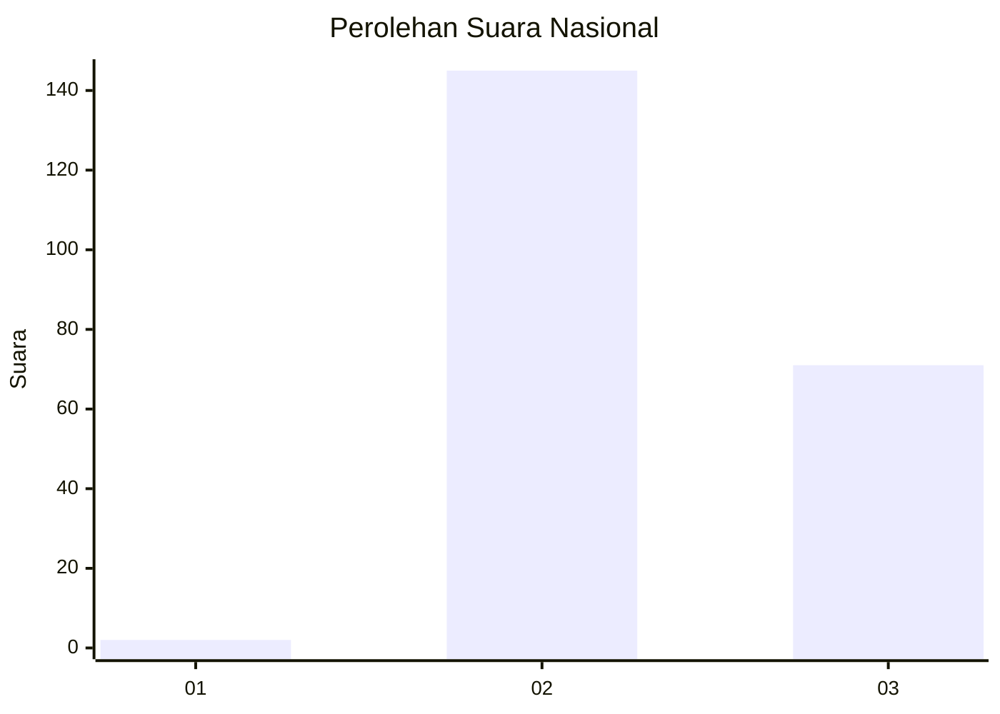
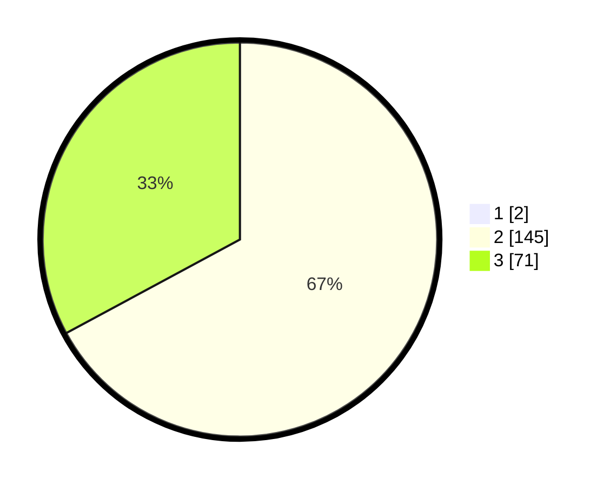

# Hasil

## Grafik

## Tabel

| No. | Nama Paslon    | Suara | Suara (raw) | Persentase |
|:--- |:-------------- | -----:| -----------:| ----------:|
| 1   | ANIES MUHAIMIN | 2     | [2][p-1]    | 0,92       |
| 2   | PRABOWO GIBRAN | 145   | [145][p-2]  | 66,51      |
| 3   | GANJAR MAHFUD  | 71    | [71][p-3]   | 32,57      |

[p-1]: https://github.com/gigit-pemilu/pemilu-2024/blob/main/pilpres/hitung-suara/sub/51-bali/sub/03-badung/sub/04-petang/sub/2001-carangsari/sub/009-tps/sub/paslon-1.txt
[p-2]: https://github.com/gigit-pemilu/pemilu-2024/blob/main/pilpres/hitung-suara/sub/51-bali/sub/03-badung/sub/04-petang/sub/2001-carangsari/sub/009-tps/sub/paslon-2.txt
[p-3]: https://github.com/gigit-pemilu/pemilu-2024/blob/main/pilpres/hitung-suara/sub/51-bali/sub/03-badung/sub/04-petang/sub/2001-carangsari/sub/009-tps/sub/paslon-3.txt

## Foto C Plano

https://sirekap-obj-formc.kpu.go.id/3ed3/pemilu/ppwp/51/03/04/20/01/5103042001009-20240215-001706--a2e0076f-6b70-4884-afd0-7dbe7af9d09f.jpg

https://sirekap-obj-formc.kpu.go.id/3ed3/pemilu/ppwp/51/03/04/20/01/5103042001009-20240215-001815--33601546-bd16-4c46-a164-ebfbaa97ca92.jpg

https://sirekap-obj-formc.kpu.go.id/3ed3/pemilu/ppwp/51/03/04/20/01/5103042001009-20240215-001928--13877b38-bbca-441c-a438-7fdc7b7446a2.jpg

## Metadata

| Key        | Value               |
| ---------- | ------------------- |
| Time Stamp | 2024-02-16 17:30:00 |

## DATA PEMILIH TETAP

Jumlah pemilih dalam DPT: **255**.
 * L: **117**.
 * P: **138**.

## DATA PENGGUNA HAK PILIH

Jumlah pengguna hak pilih dalam DPT: **221**.
 * L: **108**.
 * P: **113**.

Jumlah pengguna hak pilih dalam DPTb: **0**.
 * L: **0**.
 * P: **0**.

Jumlah pengguna hak pilih dalam DPK: **5**.
 * L: **3**.
 * P: **2**.

Jumlah pengguna hak pilih: **226**.
 * L: **111**.
 * P: **115**.

## JUMLAH SUARA SAH DAN TIDAK SAH

JUMLAH SELURUH SUARA SAH: **218**.

JUMLAH SUARA TIDAK SAH: **8**.

JUMLAH SELURUH SUARA SAH DAN SUARA TIDAK SAH: **226**.

