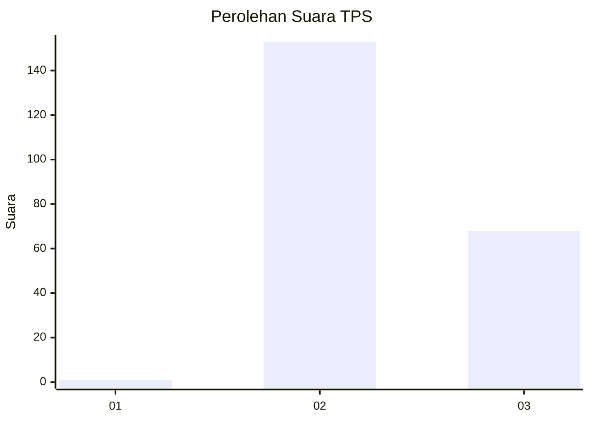
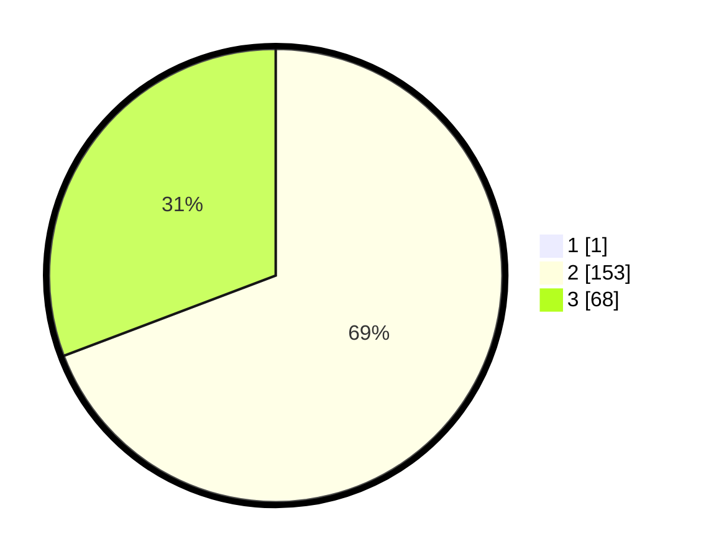

# Hasil

## Grafik

## Tabel

| No. | Nama Paslon    | Suara | Suara (raw) | Persentase |
|:--- |:-------------- | -----:| -----------:| ----------:|
| 1   | ANIES MUHAIMIN | 1     | [1][p-1]    | 0,45       |
| 2   | PRABOWO GIBRAN | 153   | [153][p-2]  | 68,92      |
| 3   | GANJAR MAHFUD  | 68    | [68][p-3]   | 30,63      |

[p-1]: https://github.com/gigit-pemilu/pemilu-2024-51-bali/blob/main/pilpres/hitung-suara/sub/51-bali/sub/03-badung/sub/04-petang/sub/2001-carangsari/sub/010-tps/sub/paslon-1.txt
[p-2]: https://github.com/gigit-pemilu/pemilu-2024-51-bali/blob/main/pilpres/hitung-suara/sub/51-bali/sub/03-badung/sub/04-petang/sub/2001-carangsari/sub/010-tps/sub/paslon-2.txt
[p-3]: https://github.com/gigit-pemilu/pemilu-2024-51-bali/blob/main/pilpres/hitung-suara/sub/51-bali/sub/03-badung/sub/04-petang/sub/2001-carangsari/sub/010-tps/sub/paslon-3.txt

## Foto C Plano

https://sirekap-obj-formc.kpu.go.id/7264/pemilu/ppwp/51/03/04/20/01/5103042001010-20240214-222932--6018934c-ef34-4e6d-a6a6-c54aa5837136.jpg

https://sirekap-obj-formc.kpu.go.id/7264/pemilu/ppwp/51/03/04/20/01/5103042001010-20240214-222949--e8386f06-ad74-4666-803f-984d8a209232.jpg

https://sirekap-obj-formc.kpu.go.id/7264/pemilu/ppwp/51/03/04/20/01/5103042001010-20240214-222958--252b7fc4-dfbb-418f-9f58-c656addfdd70.jpg

## Metadata

| Key        | Value               |
| ---------- | ------------------- |
| Time Stamp | 2024-02-24 22:31:28 |

