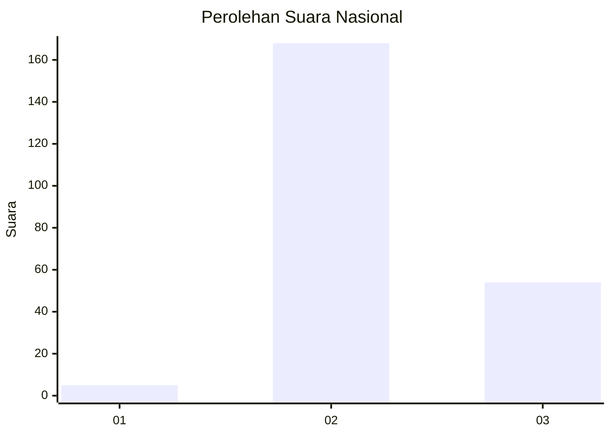
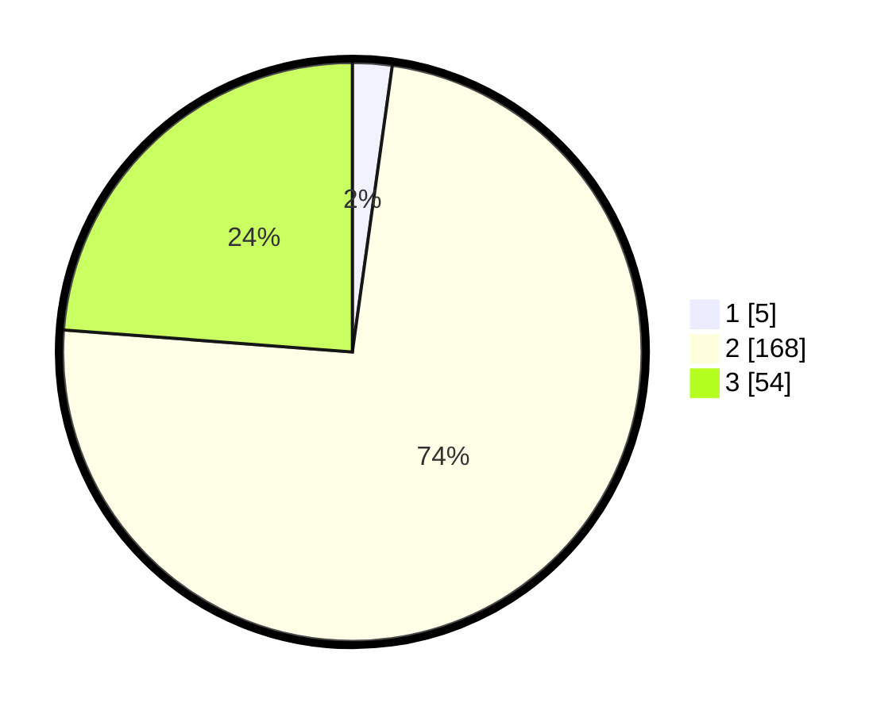

# Hasil

## Grafik

## Tabel

| No. | Nama Paslon    | Suara | Suara (raw) | Persentase |
|:--- |:-------------- | -----:| -----------:| ----------:|
| 1   | ANIES MUHAIMIN | 5     | [5][p-1]    | 2,20       |
| 2   | PRABOWO GIBRAN | 168   | [168][p-2]  | 74,01      |
| 3   | GANJAR MAHFUD  | 54    | [54][p-3]   | 23,79      |

[p-1]: https://github.com/gigit-pemilu/pemilu-2024/blob/main/pilpres/hitung-suara/sub/51-bali/sub/03-badung/sub/04-petang/sub/2001-carangsari/sub/012-tps/sub/paslon-1.txt
[p-2]: https://github.com/gigit-pemilu/pemilu-2024/blob/main/pilpres/hitung-suara/sub/51-bali/sub/03-badung/sub/04-petang/sub/2001-carangsari/sub/012-tps/sub/paslon-2.txt
[p-3]: https://github.com/gigit-pemilu/pemilu-2024/blob/main/pilpres/hitung-suara/sub/51-bali/sub/03-badung/sub/04-petang/sub/2001-carangsari/sub/012-tps/sub/paslon-3.txt

## Foto C Plano

https://sirekap-obj-formc.kpu.go.id/9b88/pemilu/ppwp/51/03/04/20/01/5103042001012-20240214-221119--7c7da7b3-2b31-4708-b007-85a63450e5e8.jpg

https://sirekap-obj-formc.kpu.go.id/9b88/pemilu/ppwp/51/03/04/20/01/5103042001012-20240214-221129--6075d8d9-3f86-4493-ad14-3c9f8c214128.jpg

https://sirekap-obj-formc.kpu.go.id/9b88/pemilu/ppwp/51/03/04/20/01/5103042001012-20240214-221146--95e8bf0e-12da-4cae-8e8b-a57d47e8c1a4.jpg

## Metadata

| Key        | Value               |
| ---------- | ------------------- |
| Time Stamp | 2024-02-24 22:31:28 |

