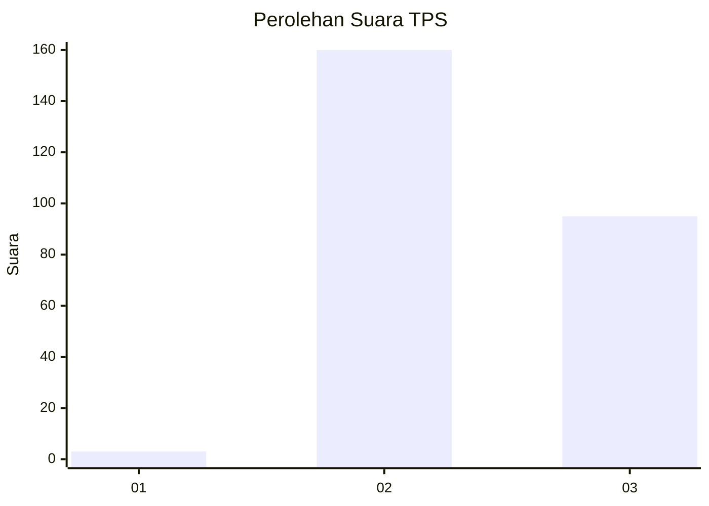
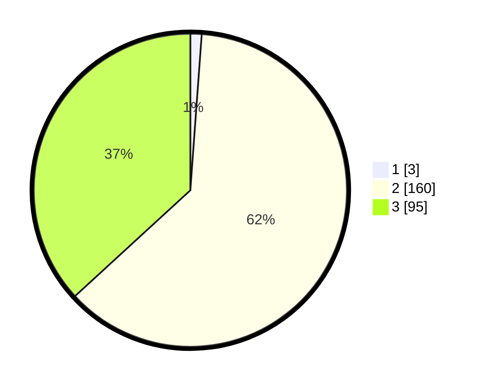

# Hasil

## Grafik

## Tabel

| No. | Nama Paslon    | Suara | Suara (raw) | Persentase |
|:--- |:-------------- | -----:| -----------:| ----------:|
| 1   | ANIES MUHAIMIN | 3     | [3][p-1]    | 1,16       |
| 2   | PRABOWO GIBRAN | 160   | [160][p-2]  | 62,02      |
| 3   | GANJAR MAHFUD  | 95    | [95][p-3]   | 36,82      |

[p-1]: https://github.com/gigit-pemilu/pemilu-2024-51-bali/blob/main/pilpres/hitung-suara/sub/51-bali/sub/03-badung/sub/04-petang/sub/2002-petang/sub/004-tps/sub/paslon-1.txt
[p-2]: https://github.com/gigit-pemilu/pemilu-2024-51-bali/blob/main/pilpres/hitung-suara/sub/51-bali/sub/03-badung/sub/04-petang/sub/2002-petang/sub/004-tps/sub/paslon-2.txt
[p-3]: https://github.com/gigit-pemilu/pemilu-2024-51-bali/blob/main/pilpres/hitung-suara/sub/51-bali/sub/03-badung/sub/04-petang/sub/2002-petang/sub/004-tps/sub/paslon-3.txt

## Foto C Plano

https://sirekap-obj-formc.kpu.go.id/2a03/pemilu/ppwp/51/03/04/20/02/5103042002004-20240215-015356--a748920f-b53d-4d3d-8351-2101099900f2.jpg

https://sirekap-obj-formc.kpu.go.id/2a03/pemilu/ppwp/51/03/04/20/02/5103042002004-20240215-015901--9a7b8ba8-86e1-45aa-8a80-d46fa49cb6b5.jpg

https://sirekap-obj-formc.kpu.go.id/2a03/pemilu/ppwp/51/03/04/20/02/5103042002004-20240215-083516--443ece10-9b56-47bd-b1f3-18058a6382bf.jpg

## Metadata

| Key        | Value               |
| ---------- | ------------------- |
| Time Stamp | 2024-02-24 22:31:28 |

